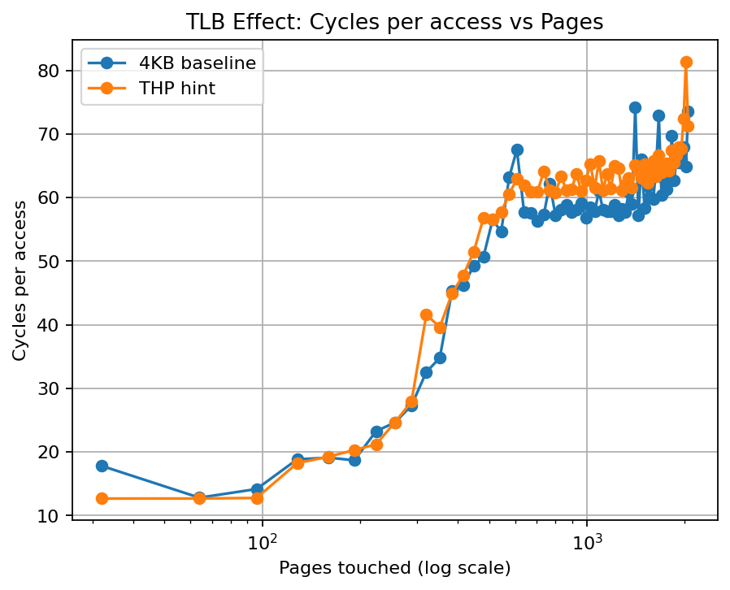

# 02 — TLB Effect

## Experiment Overview

This experiment investigates the performance impact of the **Translation Lookaside Buffer (TLB)** by measuring the latency of pointer-chasing memory accesses while varying the number of pages touched.

Each memory access jumps to a different page, forcing the CPU to repeatedly translate virtual addresses to physical addresses. When the working set exceeds the effective TLB coverage, address translation begins to incur **page table walks**, increasing memory access latency.

Two experimental configurations were used:

1. **Large Working Set Sweep**  
   Observe the full memory hierarchy up to DRAM.

2. **TLB Window Sweep**  
   Restrict the working set to isolate the TLB capacity effect.

---

# 1. Large Working Set Sweep

## Configuration

```

CPU=1
MAX_PAGES=8192
STEP_PAGES=64
ITERS=5000000
WARMUP=500000

```

Maximum working set size:

```

8192 pages × 4KB ≈ 32MB

```

This range exceeds the CPU cache hierarchy and begins to involve **main memory accesses**.

---

## Result


Observed measurements:

```

baseline latency ≈ 10.7 cycles
max latency ≈ 213 cycles
slowdown ≈ 20×

```

The final latency (~200 cycles) is close to typical **DRAM access latency**.

---

## Interpretation

As the number of pages increases, memory accesses eventually exceed the capacity of the cache hierarchy. When this occurs, memory accesses increasingly require:

```

TLB miss

* cache miss
* DRAM access

```

This combination dramatically increases the observed latency.

The measured knee therefore corresponds to the transition from **cache-resident data to DRAM accesses**, rather than purely to TLB capacity.

---

## Limitation

Although the slowdown (~20×) is clearly visible, this experiment does not isolate the TLB effect.

The working set grows to:

```

≈ 32MB

```

which exceeds the CPU cache hierarchy. As a result, **DRAM latency dominates the measurement**, masking the pure TLB effect.

In other words:

```

memory hierarchy effect > TLB effect

```

Thus the large sweep configuration mainly demonstrates the **full memory hierarchy behavior** rather than TLB capacity itself.

---

# 2. TLB Window Sweep

## Configuration

```

CPU=1
MIN_PAGES=32
MAX_PAGES=2048
STEP_PAGES=32
ITERS=15000000
WARMUP=1000000

```

Working set range:

```

32 pages  → 2048 pages
128KB     → 8MB

```

This range generally stays within the CPU cache hierarchy, allowing the experiment to better isolate the **TLB translation effect**.

---

## Result



Measured values:

```

knee pages ≈ 1408
knee size ≈ 5.5 MB

baseline latency ≈ 17.8 cycles
max latency ≈ 74 cycles

slowdown ≈ 4.2×

```

---

## Interpretation

The latency begins to rise sharply once the number of pages exceeds the effective coverage of the CPU’s TLB.

Assuming a standard 4KB page size:

```

TLB coverage ≈ 1408 × 4KB ≈ 5.5MB

```

This value closely matches the coverage expected from the **second-level TLB (STLB)** on modern x86 processors.

Typical STLB sizes:

```

1500–2000 entries

```

Which corresponds to:

```

≈ 6–8MB coverage

```

The observed knee (~5.5MB) therefore strongly suggests that the experiment captures **L2 TLB overflow**.

Beyond this point, memory accesses increasingly trigger **page table walks**, increasing memory access latency.

---

# 3. Remaining Limitations

## L1 TLB Knee Not Clearly Visible

Typical CPUs contain an L1 data TLB with approximately:

```

~64 entries

```

However, the experiment uses:

```

STEP_PAGES = 32

```

which results in coarse sampling:

```

32 → 64 → 96 → 128 pages

```

As a result, the **L1 TLB knee may not appear clearly** in the plot.

A smaller step size would likely reveal this behavior.

---

## Residual Cache Effects

Although the working set remains within the cache hierarchy, cache misses may still contribute to the measured latency.

Thus the measured slowdown (~4×) likely reflects a combination of:

```

TLB misses

* page table walks
* occasional cache misses

```

rather than a purely isolated TLB latency.

---

# 4. TLB Architecture

Modern CPUs use a multi-level Translation Lookaside Buffer (TLB) to cache virtual-to-physical address translations.

Typical structure:

```

Virtual Address
       │
       ▼
+------------------+
|   L1 Data TLB    |
| (~64 entries)    |
+------------------+
       │ miss
       ▼
+------------------+
|   L2 TLB (STLB)  |
| (~1500 entries)  |
+------------------+
       │ miss
       ▼
+------------------+
| Page Table Walk  |
| (memory access)  |
+------------------+
       │
       ▼
Physical Address

```

The L1 TLB is small but extremely fast, while the second-level TLB provides a much larger coverage.

If both levels miss, the CPU must perform a **page table walk**, which requires multiple memory accesses and significantly increases latency.

---

# 5. TLB Reach

The effective coverage of a TLB can be estimated by:

```

TLB Reach = TLB Entries × Page Size

```

Example:

```

STLB entries ≈ 1500
page size = 4KB

```

Estimated coverage:

```

1500 × 4KB ≈ 6MB

```

Measured coverage from this experiment:

```

1408 × 4KB ≈ 5.5MB

```

This close agreement suggests that the experiment successfully captured the **practical coverage of the second-level TLB**.

---

# 6. Why Pointer Chasing is Necessary

Modern CPUs contain hardware prefetchers that attempt to predict future memory accesses.

If a simple sequential pattern were used:

```

for (i = 0; i < N; i++)
sum += array[i * stride];

```

the hardware prefetcher could preload cache lines and hide part of the memory latency.

To avoid this effect, the experiment uses **pointer chasing**:

```

p = *p;

```

Each memory access depends on the result of the previous one:

```

access(i+1) depends on access(i)

```

This creates a strict dependency chain that prevents the CPU from issuing memory requests in parallel or predicting future accesses.

As a result, the measured latency reflects the **true cost of each memory access**, including TLB misses and page table walks.

---

# Conclusion

This experiment demonstrates how address translation locality can significantly affect memory performance.

The large working set sweep reveals the dramatic slowdown that occurs when memory accesses reach **DRAM latency (~200 cycles)**.

By restricting the working set to a smaller range, the TLB window sweep successfully captures the **TLB capacity effect**, showing a clear knee around **5.5MB**, consistent with the expected coverage of the second-level TLB.

These results highlight that memory performance depends not only on **cache locality** but also on **address translation locality**, making the TLB a critical component of modern processor performance.
```
