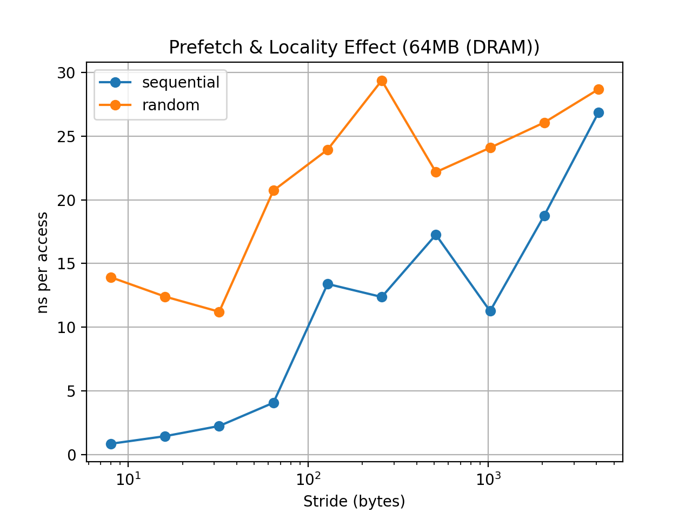

# 03 — Prefetch and Locality

## Goal

This experiment investigates how **memory access patterns** affect performance.

We compare two traversal patterns:

* **Sequential access**
* **Random access**

Both patterns access the **same memory locations**, but in different orders.

The goal is to observe how **spatial locality** and **hardware prefetching** influence memory latency.

---

# Experimental Setup

CPU: x86_64 laptop
Compiler: `gcc -O3`
Pinned CPU: core 0

Working set sizes tested:

| Size | Region       |
| ---- | ------------ |
| 32KB | L1-sized     |
| 1MB  | L2/L3 region |
| 64MB | DRAM         |

Stride sizes:

```
8B → 4096B
```

Each experiment performs approximately **64 million memory accesses**.

Metrics reported:

```
ns per access
useful MiB/s
```

---

# Results

## 32KB Working Set (L1-sized)


### Observations

* Latency remains extremely low across most stride sizes.
* Sequential and random access show **very similar performance**.
* The entire working set fits inside the **L1 cache**.

### Interpretation

When data fits inside L1 cache:

* cache misses are rare
* prefetching is less important
* access pattern has minimal impact

Performance is dominated by **L1 cache latency** rather than DRAM access.

---

## 1MB Working Set (L2/L3 region)


### Observations

* Sequential access begins to outperform random access.
* Larger strides gradually increase latency.
* Random access starts showing significantly higher latency.

### Interpretation

At this scale the dataset exceeds L1 capacity.

Therefore:

```
cache-line reuse
hardware prefetching
```

begin to influence performance.

Sequential traversal benefits from predictable memory access patterns, while random access begins to suffer more cache misses.

---

## 64MB Working Set (DRAM)



### Observations

Sequential vs random access shows a large difference.

Example measurements:

| Stride | Seq (ns/access) | Random (ns/access) |
| ------ | --------------- | ------------------ |
| 8B     | 0.84            | 13.91              |
| 16B    | 1.43            | 12.39              |
| 32B    | 2.23            | 11.20              |
| 64B    | 4.05            | 20.72              |
| 128B   | 13.39           | 23.93              |
| 256B   | 12.36           | 29.37              |
| 512B   | 17.26           | 22.17              |
| 1024B  | 11.26           | 24.09              |
| 2048B  | 18.77           | 26.07              |
| 4096B  | 26.85           | 28.68              |

Key observations:

* Sequential access is **dramatically faster** for small strides.
* Random access consistently shows higher latency.
* Latency increases significantly when stride exceeds cache-line size.

---

# Why Sequential Access Is Faster

Sequential traversal enables two key optimizations:

### Spatial locality

Modern CPUs fetch memory in **cache-line units (typically 64 bytes)**.

Sequential access reuses data within the same cache line:

```
A[i], A[i+1], A[i+2] ...
```

Random access often wastes most of the cache line.

---

### Hardware prefetching

CPUs detect predictable access patterns.

For sequential access:

```
A[i]
A[i + stride]
A[i + 2*stride]
```

the hardware prefetcher can fetch future cache lines before they are needed.

Random access breaks this predictability.

---

# Interpreting Irregularities

The sequential latency curve is **not perfectly monotonic**.

Examples:

```
stride=128  → 13.39 ns
stride=256  → 12.36 ns
stride=1024 → 11.26 ns
```

These fluctuations are expected due to several microarchitectural effects.

---

## Hardware stride prefetchers

Modern CPUs include **stride-detecting prefetchers**.

Some strides may trigger more effective prefetching than others.

---

## Memory-Level Parallelism (MLP)

Out-of-order CPUs can overlap multiple outstanding memory requests.

This can partially hide latency, producing non-linear curves.

---

## DRAM row-buffer behavior

DRAM memory operates with **row buffers**.

Certain access patterns may accidentally align with row-buffer hits, slightly reducing latency.

---

# Bandwidth Perspective

Looking at useful bandwidth (MiB/s):

| Stride | Seq (MiB/s) | Random (MiB/s) |
| ------ | ----------- | -------------- |
| 8B     | 9096        | 548            |
| 16B    | 5323        | 615            |
| 64B    | 1880        | 368            |
| 128B   | 569         | 318            |

Sequential traversal achieves dramatically higher bandwidth because cache lines are utilized efficiently.

Random access wastes most of each fetched cache line.

---

# Key Takeaways

1️⃣ **Sequential traversal is critical for performance**

Predictable access patterns allow hardware prefetchers to hide memory latency.

---

2️⃣ **Random access exposes true memory latency**

Without predictable patterns, most accesses behave like cache misses.

---

3️⃣ **Stride strongly affects cache-line utilization**

Large strides reduce spatial locality and waste memory bandwidth.

---

# Conclusion

This experiment demonstrates that **memory access patterns can dominate real-world performance**.

Even when two algorithms perform the same number of memory loads:

```
sequential traversal
vs
random traversal
```

performance can differ by more than **10×**.

Understanding locality and prefetch behavior is therefore essential when designing high-performance systems and data structures.

---

# Limitations

* Hardware prefetch events are not directly measured.
* The index array traversal introduces minor overhead.
* Results depend on the specific CPU microarchitecture.

