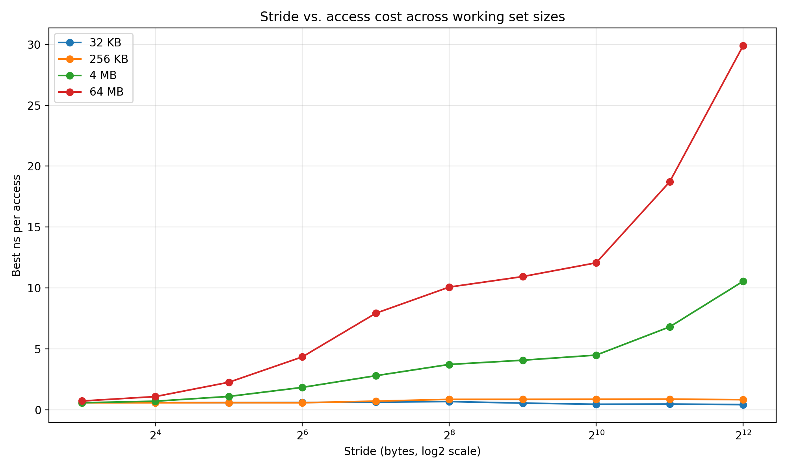
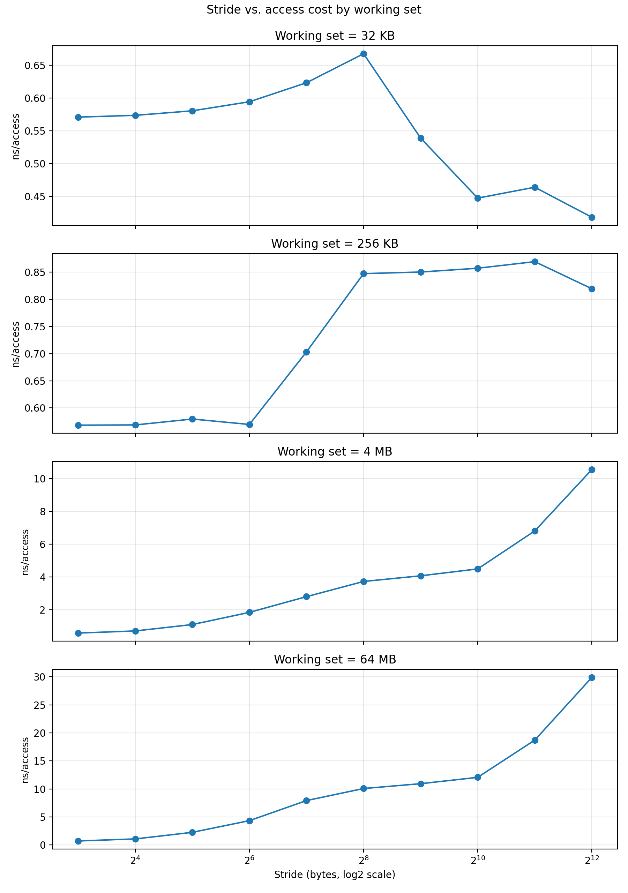

# 04-stride-vs-cache-miss

## Goal

Understand how memory access stride affects cache efficiency and overall access latency.

Key questions:
- How does increasing stride impact ns per access?
- How does the effect differ across cache levels?
- Where does cache line utilization break down?

---

## Background

Modern CPUs fetch memory in **cache line units (typically 64 bytes)**.

- Sequential access → high spatial locality → efficient cache usage
- Strided access → reduced locality → more cache misses

For `uint64_t` (8 bytes):
- 1 cache line = 8 elements

| stride | elements per cache line |
|--------|------------------------|
| 1      | 8                      |
| 2      | 4                      |
| 4      | 2                      |
| 8      | 1                      |
| ≥16    | <1 (no reuse)          |

---

## Experimental Setup

- CPU pinned to a single core
- Best-of-N timing (repeats)
- Warmup enabled
- Total accesses normalized across strides

### Working set sizes

| Size | Expected level |
|------|--------------|
| 32 KB | L1 cache |
| 256 KB | L2 cache |
| 4 MB | L3 / LLC |
| 64 MB | DRAM |

---

## Results

### 1. Stride vs access cost (all working sets)

---

### 2. Per working set breakdown

---

## 🔍 Analysis

### 1. L1 (32 KB): Almost no impact

- Access cost remains ~0.5–0.7 ns
- Stride has minimal effect

**Reason:**
- Entire working set fits in L1
- Cache hits dominate
- Memory latency is hidden

---

### 2. L2 (256 KB): Mild degradation

- Slight increase (~0.6 → 0.85 ns)
- Still relatively flat

**Reason:**
- Mostly cache hits
- Reduced cache line utilization starts to matter

---

### 3. L3 / LLC (4 MB): Clear degradation

- Latency increases steadily (~0.5 → 10 ns)

**Reason:**
- Cache misses increase
- Hardware prefetch becomes less effective
- Cache line waste increases

---

### 4. DRAM (64 MB): Dramatic slowdown

- Latency grows from ~1 ns → ~30 ns

**Key observation:**
- Performance degrades sharply with stride

**Reason:**
- Working set exceeds cache capacity
- Access becomes DRAM-bound
- Spatial locality collapses

---

## Key Observations

### 1. Cache line boundary (~64 bytes)

Critical transition point:

- `stride < 64B` → multiple accesses per cache line
- `stride ≥ 64B` → only one access per line

👉 This significantly reduces cache efficiency.

---

### 2. Working set size dominates behavior

| Working Set | Behavior |
|------------|---------|
| L1 | Flat |
| L2 | Slight increase |
| L3 | Gradual increase |
| DRAM | Sharp increase |

👉 Stride effects depend heavily on where data resides in memory hierarchy.

---

### 3. Hardware prefetcher effects

- Works well for small strides
- Becomes ineffective at large strides

👉 This contributes to the sharp increase in latency.

---

### 4. Spatial locality collapse

As stride increases:

- Cache line utilization ↓
- Effective bandwidth ↓
- Latency per access ↑

---

## Notes

- Small fluctuations (e.g., slight drops at certain strides) are normal
  - Caused by measurement noise, loop effects, and prefetch alignment
- No clear TLB effect observed
  - Likely due to stride not strongly interacting with page boundaries

---

## Conclusion

> Increasing stride reduces spatial locality, and once the working set exceeds cache capacity, memory access becomes dominated by DRAM latency.

This experiment demonstrates:

- The importance of **cache line utilization**
- The impact of **working set size**
- The role of **hardware prefetching**
- The transition from **cache-bound → memory-bound**

---

## Next Step

To isolate memory latency more clearly:

👉 Implement **random access pattern**

Expected outcome:
- Prefetcher disabled
- True DRAM latency exposed
- Even sharper performance degradation

---
