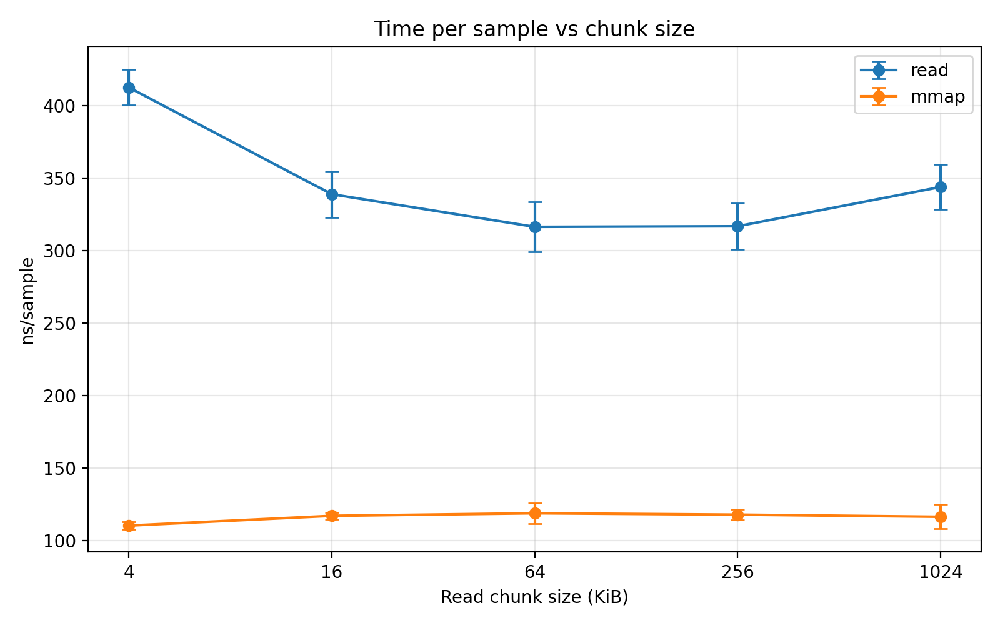
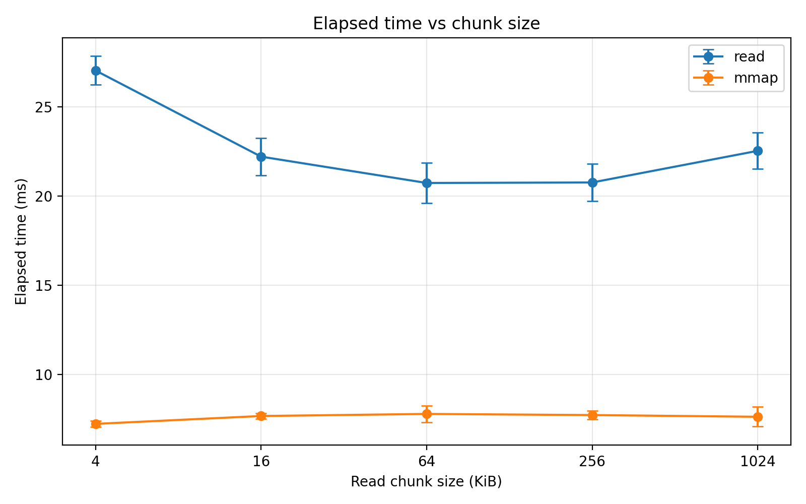

# 02-mmap-vs-read: Crossing the OS Boundary

This experiment compares two ways of accessing file data from user space:

- `read()` — explicit system calls that copy data from the kernel into a user buffer
- `mmap()` — mapping file pages directly into the process address space

The goal is **not** to benchmark disk performance. Instead, this lab investigates the **cost structure of the OS boundary** when accessing file-backed data under warm page cache conditions.

---

# Motivation

Both `read()` and `mmap()` ultimately retrieve file data through the kernel. However, their execution paths differ significantly.

`read()`:

```

user code
│
├─ read(fd, buf, size)
│
kernel
│
├─ locate page in page cache
├─ copy data → user buffer
│
user code scans buffer

```

`mmap()`:

```

user code
│
├─ mmap(file)
│
kernel sets virtual mapping
│
user accesses memory
│
page fault (first touch)
│
page cache page mapped into process

```

Key differences:

| Mechanism | read() | mmap() |
|---|---|---|
system calls | repeated | once |
data copy | kernel → user buffer | none |
access model | buffered | memory-mapped |
first-touch cost | none | page fault |

This lab measures how these differences affect performance for **sequential file scans**.

---

# Experimental Setup

Hardware and environment:

- Linux userspace
- x86_64 laptop CPU
- file size: **256 MiB**
- page stride: **4096 bytes**
- samples: **65536 per run**
- iterations: **5**

Both modes scan the same offsets to ensure identical workload.

Measured metrics:

- elapsed time
- throughput (MiB/s)
- ns per sample
- perf counters (`page-faults`, `minor-faults`, `major-faults`)

The `read()` path also sweeps different buffer sizes:

```

4 KiB
16 KiB
64 KiB
256 KiB
1024 KiB

```

---

# Results

## Time per Sample



Observed behavior:

- `read()` performance improves as chunk size increases
- plateau occurs around **64–256 KiB**
- `mmap()` remains almost constant

Measured values:

| chunk | read(ns/sample) | mmap(ns/sample) |
|---|---|---|
4 KB | ~410 | ~110 |
16 KB | ~340 | ~116 |
64 KB | ~315 | ~118 |
256 KB | ~315 | ~118 |
1024 KB | ~340 | ~116 |

Key observation:

```

mmap ≈ 3× faster per sampled access

```

---

## Throughput


Throughput results:

| chunk | read(MiB/s) | mmap(MiB/s) |
|---|---|---|
4 KB | ~9,500 | ~35,000 |
64 KB | ~12,000 | ~33,000 |
256 KB | ~12,200 | ~33,500 |

Important note:

These numbers **do not reflect disk bandwidth**.

The file was already resident in the **page cache**, so performance reflects:

```

memory bandwidth + kernel overhead

```

---

## Elapsed Time



Measured scan time for the entire 256 MiB file:

| chunk | read(ms) | mmap(ms) |
|---|---|---|
4 KB | ~27 ms | ~7 ms |
64 KB | ~21 ms | ~7.7 ms |
256 KB | ~21 ms | ~7.6 ms |

Overall:

```

mmap ≈ 2.7× faster

```

---

# perf Counter Analysis

The following counters were collected:

```

perf stat -e page-faults,minor-faults,major-faults

```

Results:

```

page-faults:   24638
minor-faults:  24638
major-faults:      0

```

Interpretation:

- **no major page faults**
- file data was already cached
- page faults observed were **minor faults** from memory mappings

This confirms the benchmark is **not disk-bound**.

Instead, the measured difference reflects:

```

read()  → syscall + buffer copy path
mmap()  → page-fault-driven memory access

```

---

# Discussion

### 1. Why `read()` depends on chunk size

Small buffers cause many system calls:

```

4 KiB buffer → ~65536 syscalls
256 KiB buffer → ~1024 syscalls

```

Larger buffers amortize syscall overhead, improving performance until the plateau around **64–256 KiB**.

---

### 2. Why `mmap()` is insensitive to chunk size

`mmap()` performs the mapping once.  
Afterwards, accesses are simple memory loads:

```

load instruction
→ page table translation
→ cached page

```

Therefore buffer size is irrelevant.

---

### 3. Why mmap appears faster here

Under warm-cache conditions:

```

read()
syscall
copy to user buffer
scan buffer

mmap()
memory load
(occasional minor fault)

```

The absence of repeated syscalls and buffer copies allows mmap to outperform read in this workload.

---

# Limitations

This experiment does **not represent all file access workloads**.

Results may change when:

- page cache is cold
- access pattern is random
- files are smaller
- dense scans (every byte) are performed
- storage devices differ

In particular, when page cache is cold:

```

mmap() may incur major page faults

```

which can significantly change performance.

---

# Conclusion

This lab demonstrates how different file access APIs translate into different kernel execution paths.

For a cached sequential scan workload:

```

mmap ≈ 2.7× faster than read

```

because it avoids repeated system calls and explicit kernel-to-user buffer copies.

However, this advantage is **workload dependent** and should not be generalized to all I/O scenarios.

The key insight is that file access APIs are not merely syntactic alternatives — they represent **different interactions with the OS memory and I/O subsystems**.
