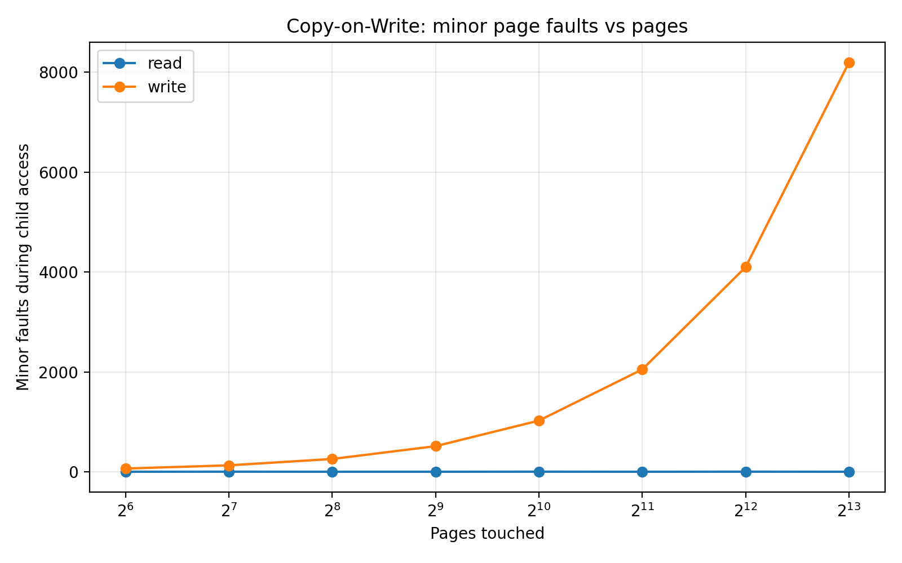
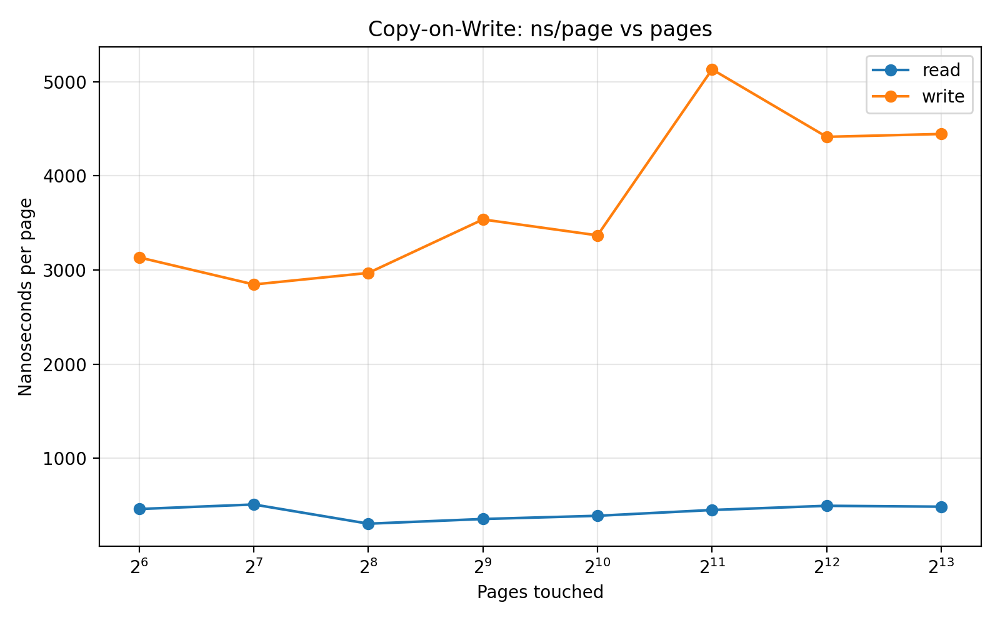
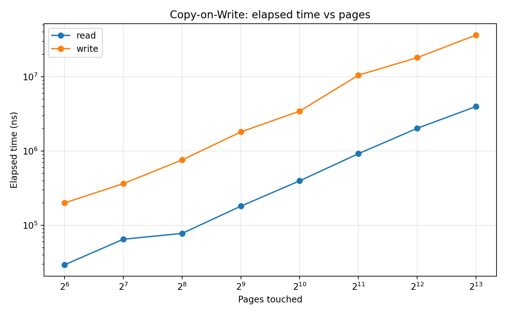

# 03-copy-on-write — Result

## Objective

This experiment investigates the **Copy-on-Write (COW)** behavior of `fork()` on Linux.

When a process calls `fork()`, the child logically receives a copy of the parent's address space.
However, modern operating systems avoid eagerly copying all memory pages. Instead they use **Copy-on-Write**:

1. Parent and child initially **share physical pages**
2. Pages are marked **read-only**
3. When either process **writes**, a page fault occurs
4. The kernel **allocates a new page and copies the original page**

This experiment verifies this behavior empirically.

---

# Experimental Setup

The program:

1. Allocates an anonymous private mapping using `mmap()`
2. Parent touches all pages (warmup)
3. `fork()` creates a child process
4. The child performs either:

* **read mode**: read one byte from each page
* **write mode**: write one byte to each page

The program measures:

* elapsed time
* minor page faults (`ru_minflt`)
* major page faults (`ru_majflt`)

---

# Raw Results

Summary extracted from `cow.csv`:

| pages | read faults | write faults | read ns/page | write ns/page |
| ----- | ----------- | ------------ | ------------ | ------------- |
| 64    | 4           | 69           | 583          | 5565          |
| 128   | 4           | 133          | 863          | 3778          |
| 256   | 4           | 261          | 751          | 7250          |
| 512   | 5           | 516          | 871          | 7144          |
| 1024  | 5           | 1029         | 843          | 4954          |
| 2048  | 4           | 2052         | 643          | 5447          |
| 4096  | 4           | 4101         | 625          | 5373          |
| 8192  | 5           | 8196         | 742          | 6026          |

Major faults were **zero for all experiments**.

---

# Minor Page Fault Behavior

Minor faults show the most important signal of Copy-on-Write.



Observations:

* **Read access**

  * Minor faults remain nearly constant (~4–5)
  * Independent of the number of pages touched

* **Write access**

  * Minor faults scale almost perfectly with pages touched

Measured relationship:

```
write_faults ≈ pages + 4~5
```

Example:

```
pages= 4096  minflt= 4101
pages= 8192  minflt= 8196
```

The small constant offset comes from runtime/library overhead unrelated to the experiment.

This demonstrates that **each written page triggers exactly one Copy-on-Write fault.**

---

# Per-Page Cost

The cost per page shows a clear difference between read and write accesses.



Observed values:

| mode  | ns/page       |
| ----- | ------------- |
| read  | ~600–870 ns   |
| write | ~3800–7200 ns |

Thus:

```
write cost ≈ 4–10× read cost
```

The additional overhead corresponds to:

* page fault handling
* physical page allocation
* page copy
* page table update

---

# Total Execution Time

Total execution time grows roughly linearly with the number of pages written.



Example measurements:

```
pages=64      elapsed=356201 ns
pages=512     elapsed=3657890 ns
pages=4096    elapsed=22009895 ns
pages=8192    elapsed=49368501 ns
```

This is consistent with:

```
total_time ∝ number_of_COW_faults
```

---

# Read vs Write Cost Ratio

The ratio between write and read cost per page was:

| pages | write/read ratio |
| ----- | ---------------- |
| 64    | 9.55             |
| 128   | 4.37             |
| 256   | 9.65             |
| 512   | 8.20             |
| 1024  | 5.87             |
| 2048  | 8.47             |
| 4096  | 8.59             |
| 8192  | 8.12             |

Average:

```
write ≈ 7× slower than read per page
```

---

# Major Page Faults

All experiments reported:

```
majflt_delta = 0
```

This confirms that:

* no disk-backed paging occurred
* all page faults were handled in memory

Thus the measured overhead comes purely from **COW page creation**.

---

# Key Findings

The experiment confirms the expected Linux `fork()` behavior:

### fork does not copy memory eagerly

Immediately after `fork()`, the parent and child share physical pages.

---

### reads do not trigger COW

Reading shared pages does not require page duplication.

Minor faults remain constant regardless of memory size.

---

### writes trigger page-granular COW

Writing to each page causes one minor page fault and a private page copy.

```
write_faults ≈ pages
```

---

### COW overhead scales linearly

Total execution time increases roughly proportionally with the number of written pages.

---

# Conclusion

This experiment empirically demonstrates **page-granular Copy-on-Write behavior in Linux `fork()`**.

The results show that:

* memory is not eagerly duplicated during process creation
* page copies occur lazily when a write happens
* each written page triggers exactly one minor page fault
* the cost of Copy-on-Write is several times higher than a simple read access

This mechanism allows `fork()` to remain efficient even for processes with large memory footprints.

---

# References

Linux manual pages:

* `fork(2)`
* `getrusage(2)`
* `mmap(2)`

---
