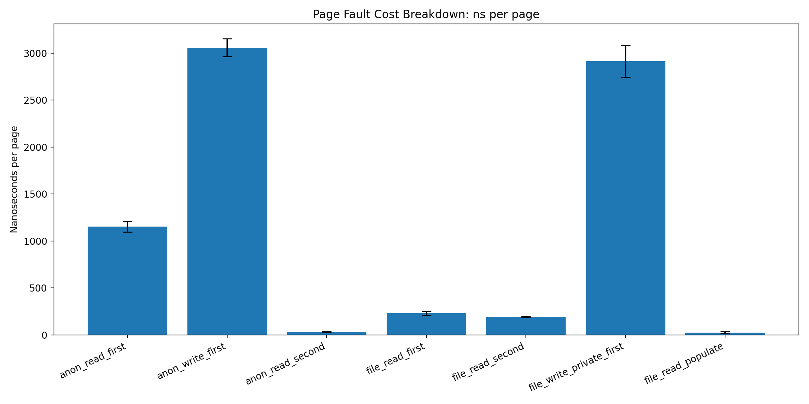
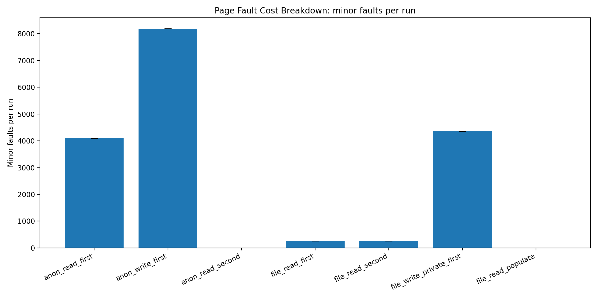
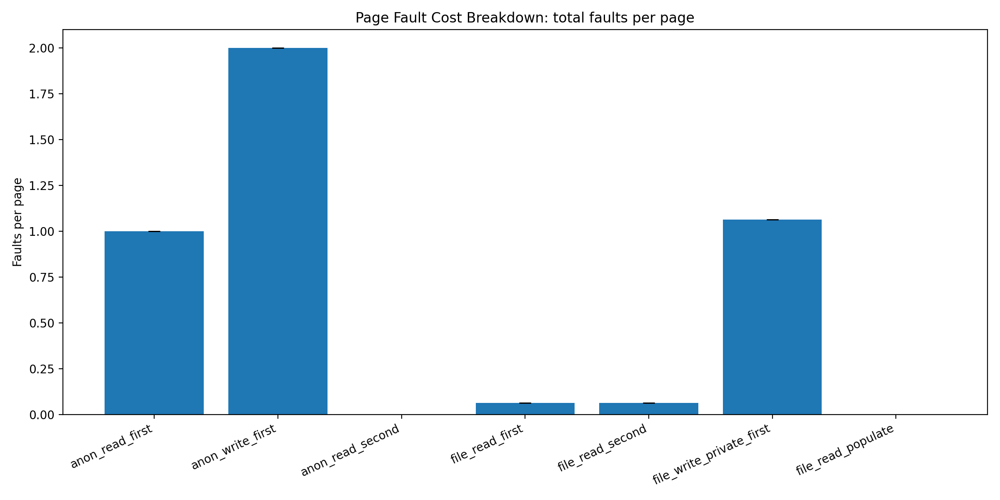

# 04-page-fault-cost-breakdown

## 1. Overview

This experiment breaks down page fault cost into distinct categories:

- Anonymous vs file-backed memory
- Read vs write access
- Cold vs warm access
- OS behaviors (readahead, COW, MAP_POPULATE)

The goal is to show that **“page fault cost” is not a single number**.

---

## 2. Experimental Setup

- Pages: 4096
- Page size: 4096 bytes
- Total size: 16MB
- Repeats: 5
- Warmup: 1
- CPU pinned

---

## 3. Results

---

### 3.1 Latency (ns per page)



| Mode | ns/page |
|------|--------|
| anon_write_first | ~3000 |
| file_write_private_first | ~2900 |
| anon_read_first | ~1100 |
| file_read_first | ~230 |
| file_read_second | ~190 |
| anon_read_second | ~30 |
| file_read_populate | ~20 |

---

### 3.2 Minor Faults



| Mode | Minor Faults |
|------|--------------|
| anon_read_first | ~4096 |
| anon_write_first | ~8192 |
| file_read_first | ~256 |
| file_write_private_first | ~4352 |
| warm modes | ~0 |

---

### 3.3 Major Faults


All modes:

```

majflt ≈ 0

```

---

### 3.4 Faults per Page



| Mode | Faults per page |
|------|----------------|
| anon_read_first | ~1 |
| anon_write_first | ~2 |
| file_read_first | ~0.06 |
| file_write_private_first | ~1.06 |
| warm modes | ~0 |

---

## 4. Analysis

---

### 4.1 Not All Page Faults Are Equal

This experiment reveals multiple types of faults:

- Zero-page fault (anonymous read)
- Allocation fault (anonymous write)
- File-backed fault (readahead)
- Copy-on-write fault (MAP_PRIVATE write)

Each has a different cost.

---

### 4.2 Write Faults Are Expensive

```

anon_read_first   ≈ 1100 ns
anon_write_first  ≈ 3000 ns

```

Write faults require:

- Physical page allocation
- Zero initialization
- Page table updates

→ ~3× slower than read faults

---

### 4.3 Readahead Reduces Faults

```

4096 pages → ~256 faults

```

This indicates ~16 pages per fault.

Linux detects sequential access and performs **readahead**, reducing fault frequency.

→ File-backed memory can generate fewer faults than anonymous memory.

---

### 4.4 Warm vs Cold Memory

```

Cold: 1000ns+
Warm: ~30ns

```

After mapping:

- No faults
- Pure memory access

→ Page fault is a **one-time cost**

---

### 4.5 MAP_POPULATE Shifts Cost

```

file_read_populate ≈ ~20ns

```

- Without: fault on access
- With: fault during mmap()

→ Cost is moved, not removed

---

### 4.6 Copy-on-Write Behavior

```

file_write_private_first ≈ anon_write_first

```

MAP_PRIVATE write:

- Allocates new page
- Copies original data

→ behaves like anonymous allocation

---

### 4.7 No Major Faults Observed

```

majflt ≈ 0

```

Meaning:

- Page cache was warm
- No disk I/O

→ This experiment reflects **memory subsystem behavior**

---

## 5. Key Takeaways

### 1. Page fault cost depends on type

There is no single “page fault cost”.

---

### 2. Write faults are the most expensive

~3× slower due to allocation.

---

### 3. OS optimizes file access

Readahead reduces faults dramatically.

---

### 4. Warm memory is a different regime

Fault disappears, only memory access remains.

---

### 5. MAP_POPULATE shifts cost timing

Not an elimination, but relocation.

---

## 6. Limitations

- No major faults (no disk I/O)
- Sequential access triggers readahead
- Results depend on system state

---

## 7. Future Work

- Stride access (disable readahead)
- madvise experiments
- Force major faults
- Compare storage backends

---

## 8. Conclusion

Page faults are not a single phenomenon, but a collection of mechanisms:

- Lazy mapping
- Memory allocation
- OS prefetching
- Copy-on-write

Understanding these differences is essential for system-level performance analysis.

---
