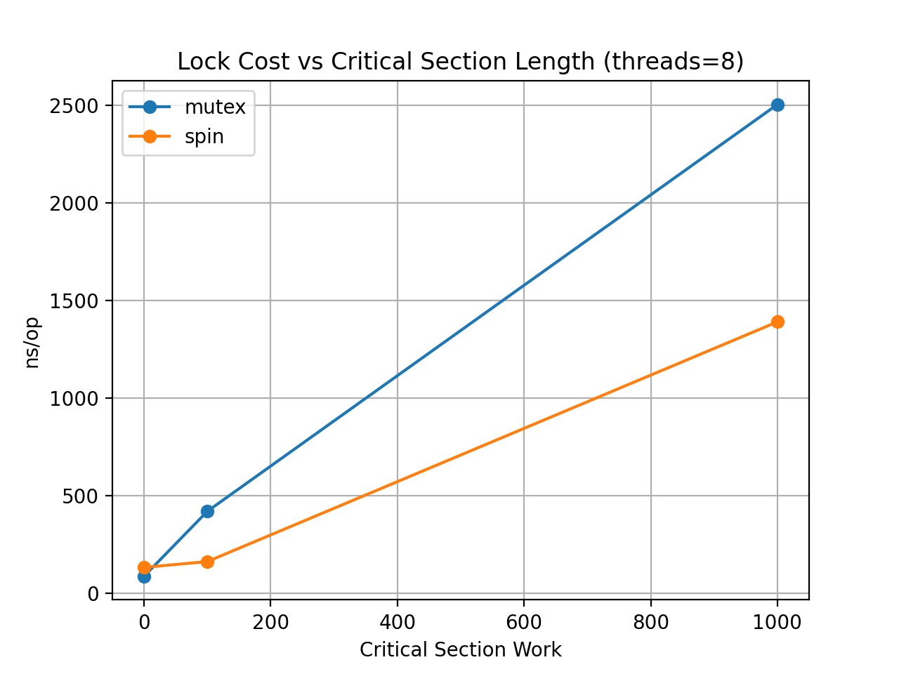

# 00-mutex-vs-spinlock

## Goal

In this experiment we compare the performance characteristics of two common locking primitives:

- `pthread_mutex`
- `pthread_spinlock`

Both primitives provide mutual exclusion, but they differ fundamentally in **how they behave under contention**.

- **Spinlock**  
  Continuously retries acquiring the lock (busy-wait).

- **Mutex**  
  May block the thread and rely on the OS scheduler to wake it up.

The goal of this lab is to understand how these two approaches behave under varying levels of:

- thread contention
- critical section length
- outside work between lock acquisitions

---

# Experimental Setup

Machine: Linux x86_64 laptop  
Compiler: `gcc -O2`

Benchmark structure:

for each iteration:

```
outside_work()

lock()

critical_section_work()

shared_counter++

unlock()

```

Parameters swept:

| Parameter    | Meaning                          |
| ------------ | -------------------------------- |
| threads      | number of worker threads         |
| cs_work      | work inside the critical section |
| outside_work | work between lock acquisitions   |

Measured metric:

```
ns_per_op = elapsed_time / total_operations
```

Each experiment performs:

```
threads × 1,000,000 lock acquisitions
```

---

# Results

## 1. Lock Cost vs Threads (cs=0, outside=0)


This configuration represents **pure contention**:

* extremely short critical section
* no spacing between lock attempts

Measured values:

| threads | mutex (ns/op) | spin (ns/op) |
| ------- | ------------- | ------------ |
| 1       | 26            | 10           |
| 2       | 46            | 15           |
| 4       | 57            | 59           |
| 8       | 87            | 132          |

### Observation

Spinlock performs better when contention is low:

```
1–2 threads → spinlock faster
```

However, performance degrades rapidly as contention increases:

```
8 threads → mutex becomes faster
```

This is a classic **contention crossover**.

Reason:

```
spinlock → busy-wait (CPU waste)
mutex → blocking + scheduler
```

When many threads compete for the same lock, the cost of spinning becomes larger than the cost of sleeping and waking.

---

# 2. Lock Cost vs Critical Section Length (threads=8)



Measured values:

| cs_work | mutex (ns/op) | spin (ns/op) |
| ------- | ------------- | ------------ |
| 0       | 86            | 132          |
| 100     | 419           | 162          |
| 1000    | 2502          | 1389         |

### Observation

As the critical section length increases:

* both lock types become slower
* however, **spinlock scales better**

At `cs_work=1000`:

```
spinlock is significantly faster than mutex
```

---

## CPU Usage Evidence

Perf results explain why.

### mutex (threads=8, cs=1000)

```
context-switches ≈ 4,713,746
task-clock ≈ 62 s
elapsed ≈ 20 s
```

### spinlock (threads=8, cs=1000)

```
context-switches ≈ 110
task-clock ≈ 90 s
elapsed ≈ 11.7 s
```

Interpretation:

```
mutex → blocking + wakeup overhead
spin  → CPU busy-wait
```

Spinlock completes faster **but consumes far more CPU time**.

This highlights a key tradeoff:

```
spinlock = lower latency but CPU intensive
mutex    = CPU efficient but may incur scheduling latency
```

---

# 3. Lock Cost vs Outside Work (threads=8)


Measured values:

| outside_work | mutex | spin |
| ------------ | ----- | ---- |
| 0            | 86    | 132  |
| 1000         | 258   | 174  |

### Observation

Adding work outside the critical section:

```
reduces lock contention
```

When contention decreases:

```
spinlock regains its advantage
```

This is expected because fewer threads attempt to acquire the lock simultaneously.

---

# Key Insights

This experiment demonstrates several important properties of lock behavior.

### 1. No universal winner

```
spinlock vs mutex depends on workload
```

---

### 2. Spinlocks favor low contention

```
short critical section
few threads
```

because they avoid kernel scheduling overhead.

---

### 3. Mutexes handle high contention better

When many threads compete for a lock:

```
blocking becomes cheaper than spinning
```

---

### 4. Spinlocks trade CPU efficiency for latency

Spinlocks can sometimes complete faster:

```
lower elapsed time
```

but at the cost of:

```
higher CPU utilization
```

---

# Conclusion

This benchmark reveals a **contention-dependent crossover** between mutex and spinlock performance.

| Scenario              | Best choice                         |
| --------------------- | ----------------------------------- |
| low contention        | spinlock                            |
| high contention       | mutex                               |
| long critical section | spinlock (faster but CPU expensive) |
| CPU efficiency        | mutex                               |

Therefore, lock selection should consider:

```
contention level
critical section length
CPU availability
```

rather than relying on a single primitive in all situations.

---

# References

POSIX Spin Locks
[https://man7.org/linux/man-pages/man3/pthread_spin_lock.3.html](https://man7.org/linux/man-pages/man3/pthread_spin_lock.3.html)

Linux Futex Mechanism
[https://man7.org/linux/man-pages/man2/futex.2.html](https://man7.org/linux/man-pages/man2/futex.2.html)

Linux perf stat
[https://man7.org/linux/man-pages/man1/perf-stat.1.html](https://man7.org/linux/man-pages/man1/perf-stat.1.html)

---

