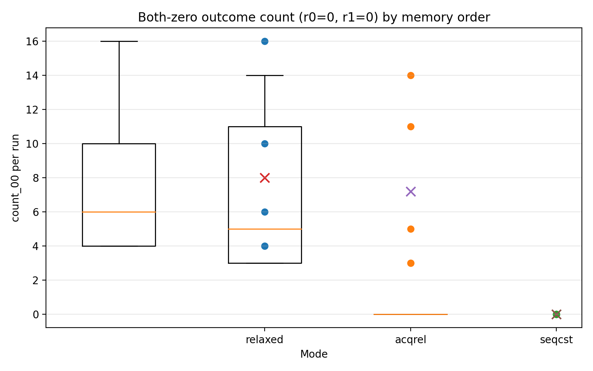
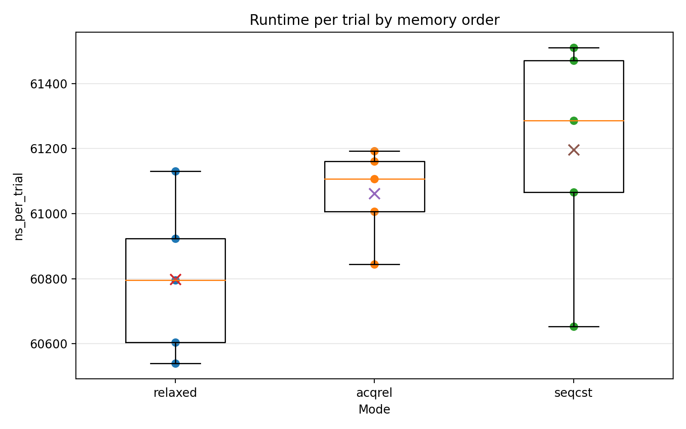

# 01-memory-ordering: Store Buffering and Atomic Memory Order

## Objective

This experiment investigates **memory ordering effects in multi-core systems** using C11 atomic operations.

Even when each thread performs a store before a load in program order, modern CPUs and compilers may expose these operations to other threads in a different order due to:

- store buffers
- cache coherence latency
- weak memory models

The goal of this experiment is to observe the classic **Store Buffering (SB) litmus test** and compare three memory ordering modes:

```

memory_order_relaxed
memory_order_acq_rel
memory_order_seq_cst

```

---

# Store Buffering Litmus Test

Two threads execute the following operations concurrently.

```

Thread 0:
x = 1
r0 = y

Thread 1:
y = 1
r1 = x

```

Initial state:

```

x = 0
y = 0

```

Possible outcomes:

| r0 | r1 | meaning |
|---|---|---|
| 0 | 0 | both reads missed the other's store |
| 0 | 1 | thread1's store observed |
| 1 | 0 | thread0's store observed |
| 1 | 1 | both stores observed |

The surprising case is:

```

r0 = 0
r1 = 0

```

This outcome appears when both loads execute before the other core's store becomes visible.

This behavior is possible due to **store buffering**.

---

# Experimental Setup

Machine:

```

CPU: x86_64
Compiler: GCC
Threads: 2
Iterations per run: 200000
Warmup: 5000

```

The test was repeated multiple times for each memory ordering mode.

---

# Results

## Both-Zero Outcome Frequency



Observed counts per run:

| mode | avg both-zero |
|---|---|
| relaxed | 8.0 |
| acqrel | 7.2 |
| seqcst | 0 |

Key observations:

- `relaxed` frequently produces the **both-zero** outcome.
- `acqrel` also allows the both-zero outcome.
- `seqcst` completely eliminates the both-zero case.

This demonstrates that:

> acquire-release ordering does not prevent the store-buffering outcome, but sequential consistency does.

---

# Outcome Distribution


Average outcome ratios:

| outcome | relaxed | acqrel | seqcst |
|---|---|---|---|
| 00 | ~0.00004 | ~0.000036 | 0 |
| 01 | ~0.49 | ~0.47 | ~0.47 |
| 10 | ~0.51 | ~0.53 | ~0.52 |
| 11 | ~0 | ~0 | small |

Interpretation:

Most executions fall into:

```

01
10

```

meaning one thread observes the other's store.

The **00 outcome is rare** because it requires both threads to read before the other store becomes visible.

---

# Runtime Cost



Average runtime:

| mode | ns per trial |
|---|---|
| relaxed | ~60780 |
| acqrel | ~61100 |
| seqcst | ~61200 |

Observation:

```

relaxed < acqrel < seqcst

```

The `seqcst` version is slightly slower due to stronger ordering constraints.

---

# Disassembly Analysis

Disassembly of `worker_main` reveals how the compiler implemented each memory order.

## Relaxed

```

mov [x],1
mov eax,[y]

```

No memory fence is emitted.

---

## Acquire/Release

```

mov [x],1
mov eax,[y]

```

On x86, acquire and release semantics are already satisfied by the architecture's memory model, so the compiler emits the same instructions as relaxed.

---

## Sequential Consistency

```

mov [x],1
mfence
mov eax,[y]

```

The `mfence` instruction enforces a full memory barrier.

This prevents the **store → load reordering** responsible for the both-zero outcome.

---

# Why Acquire/Release Does Not Prevent 00

Acquire-release ordering only creates a synchronization relationship when:

```

store_release(A)
load_acquire(A)

```

operate on the **same atomic variable**.

In this experiment:

```

Thread0 uses x then reads y
Thread1 uses y then reads x

```

No synchronization chain is formed.

Therefore the both-zero outcome remains possible.

---

# Why Sequential Consistency Prevents 00

Sequential consistency requires that all atomic operations appear in a **single global order** consistent with program order.

Under this model the following ordering cannot occur:

```

T0: load y
T1: load x
T0: store x
T1: store y

```

Therefore the `00` outcome becomes impossible.

---

# Conclusion

This experiment demonstrates three key insights about memory ordering:

1. **Relaxed atomics allow weak ordering behaviors such as store buffering.**

2. **Acquire-release ordering does not automatically prevent reordering when synchronization does not occur through the same atomic variable.**

3. **Sequential consistency enforces a stronger global ordering and eliminates the store-buffering outcome.**

Disassembly confirms that:

- relaxed and acqrel compile to identical instructions on x86
- seq_cst introduces an `mfence` barrier

Thus the experimental results directly reflect the underlying hardware memory model.

---

# References

- Sewell et al., *x86-TSO: A Rigorous and Usable Programmer's Model for x86 Multiprocessors*
- C11 Standard — Atomic Memory Order
- Intel® 64 Architecture Memory Ordering

---
