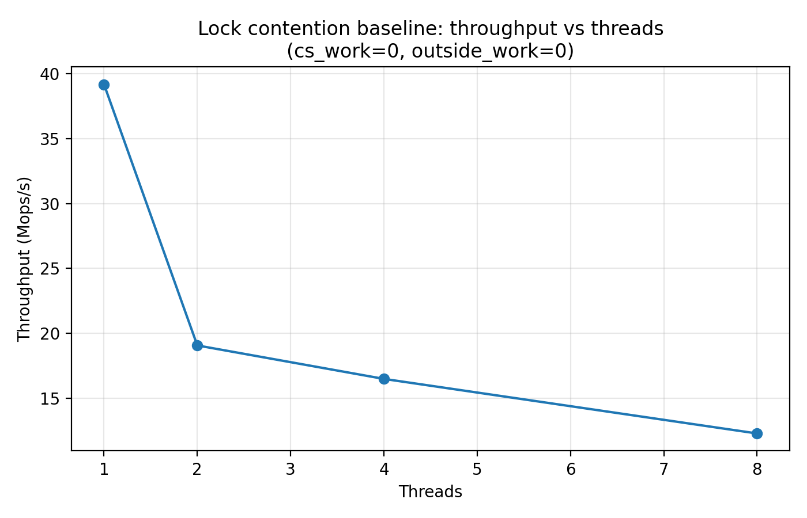
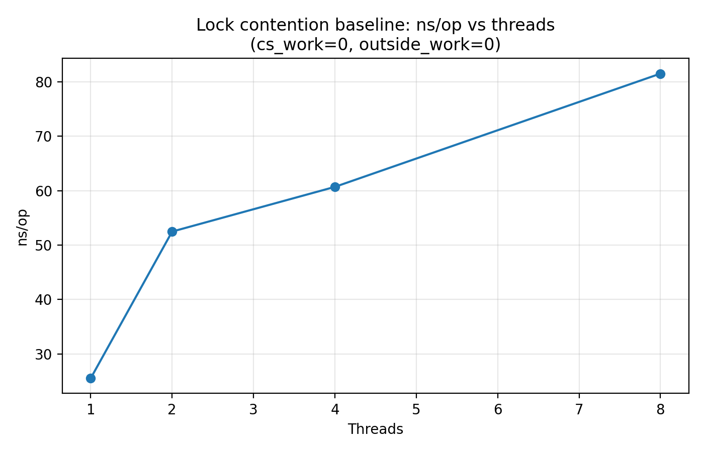
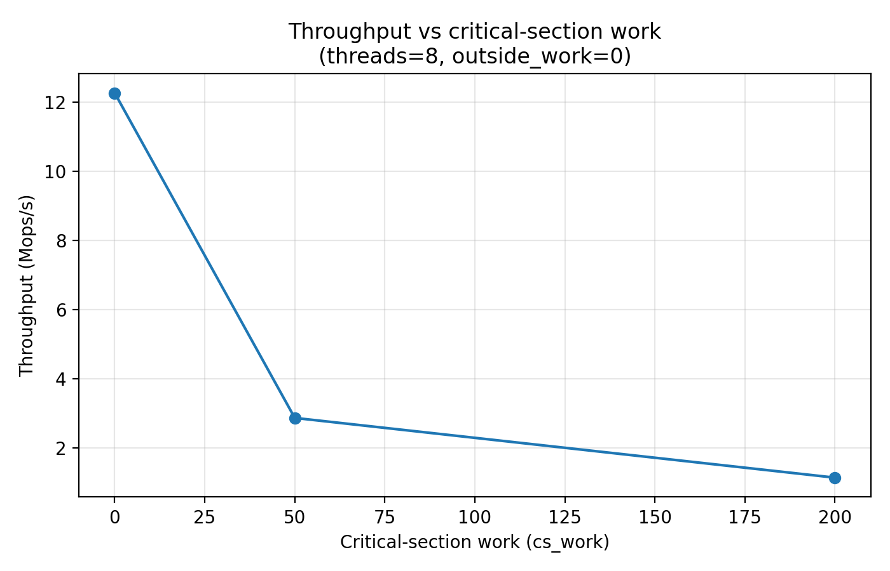
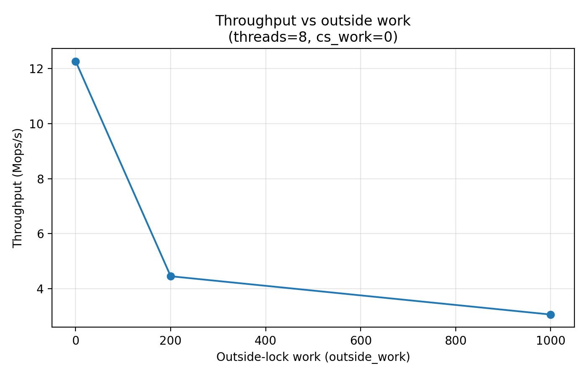

# 02-lock-contention

This experiment investigates **lock contention and scalability collapse** when multiple threads compete for a shared mutex.

The goal is to observe how:

- thread count
- critical-section length
- outside-lock work

affect system throughput and latency.

---

# Experimental Setup

Machine environment:

- OS: Linux (Ubuntu)
- CPU: x86_64
- Compiler: GCC
- Threading: pthread

Benchmark parameters:

| parameter | description |
|---|---|
| `threads` | number of worker threads |
| `iters_per_thread` | number of lock acquisitions per thread |
| `cs_work` | synthetic work inside critical section |
| `outside_work` | synthetic work outside lock |
| `pin_cpu` | thread CPU pinning |

Each worker thread repeatedly executes:

```

lock(mutex)
do cs_work
shared_counter++
unlock(mutex)

do outside_work

```

Total operations:

```

total_ops = threads × iters_per_thread

```

Metrics collected:

- elapsed time
- ns/op
- throughput (Mops/s)

---

# Correctness Verification

We verify that synchronization works correctly by checking:

```

final_counter = threads × iters_per_thread

```

Example output:

```

1000000 vs 1000000
2000000 vs 2000000

```

This confirms:

- no lost updates
- mutex synchronization correctness

---

# Results

## Throughput vs Threads

Baseline configuration:

```

cs_work = 0
outside_work = 0

```



Observed throughput:

| threads | throughput (Mops/s) |
|---|---|
|1|39.188|
|2|19.055|
|4|16.475|
|8|12.267|

Instead of scaling linearly, throughput **decreases as thread count increases**.

This demonstrates **centralized lock contention**.

---

## Latency per Operation



| threads | ns/op |
|---|---|
|1|25.52|
|2|52.48|
|4|60.70|
|8|81.52|

Latency increases with thread count due to:

- mutex queueing
- cache-line bouncing
- scheduler interaction

---

## Impact of Critical Section Length

Threads = 8



| cs_work | throughput (Mops/s) |
|---|---|
|0|12.267|
|50|2.870|
|200|1.143|

Increasing work inside the critical section causes a dramatic throughput drop.

Reason:

```

longer lock hold time
→ longer wait queue
→ contention amplification

```

---

## Impact of Outside-Lock Work

Threads = 8



| outside_work | throughput |
|---|---|
|0|12.267|
|200|4.455|
|1000|3.064|

Outside work reduces lock access frequency but increases total CPU work per operation.

Thus overall throughput decreases.

---

## Throughput Heatmap


The heatmap summarizes the interaction between:

- thread count
- critical section length

Two dominant patterns appear:

1. **thread count increase → throughput decline**
2. **critical section growth → severe contention**

---

# Analysis

## Centralized Lock Bottleneck

A single shared mutex introduces a serialization point.

As thread count increases:

```

lock contention ↑
→ waiting time ↑
→ throughput ↓

```

This explains why:

```

1 thread → 39 Mops/s
8 threads → 12 Mops/s

```

---

## Lock Hold Time Amplification

Critical-section length is one of the strongest factors affecting contention.

Even modest increases in `cs_work` drastically reduce performance.

This occurs because:

```

long critical section
→ longer lock hold
→ longer queue
→ cascading slowdown

```

---

## Practical Implications

Real systems rarely rely on a single global lock for high-throughput workloads.

Common solutions include:

- sharded locks
- per-thread counters
- lock-free data structures
- RCU-based synchronization

These techniques reduce centralized contention points.

---

# Key Takeaways

This experiment demonstrates three fundamental properties of lock-based concurrency:

1. **Shared locks limit scalability**

```

threads ↑ → throughput ↓

```

2. **Critical-section length strongly impacts contention**

```

cs_work ↑ → throughput collapse

```

3. **Workload structure affects lock pressure**

```

outside_work ↑ → lock frequency ↓

```

Understanding these factors is essential when designing scalable multi-threaded systems.

---

# Next Step

The next experiment investigates **thread-pool scaling**, focusing on how throughput evolves when task scheduling and worker pools are introduced.

---
