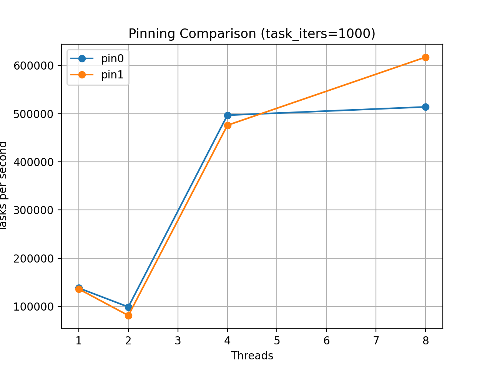

# 03-thread-pool-scaling

## Overview

In this experiment, we analyze how a simple thread pool scales with respect to:

- Number of worker threads
- Task granularity (amount of work per task)
- CPU pinning (affinity)

The goal is to understand **why increasing threads does not always lead to better performance**, and how real-world factors such as synchronization overhead and scheduling influence scalability.

---

## Experimental Setup

### Hardware

- CPU(s): 16 logical CPUs
- Cores: 8 physical cores
- Threads per core: 2 (SMT enabled)
- Socket: 1
- NUMA: 1

---

### Parameters

- Tasks: 20,000
- Task sizes:
  - 100
  - 1,000
  - 10,000
  - 100,000 iterations
- Threads:
  - 1, 2, 4, 8
- Queue capacity: 1024
- Warmup: 1 round

---

### Metrics

- `tasks_per_sec` (throughput)
- `elapsed_ns`
- Speedup (relative to 1 thread)
- Efficiency (speedup / threads)

---

## Results

### Throughput vs Threads


### Speedup vs Threads


### Efficiency vs Threads


### Pinning Comparison (task_iters=1000)



---

## Key Observations

### 1. Small Tasks: Parallelism Fails

For very small tasks (`task_iters=100`):

- Throughput decreases when increasing threads
- Speedup < 1 for all multi-threaded cases
- Efficiency collapses

**Reason:**

Thread pool overhead dominates:

- Mutex lock/unlock
- Condition variable wakeups
- Queue operations
- Scheduler involvement

> The cost of coordination exceeds the useful work.

---

### 2. Medium Tasks: Non-Monotonic Scaling

For `task_iters=1000`:

- 2-thread configuration performs worse than 1-thread
- 4 and 8 threads show significant improvement

This creates a **non-monotonic scaling curve**:

```

1 → 2 → worse
2 → 4 → much better
4 → 8 → better

```

**Interpretation:**

- At 2 threads:
  - Coordination cost exists
  - Parallel work is still insufficient

- At 4+ threads:
  - Parallel work becomes large enough
  - Overhead is amortized

> This reveals a "scaling valley" at low thread counts.

---

### 3. Large Tasks: Near-Ideal Scaling

For `task_iters=10000` and `100000`:

- Throughput increases consistently
- Speedup approaches linear scaling
- Efficiency remains high (~0.8–1.0)

**Reason:**

- Work per task dominates synchronization overhead
- Thread pool becomes compute-bound rather than coordination-bound

> This is the regime where parallelism is effective.

---

### 4. CPU Pinning: Not Universally Beneficial

From the pinning comparison:

- 2 threads:
  - Pinning often **reduces performance**
- 4 threads:
  - Mixed results
- 8 threads:
  - Pinning can **improve throughput**

**Interpretation:**

- Small worker counts:
  - OS scheduler may do a better job than fixed affinity
- Larger worker counts:
  - Reduced migration improves cache locality and stability

> CPU affinity is workload-dependent and scale-dependent.

---

### 5. Efficiency Trends

- Small tasks:
  - Efficiency collapses (< 0.2)
- Medium tasks:
  - Peak efficiency at moderate thread counts
- Large tasks:
  - Efficiency approaches 1.0

**Important Note:**

Some near-linear or slightly super-linear effects observed in raw data may be influenced by:

- CPU frequency scaling (turbo boost)
- Scheduling noise
- Measurement variance

---

## Conclusion

This experiment demonstrates that:

### 1. Thread count alone does not determine performance
More threads do not guarantee better performance.

---

### 2. Task granularity is critical
- Small tasks → overhead dominates
- Large tasks → parallelism dominates

---

### 3. Scaling is non-linear in real systems
- Performance may degrade before improving
- "Scaling valleys" can exist

---

### 4. CPU pinning is not always beneficial
- Helps in some regimes
- Hurts in others

---

## Takeaway

> A thread pool is not a free parallelism abstraction.  
> Its performance depends on the interaction between workload size, synchronization overhead, and system scheduling.

---

## Future Work

- Vary queue capacity
- Compare lock-free queue vs mutex queue
- Measure context switches (`perf`)
- Analyze CPU utilization per core
- Explore NUMA effects

---
