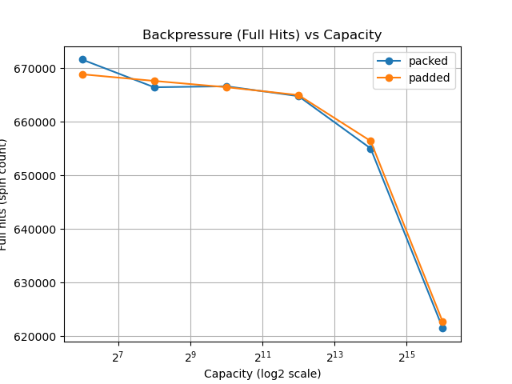

# 04-ring-buffer: Buffering, Backpressure, and Throughput

## Overview

This lab explores how a ring buffer behaves under different system conditions:

- Balanced producer/consumer
- Rate-limited producer
- Rate-limited consumer
- Bursty consumer (realistic case)

The goal is to understand:

> **Buffers are not about throughput — they are about backpressure and burst absorption**

---

## Experimental Setup

- SPSC ring buffer
- Modes:
  - `packed` (shared cache line)
  - `padded` (separated)
- CPU pinning:
  - producer → CPU 0
  - consumer → CPU 1

---

# Baseline: No Delay (Balanced System)

## Setup

- messages: 20,000,000
- no delay

## Results (best runs)

| mode   | capacity | ns/msg | Mmsgs/s |
|--------|---------|--------|--------|
| packed | 64      | ~9.89  | ~101   |
| packed | 1024    | ~10.85 | ~92    |
| padded | 1024    | ~11.45 | ~87    |
| padded | 65536   | ~11.13 | ~89    |

---

## Observation

- `packed` consistently faster (~10–15%)
- capacity has minor effect

---

## Interpretation

- head/tail are both read + written by both threads
- shared cache line improves locality

---

## Insight

> **False sharing is not always bad — communication patterns matter**

---

# Producer Delay (Incorrect Buffer Experiment)

## Setup

```c
push();
delay();   // delay=20
````

* messages: 1,000,000

## Results

| capacity | ns/msg |
| -------- | ------ |
| 64       | ~2058  |
| 1024     | ~2057  |
| 65536    | ~2057  |

---

## Observation

* Throughput extremely low (~0.48 Mmsgs/s)
* No difference across capacity or layout

---

## Limitation

* Producer is artificially slow
* Queue rarely fills

This is **NOT a buffering experiment**

---

## Insight

> This measures a *slow producer*, not buffer behavior

---

# Consumer Delay (Steady-State Bottleneck)

## Setup

```c
pop();
delay();   // delay=2
```

## Results

| capacity | ns/msg |
| -------- | ------ |
| 64       | ~213.5 |
| 1024     | ~213.4 |
| 65536    | ~214.1 |

---

## Observation

* Throughput stable (~4.68 Mmsgs/s)
* Almost no difference across capacity

---

## Limitation

* Constant delay → steady-state bottleneck
* Buffer only affects transient behavior

---

## Insight

> **Throughput is determined by the slowest stage**

---

# Bursty Consumer Delay (Final Experiment)

## Setup

```c
if (i % 256 == 0) {
    for (int j = 0; j < 200; ++j) cpu_relax();
}
```

* delay: 200
* messages: 1,000,000
* added metric: `full_hits`

---

# Results

## Throughput

| mode   | capacity | ns/msg |
| ------ | -------- | ------ |
| packed | 64       | ~87.47 |
| packed | 256      | ~83.65 |
| packed | 1024     | ~87.72 |
| padded | 256      | ~87.78 |
| padded | 4096     | ~87.78 |

Almost flat (~87–90 ns/msg)

---

## Backpressure (Full Hits)

| capacity | packed | padded |
| -------- | ------ | ------ |
| 64       | ~671k  | ~668k  |
| 256      | ~666k  | ~667k  |
| 1024     | ~666k  | ~666k  |
| 4096     | ~665k  | ~664k  |
| 16384    | ~654k  | ~656k  |
| 65536    | ~621k  | ~622k  |

---

## Plots

### Throughput


### Backpressure



---

# Key Findings

## Throughput is almost independent of buffer size

* Even under bursty load
* controlled by consumer speed

---

## Buffer size reduces backpressure

* larger buffer → fewer full hits
* burst absorbed instead of blocking producer

---

## Throughput alone is misleading

* looks identical across capacities
* but system behavior is very different

---

## Cache effects disappear under bottlenecks

* packed vs padded difference vanishes
* system imbalance dominates

---

# Final Insight

> **Buffers do not increase throughput.
> They reduce backpressure and absorb burstiness.**

---

# Systems Interpretation

| Concept     | Meaning      |
| ----------- | ------------ |
| ring buffer | queue        |
| full_hits   | backpressure |
| capacity    | buffer depth |

---

## Real-world implication

Increasing buffer:

*  does not improve throughput
*  reduces:

  * stalls
  * blocking
  * sensitivity to burst

---

# Conclusion

This lab demonstrates:

* microarchitecture matters (baseline)
* but system bottlenecks dominate (delay)
* buffers control **flow**, not **speed**

---


