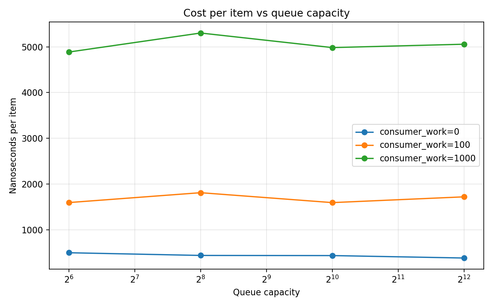
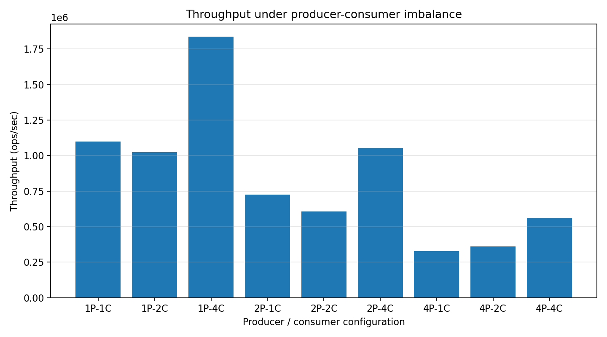
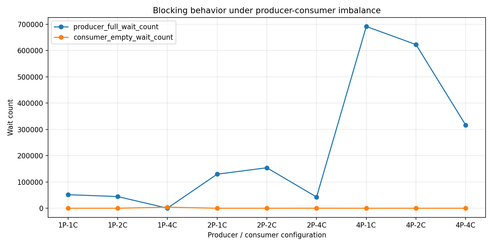

# 05-producer–consumer-queue

## 1. Overview

This lab studies a **bounded producer–consumer queue** implemented with:

- Ring buffer
- `pthread_mutex`
- `pthread_cond` (not_full / not_empty)

The goal is to understand:

- How queue capacity affects performance
- How producer–consumer imbalance manifests
- How backpressure emerges in real systems

---

## 2. Experiment Setup

### Parameters

- Producers: {1, 2, 4}
- Consumers: {1, 2, 4}
- Queue capacity: {64, 256, 1024, 4096}
- Workload:
  - `producer_work = 0`
  - `consumer_work ∈ {0, 100, 1000}`

### Metrics

- Throughput (ops/sec)
- ns per item
- Producer full-wait count
- Consumer empty-wait count
- Max observed queue depth

---

## 3. Results

---

### 3.1 Throughput vs Queue Capacity

#### Observations

- When `consumer_work = 0`, throughput improves with capacity
- When `consumer_work > 0`, throughput is almost constant

#### Interpretation

- Small queues introduce blocking overhead
- Larger queues help only when queue is the bottleneck
- Once compute dominates, queue capacity becomes irrelevant

#### Key Insight

> Throughput is not determined by queue size, but by service rate.

---

### 3.2 Cost per Item vs Queue Capacity

#### Observations

- With fast consumers, cost decreases slightly as capacity increases
- With slow consumers, cost is flat across capacities

#### Interpretation

- Queue overhead matters only when computation is cheap
- When computation dominates, queue behavior is hidden

#### Key Insight

> Queues cannot fix slow consumers.

---

### 3.3 Producer Backpressure vs Capacity

#### Observations

- With slow consumers (`consumer_work=1000`), producer wait count is very high
- Increasing capacity has little effect

#### Interpretation

- Producers are blocked because consumers cannot keep up
- Capacity increase does not eliminate backpressure

#### Key Insight

> Backpressure is governed by consumer speed, not buffer size.

---

### 3.4 Queue Depth vs Capacity

#### Observations

- Queue depth grows almost linearly with capacity
- Especially pronounced when consumer is slow

#### Interpretation

- The queue fills up and stays near full
- Increasing capacity increases buffering, not throughput

#### Key Insight

> A queue expands to match imbalance—it does not resolve it.

---

### 3.5 Throughput under Producer–Consumer Imbalance

#### Observations

- Best performance: more consumers than producers (e.g., 1P–4C)
- Worst performance: more producers than consumers (e.g., 4P–1C)

#### Interpretation

- System throughput is limited by the slower side
- Adding producers does not help if consumers are bottlenecked

#### Key Insight

> Throughput ≈ min(producer rate, consumer rate)

---

### 3.6 Blocking Behavior under Imbalance

#### Observations

- 4P–1C → producer wait dominates
- 1P–4C → consumer wait dominates
- Balanced configurations minimize both

#### Interpretation

- Wait counts directly reveal bottlenecks
- Blocking behavior reflects system imbalance

#### Key Insight

> Wait counts are a direct signal of bottleneck location.

---

## 4. Core Insights

### 4.1 Queue as a Decoupling Mechanism

A queue allows producers and consumers to run at different speeds, but only temporarily.

> It absorbs mismatch, but does not eliminate it.

---

### 4.2 Backpressure is Fundamental

When the consumer is slow:

- Queue fills
- Producers block
- System slows down upstream

This is **backpressure propagation**.

---

### 4.3 Capacity Has Diminishing Returns

- Too small → excessive blocking
- Moderate → optimal smoothing
- Too large → no benefit, only more buffering

---

### 4.4 Bottleneck Dominates Everything

The slowest stage determines system performance.

> Adding capacity or threads cannot overcome a fundamental bottleneck.

---

## 5. Real-World Relevance

These behaviors appear in real systems:

- Redis request queues
- Kafka message buffers
- Nginx worker pipelines
- Database connection pools

---

## 6. Conclusion

This lab demonstrates that:

- Queues are not performance boosters, but flow regulators
- Backpressure is a natural and necessary mechanism
- System performance is governed by service rate imbalance
- Queue capacity tuning has limited but important impact

---
