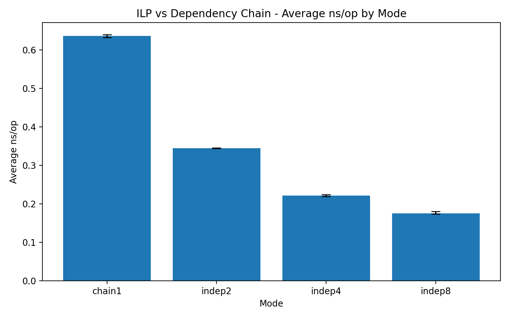
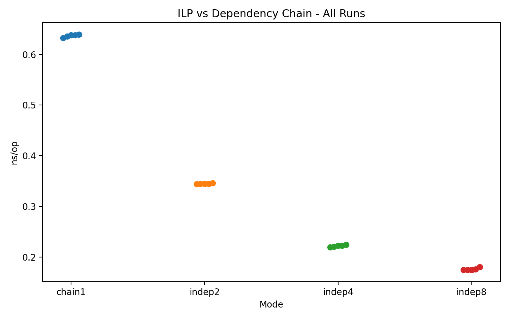

# 01-ilp-vs-dependency-chain

## Goal

This lab demonstrates the difference between:

- a **dependency chain**, where each operation depends on the previous result
- multiple **independent streams**, where the CPU can overlap execution and exploit instruction-level parallelism (ILP)

The key question is:

> If the arithmetic work is similar, why does performance change so much depending on dependency structure?

This experiment isolates core execution behavior by using register-resident integer arithmetic with minimal memory pressure.

---

## Hypothesis

A single dependency chain should be slower because each operation must wait for the previous result.

As the number of independent streams increases:

- the CPU should expose more instruction-level parallelism
- latency from one stream can be hidden by executing instructions from other streams
- `ns_per_op` should decrease

At some point, the gains should taper off due to issue width, execution-port limits, front-end throughput, or register pressure.

---

## Benchmark structure

Modes tested:

- `chain1`: one accumulator, fully serialized dependency chain
- `indep2`: two independent accumulators
- `indep4`: four independent accumulators
- `indep8`: eight independent accumulators

Each mode runs the same style of integer update sequence with add/xor operations.

The benchmark records:

- `elapsed_ns`
- `ops`
- `ns_per_op`

---

## Test environment

Example command:

```bash
./artifacts/bin/ilp_vs_dependency_chain --mode all --iters 200000000 --repeats 5 --warmup 1 --pin-cpu 0
````

Perf commands used for microarchitectural inspection:

```bash
perf stat \
  ./artifacts/bin/ilp_vs_dependency_chain --mode chain1 --iters 200000000 --repeats 1 --pin-cpu 0

perf stat \
  ./artifacts/bin/ilp_vs_dependency_chain --mode indep8 --iters 200000000 --repeats 1 --pin-cpu 0

perf stat -e cycles,instructions,branches,branch-misses \
  ./artifacts/bin/ilp_vs_dependency_chain --mode indep8 --iters 200000000 --repeats 1 --pin-cpu 0
```

System note:

* the machine exposes hybrid PMU output (`cpu_core/...`, `cpu_atom/...`)
* for interpretation, `cpu_core` numbers were used as the primary signal because nearly all counted work landed there

---

## Raw benchmark results

### Full runs

| mode   | elapsed_ns | ops        | ns_per_op |
| ------ | ---------- | ---------- | --------- |
| chain1 | 508466661  | 800000000  | 0.635583  |
| chain1 | 510555140  | 800000000  | 0.638194  |
| chain1 | 506172168  | 800000000  | 0.632715  |
| chain1 | 511781489  | 800000000  | 0.639727  |
| chain1 | 510448136  | 800000000  | 0.638060  |
| indep2 | 551950852  | 1600000000 | 0.344969  |
| indep2 | 550446301  | 1600000000 | 0.344029  |
| indep2 | 551176060  | 1600000000 | 0.344485  |
| indep2 | 553003801  | 1600000000 | 0.345627  |
| indep2 | 551750596  | 1600000000 | 0.344844  |
| indep4 | 706046096  | 3200000000 | 0.220639  |
| indep4 | 711369195  | 3200000000 | 0.222303  |
| indep4 | 712375259  | 3200000000 | 0.222617  |
| indep4 | 717698689  | 3200000000 | 0.224281  |
| indep4 | 702523369  | 3200000000 | 0.219539  |
| indep8 | 1126119895 | 6400000000 | 0.175956  |
| indep8 | 1118361880 | 6400000000 | 0.174744  |
| indep8 | 1115381956 | 6400000000 | 0.174278  |
| indep8 | 1154828622 | 6400000000 | 0.180442  |
| indep8 | 1116442460 | 6400000000 | 0.174444  |

---

## Summary statistics

### Best `ns/op`

| mode   | best ns/op |
| ------ | ---------- |
| chain1 | 0.632715   |
| indep2 | 0.344029   |
| indep4 | 0.219539   |
| indep8 | 0.174278   |

### Average `ns/op`

| mode   | avg ns/op |
| ------ | --------- |
| chain1 | 0.636856  |
| indep2 | 0.344791  |
| indep4 | 0.221876  |
| indep8 | 0.175973  |

### Speedup vs `chain1` (best basis)

| mode   | best ns/op | speedup vs chain1 |
| ------ | ---------- | ----------------- |
| chain1 | 0.632715   | 1.00x             |
| indep2 | 0.344029   | 1.84x             |
| indep4 | 0.219539   | 2.88x             |
| indep8 | 0.174278   | 3.63x             |

---

## Plots

### Best ns/op by mode


### Average ns/op by mode



### All runs



---

## Result interpretation

The benchmark behaved exactly as expected.

A single dependency chain (`chain1`) was the slowest mode:

* best `ns/op = 0.632715`

When the arithmetic was split into multiple independent streams, performance improved monotonically:

* `indep2`: `0.344029 ns/op`
* `indep4`: `0.219539 ns/op`
* `indep8`: `0.174278 ns/op`

This shows that the CPU was able to overlap work from different streams and hide the latency of one chain behind work from others.

The most important observation is that the improvement is not caused by changing the arithmetic itself, but by changing the **dependency structure**.

In other words:

* `chain1` is mainly **latency-bound**
* `indep8` moves much closer to **throughput-bound** execution

The gains also show diminishing returns:

* `chain1 -> indep2` gives a very large improvement
* `indep2 -> indep4` still gives a strong improvement
* `indep4 -> indep8` improves further, but less dramatically

That tapering is expected. Eventually the core approaches limits such as:

* issue width
* execution-port availability
* instruction delivery bandwidth
* register pressure

---

## Perf analysis

### `chain1` perf result

Core-side numbers:

* `cpu_core/instructions`: `2,429,605,468`
* `cpu_core/cycles`: `1,334,020,667`
* IPC: **1.82**
* `cpu_core/branch-misses`: `10,334` (`~0.00%`)
* top-down:

  * `tma_backend_bound`: **65.2%**
  * `tma_frontend_bound`: `4.1%`
  * `tma_bad_speculation`: `0.2%`
  * `tma_retiring`: **30.5%**

Interpretation:

* branch misprediction is negligible
* the front-end is not the main bottleneck
* the code is dominated by **backend stalls**
* because this benchmark keeps data in registers and avoids memory-heavy work, the most plausible cause is the long dependency chain exposing execution latency directly

### `indep8` perf result

Core-side numbers:

* `cpu_core/instructions`: `16,963,302,578`
* `cpu_core/cycles`: `2,941,213,248`
* IPC: **5.77**
* `cpu_core/branch-misses`: `18,600` (`0.01%`)
* top-down:

  * `tma_backend_bound`: **1.6%**
  * `tma_frontend_bound`: `2.7%`
  * `tma_bad_speculation`: `0.0%`
  * `tma_retiring`: **95.7%`

Explicit event run:

* `cpu_core/cycles`: `2,928,898,723`
* `cpu_core/instructions`: `16,955,982,905`
* IPC: **5.79**
* `cpu_core/branch-misses`: `22,206` (`0.01%`)

Interpretation:

* IPC increased dramatically from `1.82` to `5.79`
* backend-bound behavior collapsed from `65.2%` to `1.6%`
* retiring rose from `30.5%` to `95.7%`

This means the bottleneck did not merely become smaller; the execution character changed completely.

`chain1` is a code shape where the CPU often waits for dependent results.

`indep8` is a code shape where the out-of-order core can keep its execution machinery busy almost all the time.

---

## Main conclusion

This lab shows that performance is strongly shaped by dependency structure.

Even when the arithmetic pattern is similar:

* a tight dependency chain forces serialized execution and exposes latency
* multiple independent streams allow the CPU to overlap instructions and exploit ILP

Measured outcome:

* `chain1` best: `0.632715 ns/op`
* `indep8` best: `0.174278 ns/op`
* improvement: **about 3.63x**

Perf counters confirmed the same story:

* `chain1`: backend-bound, lower IPC
* `indep8`: retiring-dominant, much higher IPC

So the key lesson is:

> CPUs are often not slow because there is a lot of arithmetic.
> They are slow because dependencies prevent that arithmetic from being overlapped.

---

## Why this matters

This result directly explains why the following techniques often help:

* **loop unrolling**: creates more independent work
* **SIMD/vectorization**: processes many independent values at once
* **instruction scheduling**: rearranges code to reduce exposed latency
* **branchless transforms**: can reduce serialization and keep the pipeline fed

This lab is therefore a foundation for:

* `02-loop-unrolling`
* `03-simd-vs-scalar`
* `04-branchless-code`
* later `perf`-based counter analysis

---

## Limitations

This benchmark intentionally avoids most real-world complications.

So the results are clean, but simplified.

### 1. Minimal memory pressure

The working set stays mostly in registers.

That is good for isolating ILP, but real programs often interact with:

* cache misses
* load/store dependencies
* TLB effects
* memory-level parallelism limits

### 2. Integer toy kernel

The update sequence is a synthetic arithmetic loop.

Real workloads may include:

* different instruction mixes
* loads/stores
* branches
* compiler vectorization opportunities
* function call boundaries

### 3. Architecture dependence

Exact IPC ceilings and saturation points depend on:

* microarchitecture
* core type
* turbo/frequency state
* register renaming capacity
* front-end width and back-end resources

So the exact numbers are machine-specific, even though the qualitative trend is robust.

### 4. Hybrid CPU caveat

The machine reports both `cpu_core` and `cpu_atom` counters.

Most of the measured work landed on `cpu_core`, but hybrid scheduling and PMU reporting can still add noise.

---

## Takeaway

The lab clearly demonstrates a transition from:

* **latency-bound execution** with a single dependency chain

to

* **throughput-oriented execution** with many independent streams

That is one of the central ideas behind modern CPU performance optimization.

