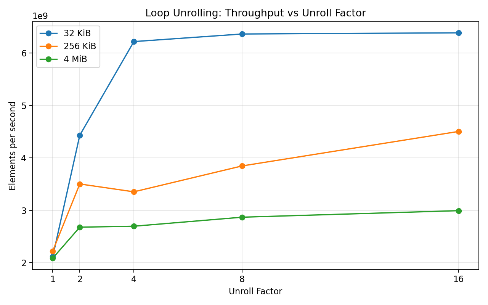

# 02-loop-unrolling

## Overview

This lab investigates the performance impact of **manual loop unrolling** on a simple scalar reduction kernel (array summation).

The goal is to isolate the effect of loop unrolling by:

- Disabling auto-vectorization (`-fno-tree-vectorize`)
- Keeping the computation identical
- Varying only the **unroll factor**: 1, 2, 4, 8, 16

We measure:

- Execution time
- ns per element
- Throughput (elements/sec)
- Hardware counters via `perf stat`

---

## Experimental Setup

- CPU: (hybrid architecture, core counters dominate)
- Compiler: `gcc -O3 -march=native -fno-tree-vectorize`
- Working set sizes:
  - 32 KiB (L1-friendly)
  - 256 KiB (L2-ish)
  - 4 MiB (larger, more memory influence)
- Kernel:
  - Scalar sum with a single accumulator
  - Manual unrolling applied

---

## Results

### 1. Throughput vs Unroll Factor

**Observations:**

- **32 KiB**
  - Throughput increases sharply from unroll 1 → 4
  - Saturates after unroll 4

- **256 KiB / 4 MiB**
  - Throughput continues to increase up to unroll 16
  - Saturation occurs later (or not yet)

---

### 2. ns per Element

**Observations:**

- 32 KiB:
  - ~0.47 → ~0.16 ns/element (≈3x improvement)
  - Minimal gain beyond unroll 4

- Larger working sets:
  - Gradual improvement across all unroll factors
  - Lower relative gains compared to 32 KiB

---

### 3. Speedup (Relative to Unroll=1)

| Working Set | Max Speedup |
|------------|------------|
| 32 KiB     | ~3.0x      |
| 256 KiB    | ~2.0x      |
| 4 MiB      | ~1.4x      |

**Observation:**

- Speedup ceiling decreases as working set size increases

---

## Microarchitectural Analysis (perf stat)

### Unroll = 1

- Branches: ~822M  
- Instructions: ~3.29B  
- IPC: ~3.98  
- Branch miss rate: ~0.03%

### Unroll = 4

- Branches: ~207M (**~4× reduction**)  
- Instructions: ~1.65B (**~2× reduction**)  
- IPC: ~5.71 (**peak**)  

### Unroll = 16

- Branches: ~52M (**~16× reduction**)  
- Instructions: ~1.03B  
- IPC: ~3.68 (**decreases**)  

---

## Key Insights

### 1. Loop unrolling reduces branch frequency, not branch misprediction

- Branch misprediction rate remains extremely low (<0.5%)
- Performance gains come from:
  - Fewer loop branches
  - Fewer loop-control instructions

> Loop unrolling is not about fixing branch prediction — it is about reducing how often branches are executed.

---

### 2. Instruction count per element decreases significantly

- Unroll 1: ~4 instructions per element  
- Unroll 4: ~2 instructions per element  
- Unroll 16: ~1.26 instructions per element  

This directly explains the performance improvement.

---

### 3. Performance saturates once loop overhead is no longer dominant

For 32 KiB:

- Unroll 1 → 4: large improvement  
- Unroll 4 → 16: almost no improvement  

Even though:

- Branches ↓↓↓  
- Instructions ↓↓↓  

Execution time no longer improves.

> This indicates that the bottleneck has shifted away from loop-control overhead.

---

### 4. IPC reveals the optimal unroll factor

- IPC peaks at **unroll 4**
- Larger unroll factors reduce IPC

This suggests:

- Front-end pressure (longer instruction sequences)
- Register pressure
- Reduced scheduling efficiency

> Excessive unrolling can hurt execution efficiency.

---

### 5. Working set size determines where saturation occurs

| Working Set | Bottleneck |
|------------|----------|
| 32 KiB     | Loop overhead |
| 256 KiB    | Mixed |
| 4 MiB      | Increasing memory influence |

- Small working set → early saturation
- Larger working set → delayed saturation

---

## Conclusion

Loop unrolling improves performance primarily by:

- Reducing branch frequency
- Reducing instruction count per element
- Increasing straight-line instruction execution

However:

- Gains exhibit **diminishing returns**
- Beyond a certain point, performance is limited by:
  - Execution bandwidth
  - Data dependencies
  - Memory access

> Loop unrolling is most effective when loop-control overhead is a dominant cost, but its benefits are bounded by other microarchitectural limits.

---

## Key Takeaway

> Loop unrolling is not a branch prediction optimization.  
> It is a **control overhead reduction technique** that increases instruction density —  
> and its effectiveness depends on where the true bottleneck lies.
