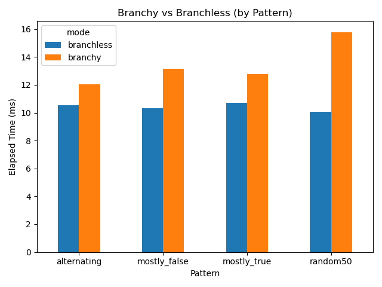
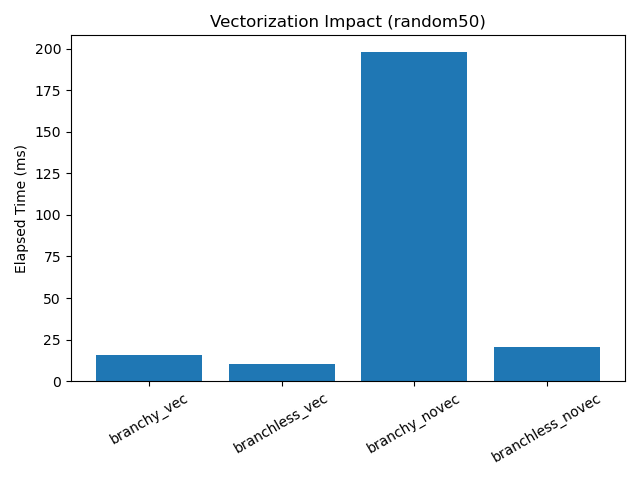

# 04-branchless-code

## Goal

This lab compares a traditional branch-based implementation with a branchless implementation.

The main question is:

> When does replacing control flow with data flow improve performance?

This lab is not only about branch misprediction.  
It also investigates whether branchless code enables better compiler optimization, especially auto-vectorization.

---

## Experiment Setup

Two implementations were compared.

### Branchy version

```c
if (data[i] >= threshold) {
    sum += weights[i];
}
```

### Branchless version

```c
uint64_t take = (uint64_t)(data[i] >= threshold);
sum += take * (uint64_t)weights[i];
```

The benchmark was tested with four input patterns:

| Pattern        | Meaning                           |
| -------------- | --------------------------------- |
| `random50`     | Roughly 50% true / 50% false      |
| `mostly_false` | Predicate is rarely true          |
| `mostly_true`  | Predicate is almost always true   |
| `alternating`  | True / false alternates regularly |

Each run used:

* elements: `1,048,576`
* repeats: `30`
* warmup: `3`
* pinned CPU: `0`
* compiler: `gcc -O3 -march=native`

---

## Result 1: Branchy vs Branchless by Pattern



Across all patterns, the branchless implementation was faster.

| Pattern        |  Branchy | Branchless | Observation             |
| -------------- | -------: | ---------: | ----------------------- |
| `random50`     | ~15.8 ms |   ~10.1 ms | Branchless wins clearly |
| `mostly_false` | ~13.1 ms |   ~10.3 ms | Branchless still wins   |
| `mostly_true`  | ~12.8 ms |   ~10.7 ms | Branchless still wins   |
| `alternating`  | ~12.0 ms |   ~10.6 ms | Branchless still wins   |

The result is interesting because branchless code won even in predictable cases such as `mostly_true`, `mostly_false`, and `alternating`.

This suggests that the benefit is not only from avoiding branch misprediction.

---

## Result 2: Vectorization Impact

To isolate the effect of compiler auto-vectorization, the same random50 case was compiled twice:

```bash
gcc -O3 -march=native src/branchless_code.c -o artifacts/bin/branchless_code_vec

gcc -O3 -march=native -fno-tree-vectorize src/branchless_code.c -o artifacts/bin/branchless_code_novec
```



| Build        | Mode       |      Time |
| ------------ | ---------- | --------: |
| vectorized   | branchy    |  ~15.8 ms |
| vectorized   | branchless |  ~10.6 ms |
| no-vectorize | branchy    | ~198.0 ms |
| no-vectorize | branchless |  ~20.8 ms |

This is the most important result in the lab.

Disabling vectorization caused a large slowdown:

* branchy: ~15.8 ms → ~198.0 ms
* branchless: ~10.6 ms → ~20.8 ms

The branchless implementation became slower without vectorization, which confirms that SIMD was a major contributor.

However, branchless without vectorization was still much faster than branchy without vectorization:

```text
branchless_novec: ~20.8 ms
branchy_novec:    ~198.0 ms
```

So the branchless advantage was not only SIMD.

---

## Perf Counter Observation

For the `random50` case, `perf stat` showed that branch misses were not the only explanation.

The branchy and branchless versions had similar branch-miss rates in some runs, but branchless still executed fewer instructions and completed faster.

This means the performance difference came from multiple effects:

1. fewer effective instructions,
2. better straight-line execution,
3. easier compiler optimization,
4. SIMD/vectorization opportunities.

---

## Interpretation

The common simplified explanation is:

> Branchless code is faster because it avoids branch misprediction.

This lab shows a deeper picture.

Branchless code converts control dependency into data dependency.

### Branchy code

```text
condition -> branch -> different control paths
```

This creates control-flow dependency.
The CPU and compiler must deal with possible jumps.

### Branchless code

```text
condition -> mask/value -> arithmetic
```

This creates a straight-line data-flow structure.
That structure is easier to pipeline and easier to vectorize.

The assembly inspection also showed vector instructions such as:

```asm
vpcmpeqd
vpand
vpaddq
vpmaskmovd
```

These indicate that the compiler generated SIMD-style mask operations for the optimized build.

---

## Key Takeaways

1. Branchless code was faster across all tested input patterns.
2. The biggest performance story was not only branch prediction.
3. Branchless code enabled better compiler optimization and SIMD-style execution.
4. Disabling vectorization hurt both implementations, but especially exposed how bad scalar branch-heavy code can become.
5. Branchless code should be understood as a structural transformation:

   * from control flow to data flow,
   * from scalar branching to mask-friendly computation,
   * from predictor-dependent execution to more regular execution.

---

## Final Conclusion

Branchless code is not simply a trick for avoiding branch misprediction.

In this lab, branchless code was faster because it produced a more optimization-friendly execution structure.

The most important lesson is:

> Branchless code can make the program more SIMD-friendly and pipeline-friendly by replacing control-flow dependency with data-flow dependency.

This is why branchless code remained strong across random, skewed, and alternating input patterns.

