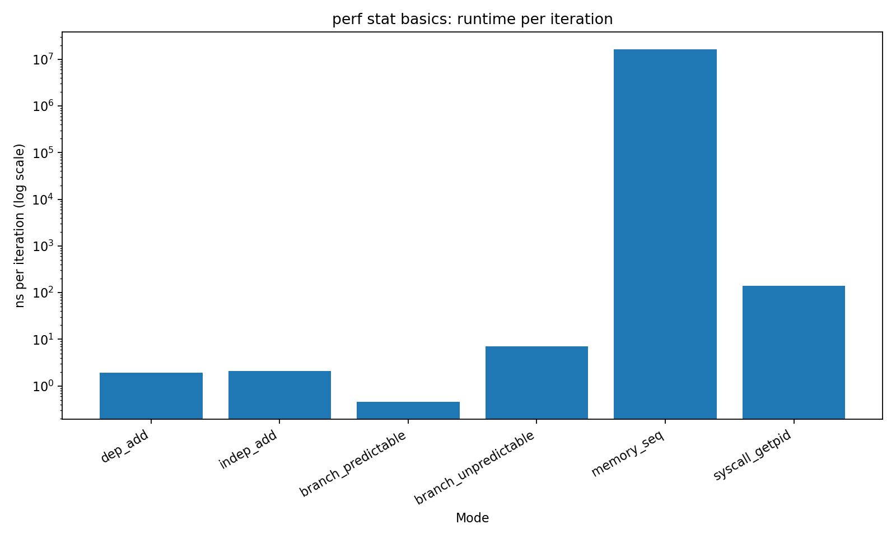
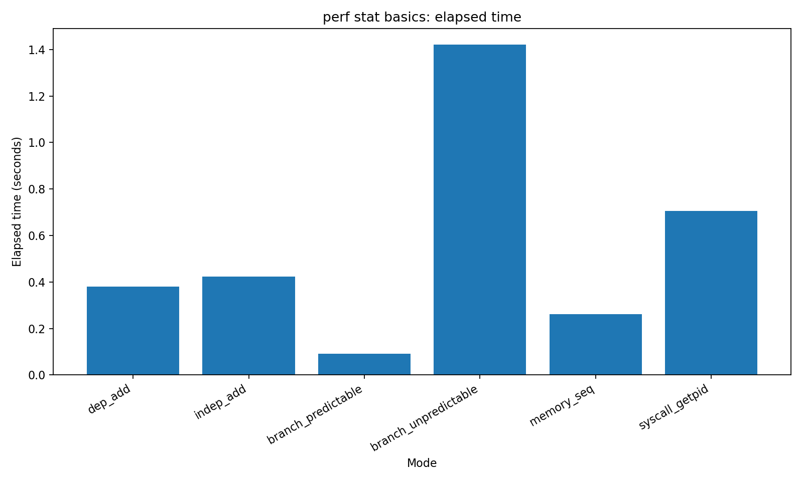
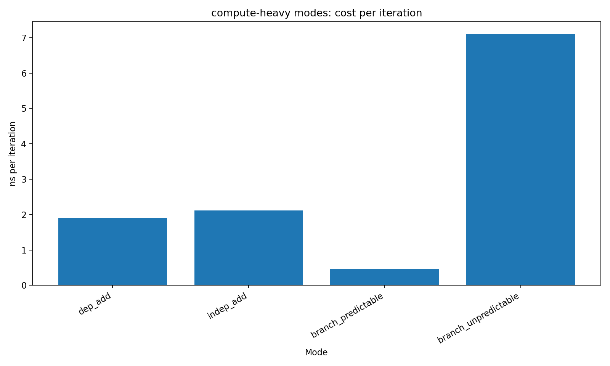
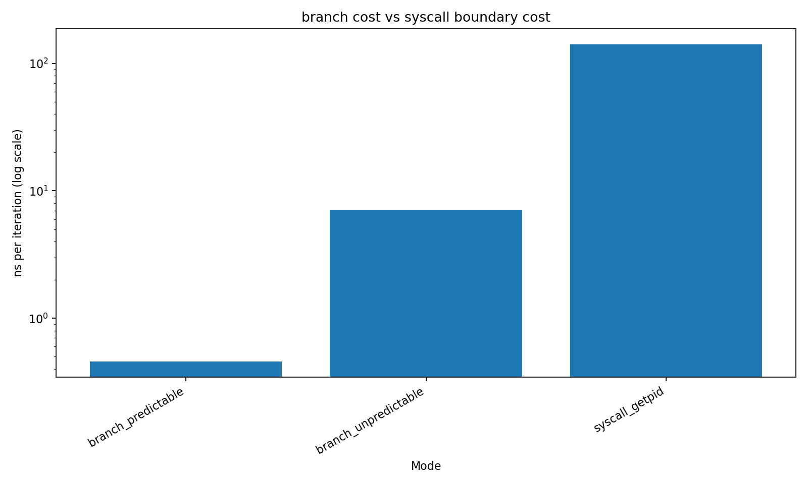

# 00-perf-stat-basics

## 📌 Overview

This experiment introduces how to interpret `perf stat` counters by running several workloads with fundamentally different performance characteristics:

- CPU dependency vs ILP (Instruction-Level Parallelism)
- Branch prediction behavior
- Memory-bound workload
- Syscall (kernel boundary) overhead

The goal is **not optimization**, but learning how to map performance numbers to real CPU behavior.

---

## 🧪 Experimental Setup

Each workload is executed with:

```bash
perf stat -e cycles,instructions,branches,branch-misses,cache-references,cache-misses
```

Collected metrics:

* cycles
* instructions
* IPC (instructions per cycle)
* branch-misses
* cache-misses

---

## 📊 Results

### 1. Runtime per Iteration (log scale)



### Key Observations

* `branch_predictable` is the fastest (~0.4 ns)
* `dep_add` and `indep_add` are similar (~2 ns)
* `branch_unpredictable` is significantly slower (~7 ns)
* `syscall_getpid` is much slower (~100+ ns)
* `memory_seq` dominates everything (orders of magnitude higher)

### Insight

```
CPU compute < branch misprediction < syscall < memory
```

---

### 2. Total Elapsed Time



### Observations

* `branch_unpredictable` is the slowest among compute workloads
* `memory_seq` shows noticeable cost due to memory access
* `syscall_getpid` spends a large portion of time in kernel mode

---

### 3. Compute-heavy Modes



### Observations

* `dep_add` is slightly faster than `indep_add`
* `branch_predictable` is extremely efficient
* `branch_unpredictable` shows a large slowdown

### Insight

Even though `indep_add` has higher IPC, it is not faster.

Reason:

* `indep_add` executes significantly more instructions
* Higher IPC does not guarantee lower execution time

```
Performance ≠ IPC only
Performance = (instructions / IPC)
```

---

### 4. Branch vs Syscall Cost



### Observations

* Branch misprediction increases cost (~7 ns)
* Syscall boundary crossing is far more expensive (~140 ns)

### Insight

```
One syscall ≈ dozens of branch mispredictions
```

---

## 🔬 perf stat Analysis

### 1. Dependency vs ILP

| Mode      | IPC  |
| --------- | ---- |
| dep_add   | ~1.2 |
| indep_add | ~4.4 |

* `dep_add`: dependency chain limits parallel execution
* `indep_add`: independent instructions enable ILP

---

### 2. Branch Prediction

| Mode                 | Branch Miss Rate |
| -------------------- | ---------------- |
| branch_predictable   | ~0%              |
| branch_unpredictable | ~20%             |

Impact:

* High misprediction rate → pipeline flush
* IPC drops to ~1
* Execution time increases drastically

---

### 3. Memory Behavior

* `memory_seq` shows high cache miss rate
* Dataset exceeds cache capacity
* Memory latency dominates execution

---

### 4. Syscall Cost

* Significant time spent in kernel mode (`sys`)
* Not a CPU compute problem
* Represents OS boundary overhead

---

## 🧠 Key Takeaways

### 1. IPC is not everything

High IPC does not guarantee better performance.

---

### 2. Branch misprediction is extremely expensive

Even simple unpredictable branches can degrade performance significantly.

---

### 3. Memory dominates everything

Once working set exceeds cache:

```
Performance becomes memory-bound
```

---

### 4. Syscalls are expensive

Crossing user/kernel boundary has a high fixed cost.

---

## 🚀 What’s Next

This experiment answers:

```
"What is slow?"
```

Next steps:

* `perf record` → identify hotspots
* `flamegraph` → visualize execution time distribution
* `counter-analysis` → explain *why* it is slow

---

## 🔥 Summary

This lab demonstrates the four fundamental performance regimes:

* CPU-bound (compute / ILP)
* Branch-bound (prediction)
* Memory-bound (cache / DRAM)
* Kernel-bound (syscall)

Understanding these categories is essential for real-world performance analysis.

