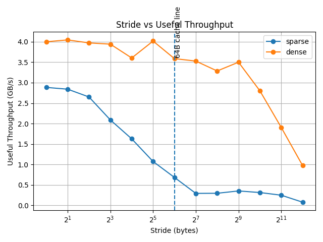
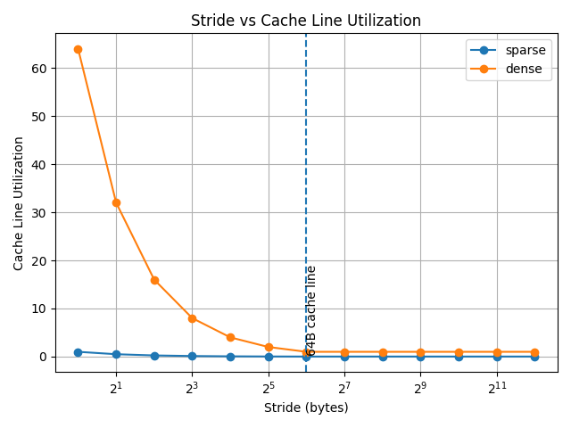

# 00-Cache Line Effect: Measuring Spatial Locality

This lab investigates how memory is transferred at cache-line granularity and how spatial locality affects performance.

We experimentally compare two access patterns:

- **Sparse**: touch 1 byte per step
- **Dense**: touch 64 bytes per step (full cache-line utilization)

---

## Experimental Setup

- Working set size: **8 MB**
- Repetitions: **16**
- Flush policy: `once`
- Compiler flags: `-O2 -march=native`
- Assumed cache line size: **64 bytes**

Two throughput metrics are measured:

### Useful Throughput

```

useful_GBps = bytes_touched / elapsed_time

```

Represents the actual bytes accessed by the program.

### Traffic Throughput

```

traffic_GBps = estimated_cacheline_bytes / elapsed_time

```

Represents memory movement at cache-line granularity.

Additionally:

```

utilization = useful_GBps / traffic_GBps

```

This approximates how efficiently each fetched cache line is used.

---

## Key Observation at Stride = 64 Bytes

At stride = 64 bytes, each access aligns with a cache-line boundary.

| stride | mode   | useful_GBps | traffic_GBps | utilization |
|--------|--------|------------|-------------|-------------|
| 64     | dense  | 3.588      | 3.588       | 1.000       |
| 64     | sparse | 0.683      | 43.702      | 0.015625    |

---

## Interpretation

### Cache-Line Utilization

Sparse mode:

```

utilization ≈ 0.015625 ≈ 1 / 64

```

This means:
- Each 64-byte cache line fetch provides only 1 useful byte.
- 63 bytes are fetched but unused.

Dense mode:

```

utilization ≈ 1.0

```

This means:
- The entire cache line is used.
- No spatial locality is wasted.

---

## Visual Analysis

### Useful Throughput



### Cache Line Utilization



The vertical line at 64 bytes highlights the cache-line boundary.

We observe a sharp divergence between sparse and dense modes at this point.

---

## Conclusion

This experiment empirically demonstrates:

1. Memory is transferred in fixed-size cache-line units (≈64 bytes).
2. Sparse access patterns waste most of each fetched cache line.
3. Dense access patterns fully utilize each cache line.
4. Measured utilization closely matches `1 / cache_line_size`.

The results provide strong experimental evidence of cache-line granularity and the impact of spatial locality.

---

## Limitations

- Cache line size was assumed to be 64 bytes.
- Prefetching may influence small-stride behavior.
- Traffic estimation for stride < 64 is a lower-bound approximation.
- CPU frequency scaling and background load may introduce noise.

---

## Repository

Source code and full benchmark data are available in:

```
02-memory-hierarchy/00-cache-line-effect

```


