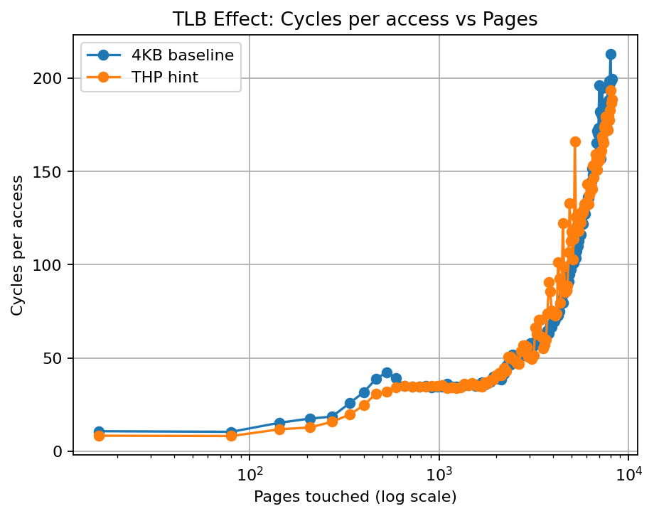

# 02-tlb-effect

Modern CPUs use **virtual memory**, which means every memory access requires a translation from a **virtual address** to a **physical address**.

To make this translation fast, CPUs include a hardware cache called the **Translation Lookaside Buffer (TLB)**.

This lab explores how TLB capacity affects memory access latency.

---

# Experiment Setup

We measure the latency of memory accesses while increasing the number of distinct pages touched.

To avoid hardware prefetch effects, the experiment uses **pointer chasing**, where each memory access depends on the result of the previous one:

```c
p = *p;
````

This creates a strict dependency chain and forces the CPU to perform address translation for every access.

---

# Large Working Set Sweep

First, we sweep a large range of pages.

```
CPU=1
MAX_PAGES=8192
STEP_PAGES=64
ITERS=5000000
WARMUP=500000
```

Maximum working set size:

```
8192 pages × 4KB ≈ 32MB
```

---

## Result



Observed latency:

```
baseline latency ≈ 10.7 cycles
max latency ≈ 213 cycles
slowdown ≈ 20×
```

---

## Interpretation

The final latency (~200 cycles) is close to typical **DRAM latency**.

This indicates that the experiment eventually reaches the point where memory accesses require:

```
TLB miss
+ cache miss
+ DRAM access
```

Thus, the knee observed in this configuration reflects the **memory hierarchy transition**, not purely the TLB capacity.

---

# TLB Window Sweep

To isolate the TLB effect, we restrict the working set to a smaller range.

```
CPU=1
MIN_PAGES=32
MAX_PAGES=2048
STEP_PAGES=32
ITERS=15000000
WARMUP=1000000
```

Working set range:

```
32 pages → 2048 pages
128KB → 8MB
```

This keeps most accesses within the CPU cache hierarchy.

---

## Result


Measured values:

```
knee pages ≈ 1408
knee size ≈ 5.5MB

baseline latency ≈ 17.8 cycles
max latency ≈ 74 cycles
slowdown ≈ 4.2×
```

---

# TLB Reach

The effective coverage of a TLB can be estimated as:

```
TLB Reach = TLB Entries × Page Size
```

For example:

```
STLB entries ≈ 1500
page size = 4KB
```

Coverage:

```
1500 × 4KB ≈ 6MB
```

Our measured coverage:

```
1408 × 4KB ≈ 5.5MB
```

This closely matches the expected capacity of the **second-level TLB (STLB)** on modern x86 processors.

---

# TLB Architecture

A simplified TLB hierarchy:

```
Virtual Address
      │
      ▼
+------------------+
|   L1 Data TLB    |
| (~64 entries)    |
+------------------+
      │ miss
      ▼
+------------------+
|   L2 TLB (STLB)  |
| (~1500 entries)  |
+------------------+
      │ miss
      ▼
+------------------+
| Page Table Walk  |
| (memory access)  |
+------------------+
      │
      ▼
Physical Address
```

The L1 TLB is small but extremely fast, while the second-level TLB provides a much larger coverage.

If both levels miss, the CPU must perform a **page table walk**, which requires multiple memory accesses.

---

# Why Pointer Chasing

Modern CPUs contain hardware prefetchers that attempt to predict future memory accesses.

If we used a simple loop:

```c
for (i = 0; i < N; i++)
    sum += array[i * stride];
```

the hardware prefetcher might preload data and hide latency.

Pointer chasing avoids this problem:

```c
p = *p;
```

Each access depends on the previous one:

```
access(i+1) depends on access(i)
```

This prevents the CPU from issuing memory requests in parallel and exposes the true latency of each memory access.

---

# Conclusion

This experiment demonstrates that memory performance depends not only on **cache locality** but also on **address translation locality**.

The large working set sweep reveals the dramatic slowdown when accesses reach **DRAM latency (~200 cycles)**.

By restricting the working set, the TLB window sweep captures the **TLB capacity effect**, showing a clear knee around **5.5MB**, consistent with the expected coverage of the second-level TLB.

Even when data fits within the cache hierarchy, exceeding the TLB capacity can still introduce significant performance penalties.
