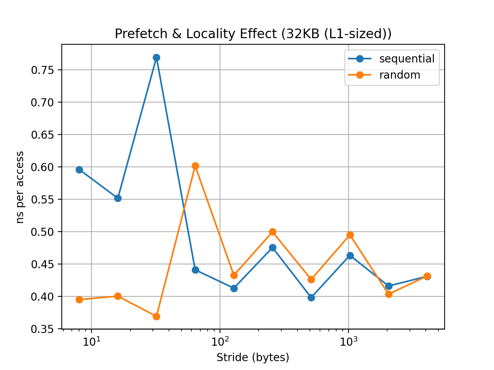
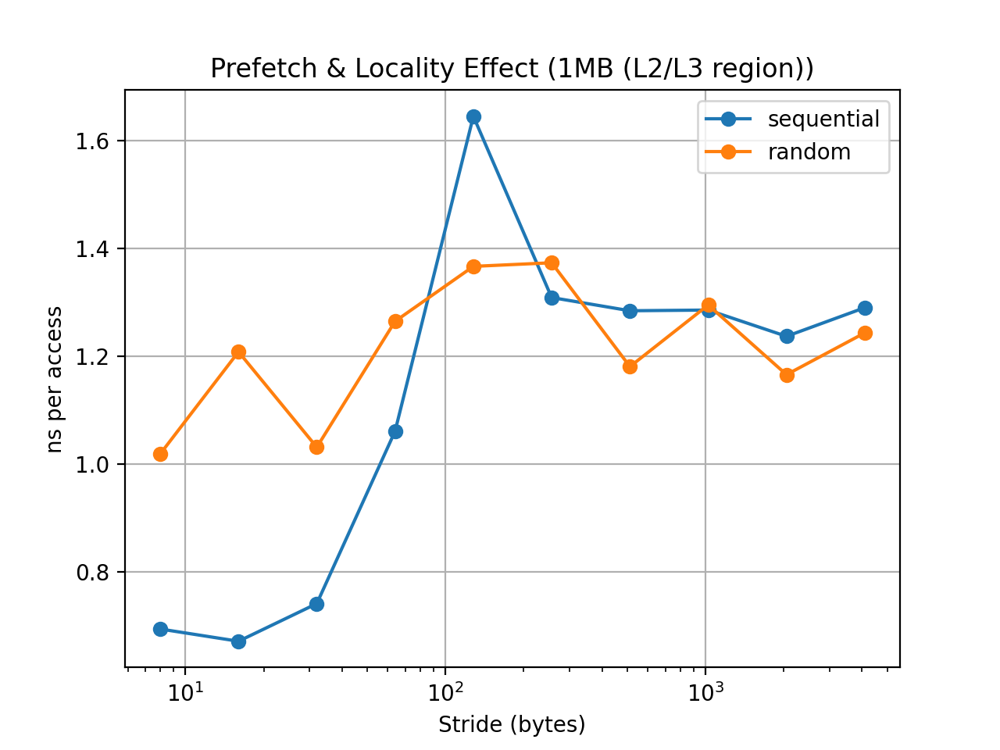

# 03-prefetch-and-locality

Modern CPUs rely heavily on **hardware prefetching** and **spatial locality** to hide memory latency.

This experiment demonstrates how memory access patterns influence performance.

---

## The Idea

Two traversal patterns are compared:

- Sequential traversal
- Random traversal

Both access the **same set of memory locations**, but in different orders.

Sequential traversal allows hardware prefetchers to predict future accesses.

Random traversal breaks this predictability.

---

## Experimental Setup

The benchmark accesses a large array while varying:

- working set size
- stride size
- access order

Working set sizes:

- 32KB (L1-sized)
- 1MB (L2/L3 region)
- 64MB (DRAM)

Stride sizes:

8B → 4096B

Each test performs roughly **64 million memory accesses**.

---

## Results

### L1-sized working set

When the working set fits entirely inside L1 cache, access pattern has little impact.

---

### L2/L3 region

Sequential traversal begins to outperform random access.

Hardware prefetchers become effective here.

---

### DRAM-scale dataset

The difference becomes dramatic:

- Sequential access remains relatively efficient
- Random access incurs significantly higher latency

---

## Why This Happens

Modern CPUs fetch memory in **cache-line units** (typically 64 bytes).

Sequential traversal:

- uses most of each cache line
- allows prefetchers to detect patterns

Random traversal:

- wastes cache lines
- prevents prefetch prediction
- exposes full DRAM latency

---

## Takeaway

Memory access patterns can dominate performance.

Even when algorithms perform the same number of loads, sequential access may be **several times faster** than random access.

Designing cache-friendly data structures and traversal patterns is therefore crucial for high-performance systems.
