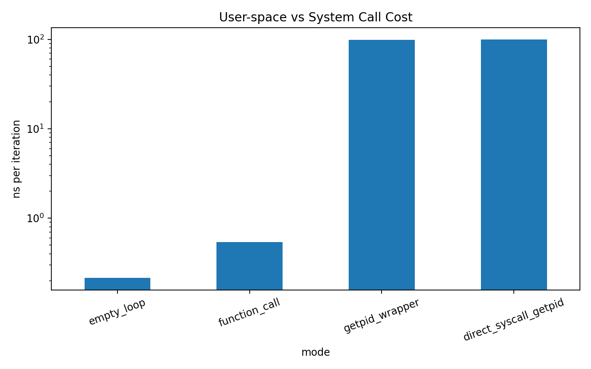

# 00-syscall-cost

Modern software frequently interacts with the operating system through **system calls (syscalls)**.  
Although syscalls provide essential services such as file I/O, process management, and networking, they require crossing the **user–kernel boundary**, which introduces non-trivial overhead.

This experiment measures the cost of a minimal syscall and compares it with normal user-space execution.

---

# Why Measure System Call Cost?

User-space code runs in **unprivileged mode**, while the operating system runs in **kernel mode**.

A system call must perform the following steps:

1. Switch from user mode to kernel mode
2. Execute kernel-side logic
3. Return back to user mode

Even when the kernel performs very little work, the privilege transition itself has a measurable cost.

Understanding this cost is important for performance-sensitive systems because:

- Frequent syscalls can become a bottleneck
- Small I/O operations may suffer from syscall overhead
- High-performance systems often batch operations to reduce kernel interactions

---

# Experiment Design

We compare four scenarios:

| Mode | Description |
|-----|-------------|
| empty_loop | Baseline loop overhead |
| function_call | Simple user-space function call |
| getpid_wrapper | libc wrapper (`getpid()`) |
| direct_syscall_getpid | direct syscall (`syscall(SYS_getpid)`) |

This allows us to isolate the cost of crossing the **user–kernel boundary**.

---

# Benchmark Configuration

iterations = 10,000,000
repeats = 5
CPU pinning = enabled
clock source = CLOCK_MONOTONIC

The benchmark measures:

elapsed_ns
ns_per_iter

Results are stored in:

artifacts/data/syscall_cost.csv

---

# Results

Average values across 5 runs:

| Mode | Mean (ns per iteration) |
|-----|--------------------------|
| empty_loop | ~0.23 ns |
| function_call | ~0.54 ns |
| getpid_wrapper | ~98 ns |
| direct_syscall_getpid | ~99 ns |

---

# Visualization

The figure shows the average cost per iteration.

Two observations immediately stand out:

- User-space execution is extremely cheap
- Syscalls are roughly **two orders of magnitude more expensive**

---

# Key Observations

## 1. User-space execution is extremely fast

A simple function call costs roughly:

~0.5 ns

This corresponds to only a few CPU cycles.

---

## 2. System calls are about 200× slower

A minimal syscall (`getpid`) costs approximately:

~100 ns

Relative cost:

syscall / function_call ≈ 100 ns / 0.54 ns ≈ 185×

Even the simplest syscall is roughly **two orders of magnitude more expensive** than a normal function call.

---

## 3. libc wrapper overhead is negligible

Comparing:

getpid()
syscall(SYS_getpid)

shows almost identical results.

| Mode | Mean ns |
|-----|---------|
| getpid_wrapper | ~98 |
| direct syscall | ~99 |

This indicates that the majority of the cost comes from the **kernel boundary crossing**, not from the libc wrapper.

---

# Estimated CPU Cycle Cost

Assuming a CPU frequency of **3–4 GHz**:

1 cycle ≈ 0.25–0.33 ns

Therefore:

100 ns ≈ 300–400 cycles

This aligns well with commonly reported syscall entry/exit costs on modern x86 systems.

---

# Why This Matters

Because syscalls are expensive relative to user-space operations, high-performance software often tries to:

- batch system calls
- buffer I/O operations
- avoid very small reads/writes
- minimize kernel transitions

This principle is widely used in systems such as:

- high-performance web servers
- database engines
- networking stacks

---

# Limitations

This experiment measures a **minimal syscall (`getpid`)**.

Real-world syscalls may involve additional overhead due to:

- disk I/O
- scheduler interactions
- memory allocation
- blocking operations

Additionally, measurements may vary depending on:

- CPU frequency scaling
- background processes
- kernel version
- hardware architecture

---

# Conclusion

This experiment confirms a key systems performance insight:

empty loop ≈ 0.2 ns
function call ≈ 0.5 ns
minimal syscall ≈ 100 ns

Even the lightest system call is roughly **two orders of magnitude more expensive** than a typical user-space function call.

The difference arises from the **user–kernel privilege boundary**, making syscall frequency a critical factor in performance-sensitive systems.
