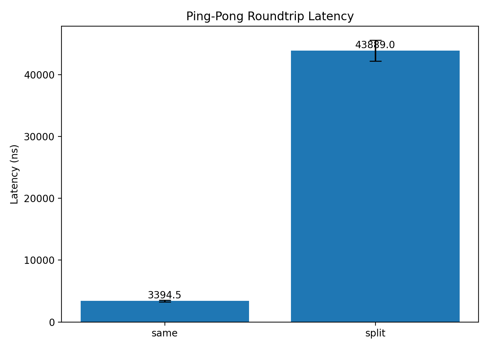
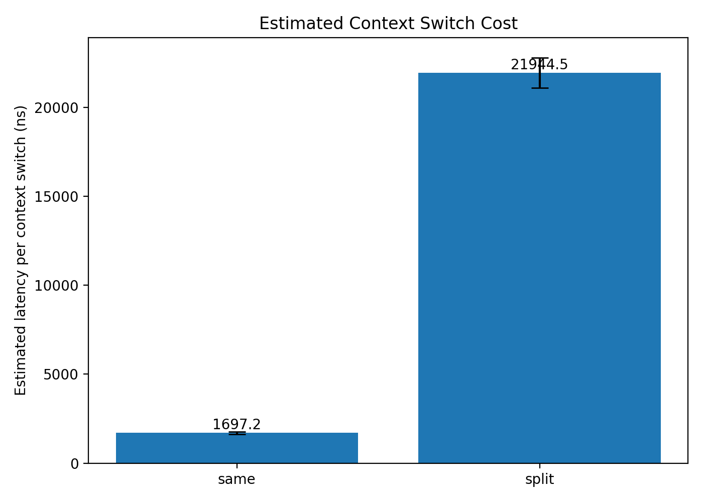
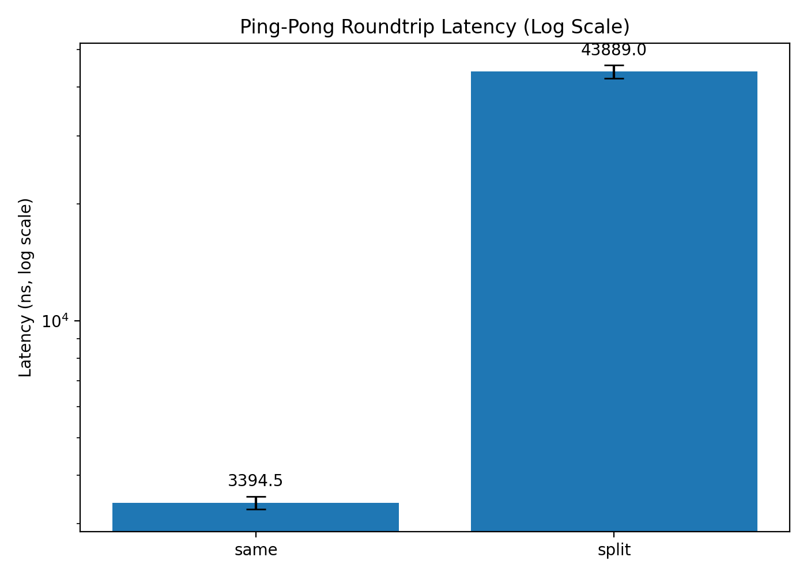

# 01-context-switch

# Context Switch Cost

In this lab we measure the latency of **process hand-offs across the operating system boundary**.

Modern systems constantly switch execution between tasks:

- processes
- threads
- kernel tasks
- interrupt handlers

Each transition requires a **context switch**, where the scheduler suspends one task and resumes another.

Understanding the cost of this operation is fundamental to systems performance.

---

# Experiment Goal

The goal of this experiment is to estimate the latency of a context switch.

We approximate this cost using a **ping-pong benchmark** between two processes.

```

parent → child → parent

```

Each round-trip involves two scheduler hand-offs:

1. parent blocks and child wakes up
2. child blocks and parent wakes up

Therefore we estimate:

```

context_switch_cost ≈ roundtrip_latency / 2

```

This estimate includes additional overhead such as:

- pipe syscall cost
- scheduler wakeup latency
- cache and TLB effects

---

# Benchmark Design

The benchmark uses two pipes to exchange a single byte between a parent and child process.

```

## Parent                      Child

write(pipe)
read(pipe)
write(pipe)
read(pipe)

```

Execution flow:

```

parent write
child wakeup
child write
parent wakeup

```

This pattern forces the scheduler to alternate execution between the two processes.

---

# Experimental Environment

```

CPU: Intel Core i7-1360P
Architecture: x86_64
Threads: 16
Kernel: 6.6.87.2-microsoft-standard-WSL2
Hypervisor: Microsoft Hyper-V
Environment: WSL2

```

The benchmark runs inside **Windows Subsystem for Linux (WSL2)**.

This means scheduling may involve multiple layers:

```

Linux guest scheduler
→ Hyper-V hypervisor
→ Windows host scheduler

```

Cross-CPU wakeups therefore may be significantly slower than on bare metal Linux.

---

# Measurement Setup

Benchmark parameters:

```

iterations = 200000
warmup = 20000
repeats = 5

```

Two scheduling modes were tested:

### Same-core

```

parent_cpu = 0
child_cpu = 0

```

Both processes run on the same logical CPU.

### Split-core

```

parent_cpu = 0
child_cpu = 1

```

Parent and child run on different CPUs.

---

# Raw Measurements

## Same-core roundtrip latency

```

3281.94 ns
3429.07 ns
3239.27 ns
3498.98 ns
3523.14 ns

```

Average:

```

3394.48 ns roundtrip
1697.24 ns estimated context switch

```

---

## Split-core roundtrip latency

```

42388.11 ns
42457.03 ns
44279.63 ns
46564.50 ns
43755.49 ns

```

Average:

```

43889 ns roundtrip
21944 ns estimated context switch

```

---

# Scheduler Validation

To verify that the benchmark actually produces context switches, we measured scheduler events using `perf`.

```

sudo perf stat -e context-switches,cpu-migrations ./context_switch

```

Result:

```

context-switches: 440005
cpu-migrations: 2

```

Total ping-pong operations executed:

```

warmup + iterations
= 20000 + 200000
= 220000

```

Expected context switches:

```

220000 × 2 = 440000

```

Observed:

```

440005

```

This confirms that the benchmark generates approximately **two context switches per round-trip**.

---

# Results

## Round-trip latency



---

## Estimated context switch latency



---

## Log-scale comparison



---

# Analysis

### Same-core switching

Measured latency:

```

~3.4 µs roundtrip
~1.7 µs per context switch

```

This value is higher than typical bare-metal Linux measurements (often below 1 µs) but reasonable in a virtualized environment.

---

### Split-core switching

Measured latency:

```

~44 µs roundtrip

```

This is roughly:

```

13× slower than same-core switching

```

The most plausible explanation is **cross-vCPU wakeup overhead in WSL2**.

In this configuration, a wakeup must traverse:

```

guest scheduler
→ hypervisor
→ host scheduler
→ target vCPU

```

This multi-layer scheduling path introduces significant latency.

---

# Key Takeaways

- A simple pipe-based ping-pong benchmark can effectively measure scheduler switching behavior.
- Same-core context switching in WSL2 costs roughly **1–2 µs**.
- Cross-CPU wakeups in virtualized environments can be **an order of magnitude slower**.
- Scheduler topology and virtualization strongly influence observed latency.

---

# Next Experiments

This experiment opens the door to several follow-up measurements:

- thread ping-pong using `futex`
- `sched_yield` microbenchmarks
- lock contention experiments
- thread-pool wakeup latency

These will be explored in the **concurrency section** of this repository.
---
