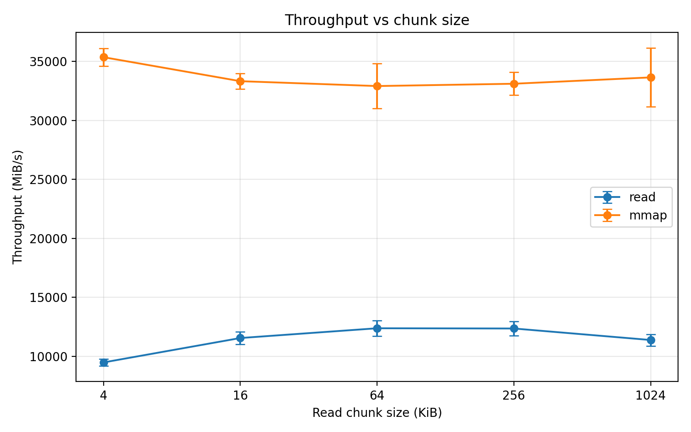

# 02-mmap-vs-read: What Really Happens at the OS Boundary

Modern Unix systems provide two common ways to access file data:

* `read()` — the traditional system call interface
* `mmap()` — memory-mapped file access

At first glance, both ultimately retrieve bytes from the same file.
However, they follow **very different execution paths through the operating system**.

This experiment investigates what happens when we scan a file using these two mechanisms, focusing on **the cost of crossing the OS boundary** rather than raw disk performance.

---

# The Core Question

When reading file-backed data sequentially:

> Is it faster to repeatedly call `read()` or to map the file with `mmap()` and access it as memory?

To answer this, we implemented a small benchmark comparing the two access paths.

---

# Two Ways to Access File Data

## read()

`read()` performs explicit system calls to transfer data from the kernel to a user buffer.

```
user code
   │
   ├─ read(fd, buf, size)
   │
kernel
   │
   ├─ locate page in page cache
   ├─ copy data → user buffer
   │
user scans buffer
```

Key properties:

* repeated system calls
* kernel → user buffer copy
* explicit buffer management

---

## mmap()

`mmap()` maps file pages directly into the process address space.

```
user code
   │
   ├─ mmap(file)
   │
kernel installs mapping
   │
user accesses memory
   │
page fault on first touch
   │
page cache page mapped
```

Key properties:

* mapping created once
* data accessed via normal memory loads
* first access may trigger a page fault

---

# Experimental Setup

Environment:

* Linux userspace
* x86_64 laptop CPU
* file size: **256 MiB**
* sequential scan
* page stride: **4096 bytes**
* samples per run: **65536**
* iterations: **5**

Both access modes touch **exactly the same offsets** to ensure a fair comparison.

We also sweep different `read()` buffer sizes:

```
4 KiB
16 KiB
64 KiB
256 KiB
1024 KiB
```

Measured metrics:

* elapsed time
* throughput
* time per sample
* page fault counters

---

# Results

## Time per Sample


Observations:

* `read()` improves as buffer size increases
* performance stabilizes around **64–256 KiB**
* `mmap()` remains almost constant

Approximate values:

| chunk   | read(ns/sample) | mmap(ns/sample) |
| ------- | --------------- | --------------- |
| 4 KB    | ~410            | ~110            |
| 16 KB   | ~340            | ~116            |
| 64 KB   | ~315            | ~118            |
| 256 KB  | ~315            | ~118            |
| 1024 KB | ~340            | ~116            |

In this workload:

```
mmap ≈ 3× faster per sampled access
```

---

## Throughput



Measured throughput:

| chunk  | read(MiB/s) | mmap(MiB/s) |
| ------ | ----------- | ----------- |
| 4 KB   | ~9,500      | ~35,000     |
| 64 KB  | ~12,000     | ~33,000     |
| 256 KB | ~12,200     | ~33,500     |

Important note:

These numbers **do not represent disk bandwidth**.

The file was already resident in the **page cache**, meaning this benchmark primarily measures:

```
memory bandwidth + kernel overhead
```

---

## Elapsed Time


Total scan time for the 256 MiB file:

| chunk  | read(ms) | mmap(ms) |
| ------ | -------- | -------- |
| 4 KB   | ~27 ms   | ~7 ms    |
| 64 KB  | ~21 ms   | ~7.7 ms  |
| 256 KB | ~21 ms   | ~7.6 ms  |

Overall:

```
mmap ≈ 2.7× faster
```

---

# perf Counter Analysis

We collected page fault statistics using:

```
perf stat -e page-faults,minor-faults,major-faults
```

Results:

```
page-faults:   24638
minor-faults:  24638
major-faults:      0
```

Interpretation:

* no major faults occurred
* the file was already cached in memory
* observed faults were minor mapping faults

Therefore the benchmark was **not disk-bound**.

Instead, it highlights the difference between two kernel execution paths:

```
read()
  syscall
  buffer copy

mmap()
  page mapping
  memory load
```

---

# Why read() Depends on Chunk Size

Small buffers require more system calls.

Example:

```
4 KiB buffer   → ~65536 read syscalls
256 KiB buffer → ~1024 read syscalls
```

Larger buffers amortize syscall overhead, which explains the improvement between 4 KiB and 64 KiB.

---

# Why mmap() Is Stable

After the mapping is created, accesses become simple memory loads:

```
load instruction
→ page table translation
→ cached memory page
```

Buffer size has no effect because there is **no repeated read call**.

---

# Why mmap Looks Faster Here

Under warm-cache conditions the two paths behave like this:

```
read()
  syscall
  copy to user buffer
  scan buffer

mmap()
  memory load
  occasional minor fault
```

Avoiding repeated syscalls and explicit buffer copies gives `mmap()` an advantage.

---

# Limitations

This experiment represents **one specific workload**:

* sequential scan
* page-stride sampling
* warm page cache

Performance may change significantly when:

* the page cache is cold
* access patterns are random
* files are smaller
* the scan touches every byte

For example, when the cache is cold:

```
mmap() may trigger major page faults
```

which can drastically change performance.

---

# Takeaway

The key lesson is not that one API is universally faster.

Instead, the experiment reveals something deeper:

> File access APIs encode **different interactions with the operating system**.

In this particular workload:

```
mmap ≈ 2.7× faster than read
```

because it avoids repeated system calls and explicit kernel-to-user copies.

Understanding these differences helps explain why systems software sometimes prefers memory-mapped I/O — and why it isn't always the right choice.

---

# Source Code

Full benchmark source code is available in the repository:

```
systems-behavior-lab
└── 03-os-boundary
    └── 02-mmap-vs-read
```

---

# Next Experiments

Future extensions of this lab:

* cold page cache measurements
* random access patterns
* dense scans (touch every byte)
* measuring major page faults

These variations help reveal how storage, memory, and the OS interact under different workloads.

