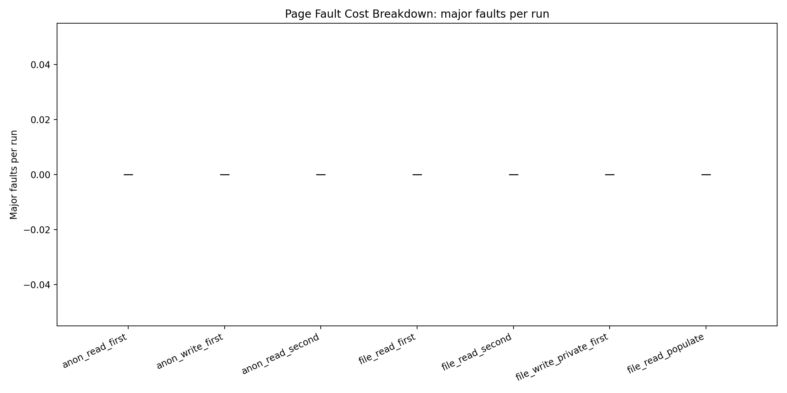

# Page Fault Cost Breakdown — Not All Faults Are Equal

> “A page fault costs ~1000ns.”
>
>  This is misleading.

This experiment shows a simple but important truth:

> **There is no single “page fault cost.”**

---

## Experimental Setup

- 4096 pages (16MB total)
- Page size: 4KB
- Sequential access pattern
- CPU pinned
- Multiple runs with warmup

Tested modes:

- Anonymous memory (read / write)
- File-backed mmap
- Copy-on-write (MAP_PRIVATE)
- MAP_POPULATE

---

## Result 1 — Latency (ns per page)


### Summary

```

anon_write_first        ≈ 3000 ns
file_write_private      ≈ 2900 ns
anon_read_first         ≈ 1100 ns
file_read_first         ≈ 230 ns
file_read_second        ≈ 190 ns
anon_read_second        ≈ 30 ns
file_read_populate      ≈ 20 ns

```

---

## Insight #1 — Write Faults Are Real Work

```

read  ≈ 1100 ns
write ≈ 3000 ns

```

Why is write ~3× slower?

Because it performs real work:

- Physical page allocation
- Zero initialization
- Page table updates

In contrast, read faults often map a shared **zero page**.

>  **Read fault = lazy mapping**  
>  **Write fault = real allocation**

---

## Result 2 — Minor Faults


```

anon_read_first   ≈ 4096
anon_write_first  ≈ 8192
file_read_first   ≈ 256

```

---

## Insight #2 — The OS Reduces Faults (Readahead)

```

4096 pages → ~256 faults

```

This implies ~16 pages per fault.

Linux detects sequential access and performs **readahead**, fetching multiple pages at once.

>  File-backed memory can generate **fewer faults than anonymous memory**

---

##  Result 3 — Faults per Page


```

anon_read        ≈ 1
anon_write       ≈ 2
file_read        ≈ 0.06
file_write       ≈ 1.06

```

---

## Insight #3 — Writes Trigger Multiple Faults

```

anon_write = read fault + write fault

```

Which explains:

```

8192 faults = 2 × 4096

```

---

## Result 4 — Major Faults



```

majflt = 0

```

---

## Insight #4 — Page Fault ≠ Disk I/O

This is a critical point.

> ❌ Page fault = disk access  
> ✔ Page fault = often a memory event

In this experiment:

- Page cache was already warm
- No disk I/O occurred

---

## Insight #5 — Warm vs Cold Memory

```

cold access   ≈ 1000ns+
warm access   ≈ 30ns

```

After the first access:

- No more page faults
- Only memory access remains

> 💡 Page faults are **one-time initialization costs**

---

## 🔥 Insight #6 — Copy-on-Write Is Just Allocation

```

file_write_private ≈ anon_write_first

```

Why?

- The file is not modified
- A new anonymous page is allocated
- Original data is copied

> COW = hidden allocation

---

## Insight #7 — MAP_POPULATE Does Not Remove Cost

```

file_read_populate ≈ 20ns

```

This looks like “free” access, but it’s not.

- Without MAP_POPULATE → cost happens on access
- With MAP_POPULATE → cost happens during mmap()

>  **Cost is shifted, not removed**

---

## Summary

Page faults fall into distinct categories:

| Type | Behavior | Cost |
|------|----------|------|
| Zero-page fault | Lazy mapping | Low |
| Allocation fault | Memory allocation + zero | High |
| File-backed fault | Readahead | Medium |
| Copy-on-write | Copy + allocate | High |

---

## Limitations

- No major faults (no disk I/O)
- Sequential access triggers readahead
- Results depend on page cache state and system load

---

## Future Work

- Stride access to disable readahead
- `madvise()` experiments (RANDOM vs SEQUENTIAL)
- Force major faults (large datasets)
- Compare tmpfs vs disk-backed storage

---

## Final Takeaway

> Page faults are not a single cost.

They are a combination of:

- Lazy mappings
- Memory allocation
- OS prefetching
- Copy-on-write behavior

Understanding these differences is essential for:

- Systems performance engineering
- Memory optimization
- Low-level system design

---

## Closing Thought

If you ever hear:

> “A page fault costs ~1000ns”

Just remember:

> **It depends.**

---

