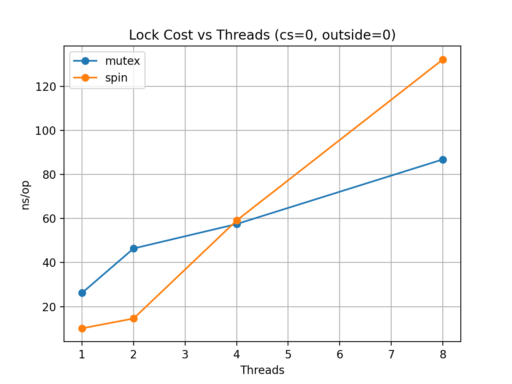
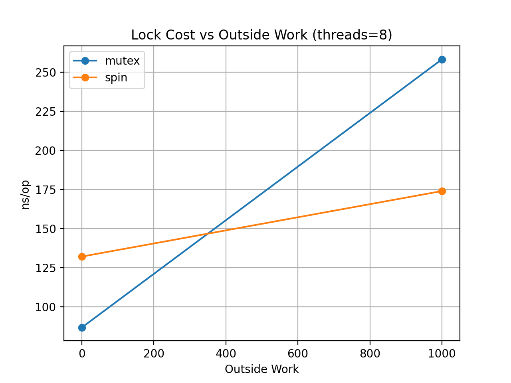

# 00-spinlock-vs-mutex: When Busy-Wait Beats Blocking

Concurrency often starts with a deceptively simple question:

> Which lock is faster: a spinlock or a mutex?

At first glance, the answer seems obvious.  
Spinlocks avoid context switches, so they should be faster — right?

In reality, the answer is much more nuanced.

In this lab we benchmarked two POSIX synchronization primitives:

- `pthread_mutex`
- `pthread_spinlock`

Our goal was to understand **how lock performance changes under different contention patterns**.

---

# Benchmark Setup

The benchmark repeatedly executes the following structure:

```

outside_work()

lock()

critical_section_work()

shared_counter++

unlock()

```

Three parameters control the workload:

| Parameter | Meaning |
|---|---|
threads | number of worker threads |
cs_work | work inside the critical section |
outside_work | work between lock acquisitions |

Each thread performs:

```

1,000,000 lock acquisitions

```

Performance is measured as:

```

ns/op = elapsed_time / total_operations

```

---

# Result 1 — Lock Cost vs Threads



This configuration represents **maximum contention**:

```

cs_work = 0
outside_work = 0

```

| threads | mutex | spin |
|---|---|---|
1 | 26 ns | 10 ns |
2 | 46 ns | 15 ns |
4 | 57 ns | 59 ns |
8 | 87 ns | 132 ns |

### What we observe

Spinlock wins when contention is low:

```

1–2 threads → spinlock faster

```

But as thread count increases, performance collapses:

```

8 threads → mutex becomes faster

```

This is the classic **spinlock contention collapse**.

Why?

Spinlocks perform **busy waiting**:

```

while(lock) { spin }

```

With many threads, multiple CPUs repeatedly poll the same cache line.

This creates:

- cache-line bouncing
- wasted CPU cycles
- longer lock handoff latency

Mutexes instead allow threads to **sleep and be woken by the scheduler**.

When contention becomes high, blocking is cheaper than spinning.

---

# Result 2 — Lock Cost vs Critical Section Length


Here we fix the thread count at 8 and increase work inside the critical section.

| cs_work | mutex | spin |
|---|---|---|
0 | 86 ns | 132 ns |
100 | 419 ns | 162 ns |
1000 | 2502 ns | 1389 ns |

Surprisingly:

```

spinlock becomes faster for long critical sections

```

This contradicts a common rule of thumb.

The explanation becomes clear with `perf`.

### perf results

mutex:

```

context-switches ≈ 4.7 million
elapsed ≈ 20 s

```

spinlock:

```

context-switches ≈ 110
elapsed ≈ 11.7 s

```

Mutexes incur large scheduling overhead when threads frequently block and wake.

Spinlocks avoid this cost entirely, at the expense of burning CPU cycles.

---

# Result 3 — Lock Cost vs Outside Work



Adding work outside the lock changes the contention pattern.

| outside_work | mutex | spin |
|---|---|---|
0 | 86 ns | 132 ns |
1000 | 258 ns | 174 ns |

Outside work spreads out lock requests.

This reduces contention and allows spinlocks to regain their advantage.

---

# CPU Utilization Tradeoff

Spinlocks often finished faster, but they consumed much more CPU time.

Example (`threads=8, cs_work=1000`):

| lock | elapsed | task-clock |
|---|---|---|
mutex | 20 s | 62 s |
spin | 11.7 s | 90 s |

Interpretation:

```

spinlock → lower latency, higher CPU cost
mutex → higher latency, lower CPU waste

```

This highlights an important tradeoff in lock design.

---

# Key Takeaways

There is **no universally superior lock**.

Performance depends on:

- contention level
- critical section length
- CPU availability

General guidelines:

| Scenario | Better Choice |
|---|---|
low contention | spinlock |
high contention | mutex |
CPU efficiency | mutex |
lowest latency | spinlock |

The most important lesson is this:

> Lock behavior depends heavily on workload characteristics.

Microbenchmarks like this help reveal where those boundaries lie.

---

# References

POSIX Spin Locks  
https://man7.org/linux/man-pages/man3/pthread_spin_lock.3.html

Linux Futex Mechanism  
https://man7.org/linux/man-pages/man2/futex.2.html

Linux perf stat  
https://man7.org/linux/man-pages/man1/perf-stat.1.html

---
