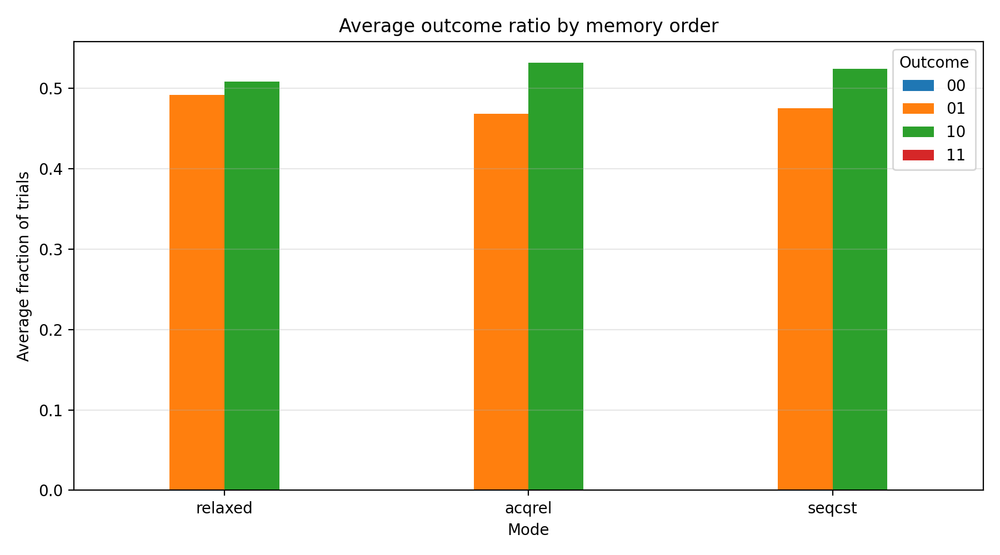

# 01-memory-ordering and the Store Buffering Experiment

Modern multi-core processors do not guarantee that memory operations appear to other threads in the same order they are written in the program.

This experiment explores **memory ordering effects** using the classic **Store Buffering (SB) litmus test** and compares three C11 atomic memory orders:

- `memory_order_relaxed`
- `memory_order_acq_rel`
- `memory_order_seq_cst`

The goal is to observe how different memory orders affect the visibility of memory operations across threads.

---

# The Store Buffering Litmus Test

The test uses two shared variables initialized to zero.

```

x = 0
y = 0

```

Two threads execute the following code concurrently.

Thread 0

```

x = 1
r0 = y

```

Thread 1

```

y = 1
r1 = x

```

Possible results:

| r0 | r1 | meaning |
|----|----|--------|
|0|0|both threads missed the other's store|
|0|1|thread1 store observed|
|1|0|thread0 store observed|
|1|1|both stores observed|

The surprising case is:

```

r0 = 0
r1 = 0

```

This means both loads occurred **before the other core's store became visible**.

This behavior arises due to **store buffers** in modern CPUs.

---

# Experimental Setup

- Platform: x86_64
- Compiler: GCC
- Threads: 2
- Iterations per run: 200000
- Warmup iterations: 5000

Each memory ordering mode was executed multiple times.

---

# Both-Zero Outcome

The key metric is how often the **both-zero** result occurs.


Average counts per run:

| mode | avg both-zero |
|------|--------------|
| relaxed | 8.0 |
| acqrel | 7.2 |
| seqcst | 0 |

Observations:

- `relaxed` frequently produces the both-zero outcome
- `acqrel` also allows the both-zero outcome
- `seqcst` completely eliminates it

This confirms that:

> acquire-release ordering alone does not prevent store-buffering reordering, while sequential consistency does.

---

# Outcome Distribution



Most executions produce:

```

01
10

```

meaning one thread observes the other's store.

The `00` outcome is rare because it requires a precise timing window where both loads occur before the other store becomes visible.

---

# Runtime Cost

Stronger ordering can introduce performance overhead.


Average runtime:

| mode | ns per trial |
|------|--------------|
| relaxed | ~60780 |
| acqrel | ~61100 |
| seqcst | ~61200 |

Sequential consistency is slightly slower due to additional ordering constraints.

---

# What the Compiler Actually Generates

Disassembling the binary reveals how each memory order is implemented.

## Relaxed

```

mov [x],1
mov eax,[y]

```

No ordering constraints are emitted.

---

## Acquire / Release

```

mov [x],1
mov eax,[y]

```

On x86, acquire and release semantics are already guaranteed by the architecture, so the compiler emits the same instructions as relaxed.

---

## Sequential Consistency

```

mov [x],1
mfence
mov eax,[y]

```

The `mfence` instruction enforces a **full memory barrier**, preventing the store→load reordering responsible for the both-zero outcome.

---

# Why Acquire/Release Does Not Prevent This

Acquire-release ordering only establishes a synchronization relationship when the same atomic variable is used:

```

store_release(A)
load_acquire(A)

```

In this experiment:

```

Thread0 writes x then reads y
Thread1 writes y then reads x

```

Since the synchronization chain is broken, the both-zero outcome remains possible.

---

# Why Sequential Consistency Prevents It

Sequential consistency requires all atomic operations to appear in a **single global order** that respects program order.

Under this constraint the following ordering cannot occur:

```

T0: load y
T1: load x
T0: store x
T1: store y

```

Therefore the `00` result becomes impossible.

---

# Key Takeaways

This experiment highlights three important facts about memory ordering.

1. **Relaxed atomics allow weak memory behaviors such as store buffering.**

2. **Acquire-release ordering does not automatically prevent reordering unless a synchronization chain is formed.**

3. **Sequential consistency enforces a stronger global order and eliminates the store-buffering outcome.**

Disassembly confirms that:

- `relaxed` and `acqrel` compile to identical instructions on x86
- `seq_cst` introduces a memory fence

The experimental results directly reflect the underlying hardware memory model.

---

# References

- Sewell et al., *x86-TSO: A Rigorous and Usable Programmer's Model for x86 Multiprocessors*
- C11 Atomic Memory Model
- Intel® 64 Architecture Memory Ordering

---
