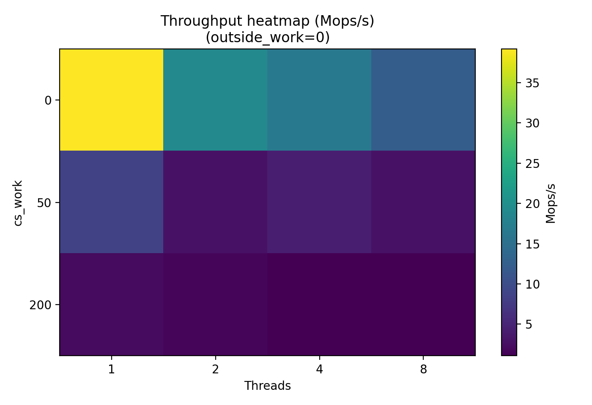

# 02-lock-contention: When More Threads Make Things Slower

Modern CPUs have many cores, so it is tempting to assume that simply adding more threads will increase performance.  
However, this assumption quickly breaks down when threads compete for shared resources.

One of the most common bottlenecks in concurrent systems is **lock contention**.

This experiment investigates how a shared mutex behaves when multiple threads repeatedly acquire and release it.

---

# The Problem: Shared Locks

Consider a simple shared counter protected by a mutex.

```c
pthread_mutex_lock(&lock);
counter++;
pthread_mutex_unlock(&lock);
```

If multiple threads repeatedly execute this code, they must **serialize access** to the counter.

Even on a multi-core machine, only **one thread can hold the lock at a time**.

This creates a **scalability bottleneck**.

---

# Experimental Design

Each worker thread repeatedly executes the following loop:

```
lock(mutex)
    do cs_work
    shared_counter++
unlock(mutex)

do outside_work
```

Parameters we vary:

| parameter      | meaning                          |
| -------------- | -------------------------------- |
| `threads`      | number of worker threads         |
| `cs_work`      | work inside the critical section |
| `outside_work` | work outside the lock            |

Each thread performs:

```
1,000,000 lock acquisitions
```

Metrics collected:

* elapsed time
* ns/op
* throughput (Mops/s)

---

# Correctness Check

To verify synchronization correctness we ensure:

```
final_counter = threads × iterations
```

Example:

```
1000000 vs 1000000
2000000 vs 2000000
```

This confirms the mutex correctly protects the shared counter.

---

# Baseline: Throughput vs Threads

Configuration:

```
cs_work = 0
outside_work = 0
```


Results:

| threads | throughput (Mops/s) |
| ------- | ------------------- |
| 1       | 39.188              |
| 2       | 19.055              |
| 4       | 16.475              |
| 8       | 12.267              |

Instead of increasing with thread count, throughput **decreases**.

Why?

Because the mutex becomes a **serialization point**.

```
more threads
→ more waiting
→ less throughput
```

---

# Lock Latency Growth


| threads | ns/op |
| ------- | ----- |
| 1       | 25.52 |
| 2       | 52.48 |
| 4       | 60.70 |
| 8       | 81.52 |

Latency per operation increases because threads must wait longer to acquire the mutex.

Three main effects contribute:

* mutex wait queues
* cache-line bouncing
* scheduler interaction

---

# Impact of Critical Section Length

When the critical section becomes longer, contention becomes dramatically worse.

Threads = 8


| cs_work | throughput |
| ------- | ---------- |
| 0       | 12.267     |
| 50      | 2.870      |
| 200     | 1.143      |

Longer critical sections increase **lock hold time**, which increases waiting time for other threads.

```
longer lock hold
→ longer queues
→ throughput collapse
```

---

# Impact of Outside Work

Threads = 8


Increasing work outside the lock changes how frequently threads attempt to acquire the mutex.

However, because the outside work itself consumes CPU cycles, total throughput still decreases.

---

# Contention Overview

The following heatmap summarizes the interaction between:

* thread count
* critical section size



Two patterns are clearly visible:

1. **More threads → lower throughput**
2. **Longer critical section → severe contention**

---

# Why This Matters

Many real systems suffer from the same issue.

Examples include:

* global counters
* shared queues
* centralized allocators
* global caches

To avoid contention bottlenecks, scalable systems often use:

* per-thread structures
* sharded locks
* lock-free data structures
* RCU-based synchronization

---

# Key Takeaways

This experiment demonstrates three fundamental properties of lock-based concurrency.

### 1. Shared locks limit scalability

```
threads ↑ → throughput ↓
```

### 2. Critical section length amplifies contention

```
cs_work ↑ → throughput collapse
```

### 3. Work distribution affects lock pressure

```
outside_work ↑ → lock frequency ↓
```

Understanding these behaviors is essential when designing high-performance concurrent systems.

---

# Next Experiment

Next we investigate **thread pool scaling**, where work distribution and scheduling overhead introduce new performance limits.

---
