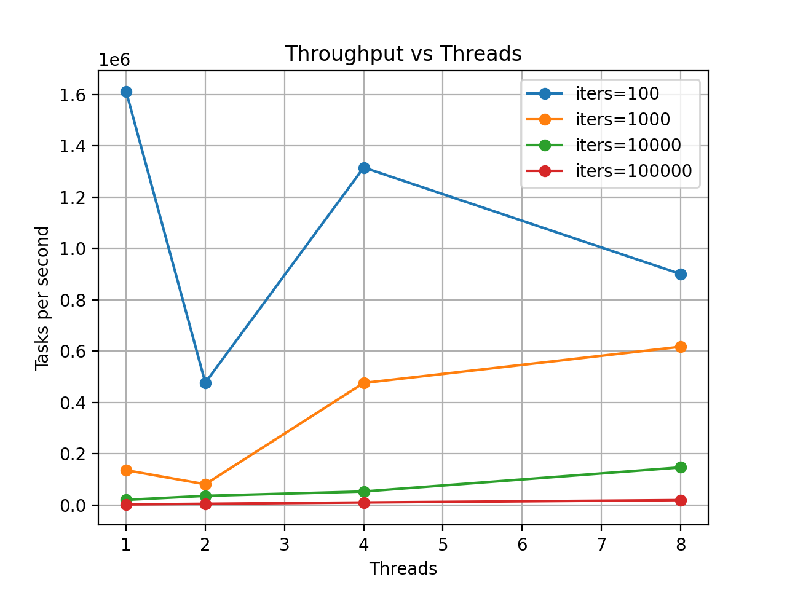
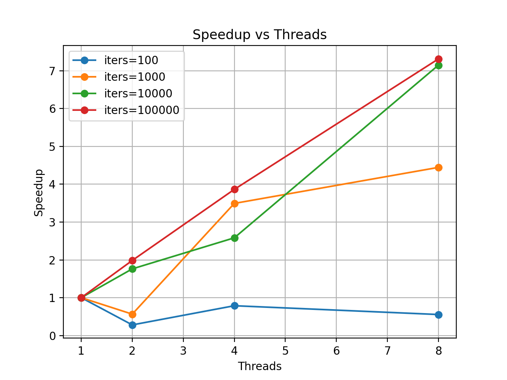
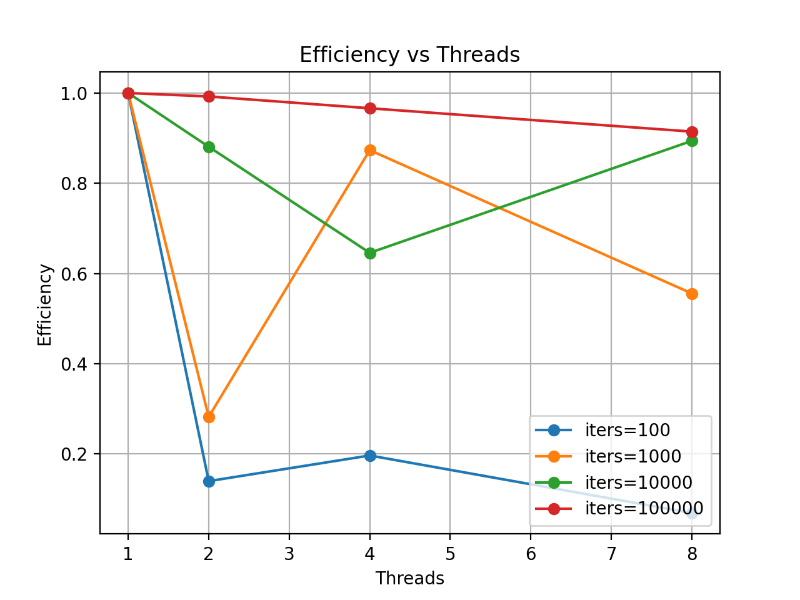

# Thread Pool Scaling: Why More Threads Don't Always Make It Faster

> A thread pool is not a free performance boost.  
> In fact, adding more threads can *make things worse*.

---

## Motivation

Thread pools are one of the most common abstractions in systems programming.

We use them everywhere:

- web servers
- databases
- async runtimes
- job schedulers

The intuitive expectation is simple:

> More threads → more parallelism → faster execution

But in real systems, this assumption often fails.

This experiment explores **why**.

---

## What We Want to Understand

We focus on three key questions:

1. Does increasing the number of worker threads always improve performance?
2. How does **task size** affect scalability?
3. Does **CPU pinning** (thread affinity) help or hurt?

---

## Experimental Setup

### Machine

- 8 physical cores
- 16 logical CPUs (SMT)
- Single NUMA node

---

### Workload

We implemented a simple thread pool with:

- Mutex + condition variable
- Bounded queue
- Fixed worker threads

Each task performs CPU-bound work:

```c
cpu_burn(seed, task_iters);
````

---

### Parameters

* Tasks: 20,000
* Threads: 1, 2, 4, 8
* Task sizes:

  * 100
  * 1,000
  * 10,000
  * 100,000 iterations

---

## Results

### Throughput vs Threads



---

### Speedup vs Threads



---

### Efficiency vs Threads



---

### CPU Pinning Comparison


---

## Key Insight #1: Small Tasks Kill Parallelism

Look at `task_iters = 100`.

Instead of getting faster, performance **gets worse** as we add threads.

Why?

Because the system is dominated by **overhead**:

* mutex lock/unlock
* condition variable wakeups
* queue operations
* scheduler interaction

In this regime:

> The cost of coordination is larger than the useful work.

---

## Key Insight #2: The "2-Thread Valley"

For `task_iters = 1000`, something surprising happens.

Performance behaves like this:

```
1 thread  → baseline
2 threads → WORSE
4 threads → much better
8 threads → even better
```

This is not a smooth scaling curve.

This is a **non-monotonic scaling pattern**.

---

### Why does this happen?

At 2 threads:

* We already pay synchronization costs
* But parallel work is still too small

So we get:

> Worst of both worlds: overhead without enough parallel benefit

At 4+ threads:

* Enough parallel work accumulates
* Overhead becomes relatively small

This creates a **"scaling valley"**.

---

## Key Insight #3: Large Tasks Scale Well

For `task_iters = 10000` and `100000`:

* Throughput increases consistently
* Speedup approaches linear scaling
* Efficiency stays high

Here:

> Work dominates overhead

This is the only regime where thread pools behave "as expected".

---

## Key Insight #4: CPU Pinning is Not Always Good

Pinning threads to CPUs sounds like a good idea.

But results show:

* 2 threads → pinning hurts
* 4 threads → mixed
* 8 threads → sometimes helps

Why?

Because:

* The OS scheduler can sometimes place threads better dynamically
* Pinning can lock threads into suboptimal cores
* Benefits only appear when workload is large enough

---

## What This Means in Practice

### Myth

> "More threads always make programs faster"

### Reality

Performance depends on:

* Task granularity
* Synchronization overhead
* Scheduler behavior
* CPU topology

---

## The Real Model

A better mental model:

```
Total time =
    useful work
  + synchronization cost
  + scheduling cost
  + memory/cache effects
```

Scaling only works when:

```
useful work >> overhead
```

---

## Takeaway

> A thread pool is not a magic speedup tool.
> It is a trade-off between parallelism and coordination cost.

---

## Future Work

* Lock-free queue vs mutex queue
* Work-stealing thread pool
* NUMA-aware scheduling
* Context switch analysis (`perf`)
* Cache miss profiling

---

## Final Thought

If your tasks are too small,
your thread pool is just a very expensive way to go slower.

---
