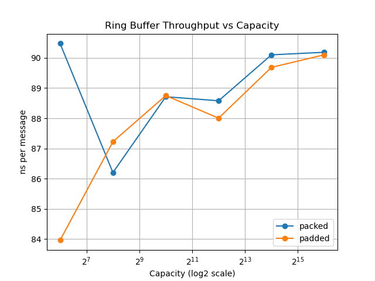

# 04-ring-buffer: Throughput vs Backpressure

## Introduction

This experiment investigates the behavior of a single-producer/single-consumer (SPSC) ring buffer under different workload conditions.

The goal is to understand:

- When cache-level optimizations matter
- When system-level bottlenecks dominate
- Why buffer size does not necessarily improve throughput
- How buffering affects backpressure

---

## Experimental Setup

- SPSC ring buffer
- Two implementations:
  - packed: head and tail in the same cache line
  - padded: head and tail separated into different cache lines
- CPU pinning:
  - producer → CPU 0
  - consumer → CPU 1

---

## Stage 1: No Delay (Balanced System)

### Configuration

- messages: 20,000,000
- no artificial delay

### Results (best runs)

| mode   | capacity | ns/msg | Mmsgs/s |
|--------|----------|--------|--------|
| packed | 64       | ~9.89  | ~101   |
| packed | 1024     | ~10.85 | ~92    |
| padded | 1024     | ~11.45 | ~87    |
| padded | 65536    | ~11.13 | ~89    |

### Analysis

The packed version is consistently faster than the padded version.

This contradicts the expectation that separating head and tail should reduce false sharing and improve performance.

The reason is that both threads frequently read and write both indices:

- producer writes tail, reads head
- consumer writes head, reads tail

Placing both variables in the same cache line improves locality.

### Conclusion

False sharing is not always harmful. In communication-heavy patterns, shared cache lines can improve performance.

---

## Stage 2: Producer Delay

### Configuration

```c
push();
delay();   // delay = 20
```

* messages: 1,000,000

### Results

| capacity | ns/msg |
| -------- | ------ |
| 64       | ~2058  |
| 1024     | ~2057  |
| 65536    | ~2057  |

### Analysis

Throughput drops significantly and becomes independent of buffer size.

The producer is artificially slowed down, so the queue rarely fills.

### Limitation

This configuration does not represent buffering behavior.

### Conclusion

This measures a slow producer system, not a buffering system.

---

## Stage 3: Consumer Delay (Steady-State Bottleneck)

### Configuration

```c
pop();
delay();   // delay = 2
```

### Results

| capacity | ns/msg |
| -------- | ------ |
| 64       | ~213.5 |
| 1024     | ~213.4 |
| 65536    | ~214.1 |

### Analysis

Throughput stabilizes and becomes nearly independent of capacity.

The system is now limited by consumer speed.

### Limitation

Constant delay creates a steady-state bottleneck.

Buffer size only affects transient behavior, not steady-state throughput.

### Conclusion

Throughput is determined by the slowest stage in the pipeline.

---

## Stage 4: Bursty Consumer Delay

### Configuration

```c
if (i % 256 == 0) {
    for (int j = 0; j < 200; ++j) cpu_relax();
}
```

* messages: 1,000,000
* added metric: full_hits (number of times producer encountered a full queue)

---

## Results

### Throughput



### Backpressure (Full Hits)


---

## Observations

### Throughput

* Nearly constant across all capacities
* Approximately 87–90 ns/msg
* No meaningful difference between packed and padded

### Backpressure

| capacity | packed | padded |
| -------- | ------ | ------ |
| 64       | ~671k  | ~668k  |
| 256      | ~666k  | ~667k  |
| 1024     | ~666k  | ~666k  |
| 4096     | ~665k  | ~664k  |
| 16384    | ~654k  | ~656k  |
| 65536    | ~621k  | ~622k  |

Backpressure decreases as capacity increases.

---

## Interpretation

### Throughput

Throughput is governed by the consumer, which is the slowest stage.

Increasing buffer size does not increase throughput.

### Backpressure

Larger buffers reduce the frequency of full conditions.

This allows the producer to proceed without frequent blocking.

### Cache Effects

The difference between packed and padded layouts disappears.

System-level imbalance dominates microarchitectural effects.

---

## Key Takeaways

1. Throughput is not improved by increasing buffer size.

2. Buffer size reduces backpressure and absorbs bursty delays.

3. Throughput alone is not sufficient to evaluate a queue.

4. Microarchitectural optimizations matter only when the system is balanced.

---

## Conclusion

This experiment demonstrates that buffers primarily serve to manage burstiness and reduce backpressure, rather than to improve throughput.

In real systems, increasing buffer size helps stabilize performance under irregular workloads, but does not increase the overall processing rate.

---

