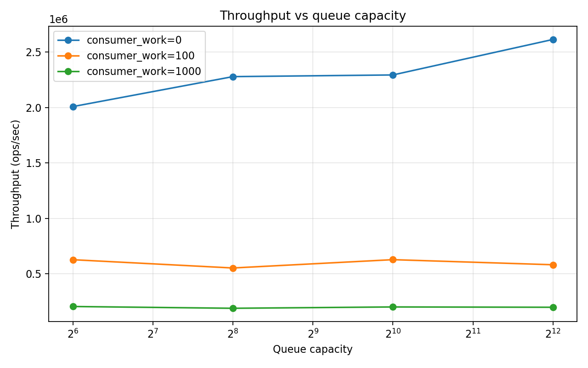
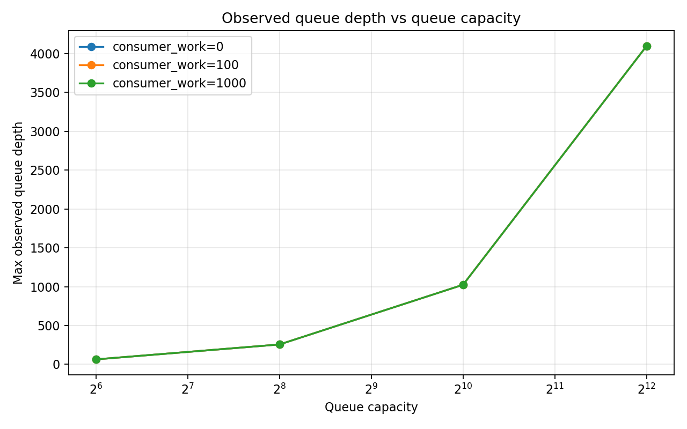
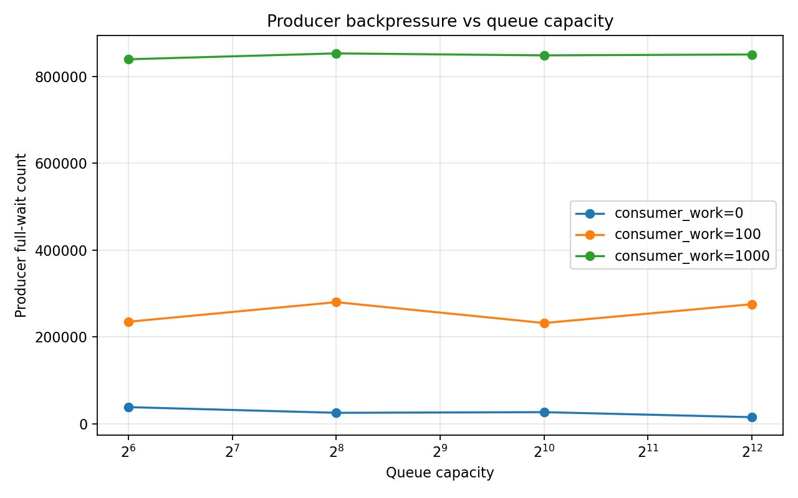

# 05-producer-consumer-queue

---

## 1. Why This Experiment Matters

In many systems, we insert a queue between components:

- Web servers handling requests
- Databases processing queries
- Streaming systems like Kafka
- Worker pools and task schedulers

The intention is simple:

> “Let producers and consumers run independently.”

But what actually happens?

Does a queue improve performance?  
Or does it simply **hide problems**?

This lab explores a classic setup:

- Multiple producers
- Multiple consumers
- A bounded queue in between

And asks a deeper question:

> What does the queue reveal about the system?

---

## 2. The Setup

We implement a **bounded blocking queue** using:

- A ring buffer
- `pthread_mutex`
- `pthread_cond` (not_full / not_empty)

Each experiment varies:

- Queue capacity
- Number of producers / consumers
- Consumer workload (to simulate slow processing)

We measure:

- Throughput
- Cost per item
- Blocking behavior (wait counts)
- Queue depth

---

## 3. First Surprise: Bigger Queues Don’t Always Help

When consumers are fast:

- Increasing capacity improves throughput

But when consumers are slow:

- Throughput barely changes

### What this means

A queue only helps when **the queue itself is the bottleneck**.

Once computation dominates, increasing capacity does nothing.

> A queue cannot fix a slow consumer.

---

## 4. The Queue Fills Up — And Stays Full

As capacity increases, the observed queue depth increases almost linearly.

Especially with slow consumers.

### What this means

The queue does not stabilize at some "optimal level".

Instead:

> It expands until it is full.

This is a critical insight:

> A queue absorbs imbalance — but does not resolve it.

---

## 5. Backpressure: The Invisible Force

When consumers are slow:

- Producer wait count explodes
- Increasing capacity barely helps

### What this means

The system pushes back.

This phenomenon is called **backpressure**:

- Consumer is slow
- Queue fills up
- Producers are forced to wait

> Backpressure is not a bug. It is a fundamental system behavior.

---

## 6. The True Bottleneck Reveals Itself

Different configurations:

- 1 Producer / 4 Consumers → fastest
- 4 Producers / 1 Consumer → slowest

### What this means

Throughput is governed by the slowest stage:

> throughput ≈ min(producer rate, consumer rate)

Adding more producers does not help if consumers are the bottleneck.

---

## 7. Blocking Tells You Everything

- Too many producers → producer wait dominates
- Too many consumers → consumer wait dominates
- Balanced system → minimal waiting

### What this means

Wait counts directly show where the bottleneck is.

You don’t need complex profiling.

> Blocking behavior *is* the signal.

---

## 8. The Role of Queue Capacity

Queue capacity has three regimes:

### Too Small
- Frequent blocking
- Lower throughput

### Just Right
- Smooths small imbalances
- Best performance

### Too Large
- No throughput gain
- Just more buffering

> Bigger buffers don’t make systems faster — they make problems quieter.

---

## 9. Key Takeaways

### 1. A Queue Is Not a Performance Tool
It is a **decoupling mechanism**, not an optimizer.

---

### 2. Bottlenecks Dominate Everything
The slowest stage defines system throughput.

---

### 3. Backpressure Is Inevitable
And necessary for system stability.

---

### 4. Queue Capacity Has Limits
After a point, it stops helping.

---

### 5. Blocking Is Insight
Wait counts reveal system imbalance directly.

---

## 10. Real-World Implications

These exact behaviors appear in:

- Redis pipelines
- Kafka partitions
- Nginx worker queues
- Database connection pools

Understanding this model helps explain:

- Why systems stall under load
- Why adding threads sometimes makes things worse
- Why buffers grow but performance doesn’t improve

---

## 11. Final Thought

A queue sits between two worlds:

- The speed of production
- The speed of consumption

It cannot make them equal.

It can only **expose the difference**.

> A queue does not solve performance problems.  
> It tells you where they are.

---
