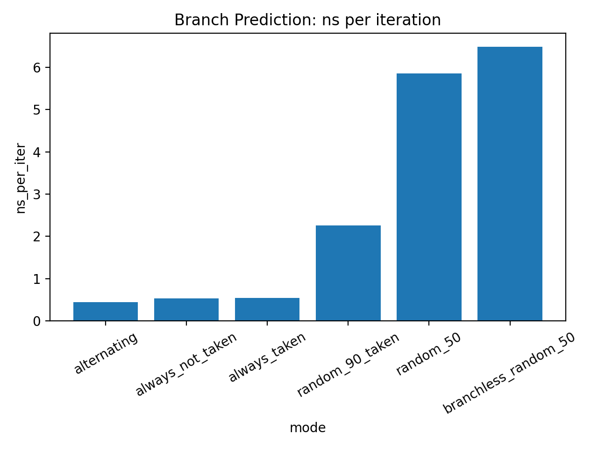
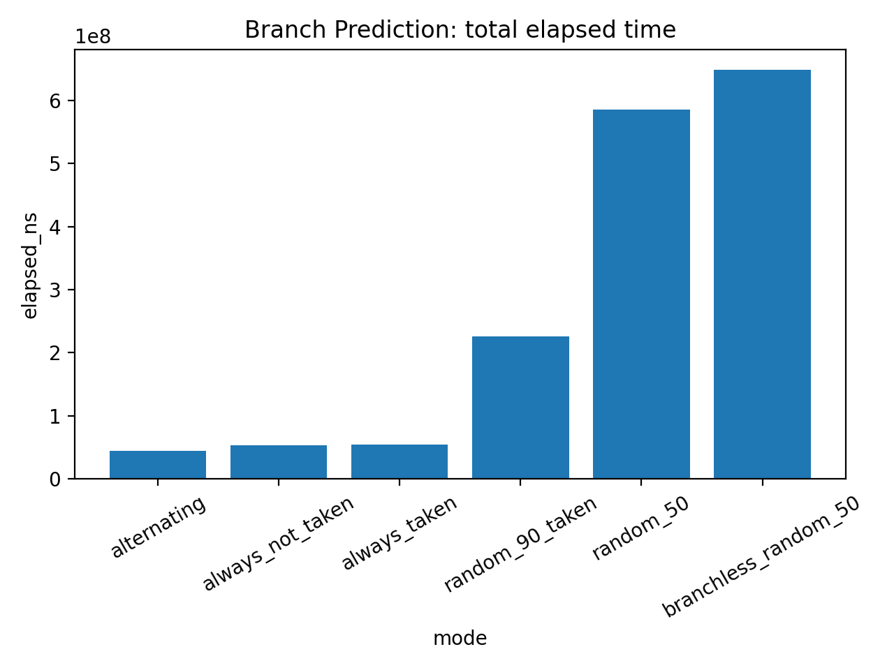

# 00-branch-prediction: Why Random Branches Kill Performance

Modern CPUs are extremely fast — but only when they can **predict what comes next**.

In this experiment, we explore a simple but powerful question:

> Is a branch itself expensive, or is it the unpredictability of the branch that hurts performance?

---

## Experiment Idea

We run the same loop, but vary only the **branch outcome pattern**:

```c
if (data[i] > threshold) {
    sum += 3;
} else {
    sum += 1;
}
```

The computation is identical.
Only the **pattern of `true/false`** changes.

We test:

* `always_taken`
* `always_not_taken`
* `alternating`
* `random_50`
* `random_90_taken`
* `branchless_random_50`

---

## Setup

* Iterations: 100M
* Warmup: 1M
* CPU pinned
* Compiler: `-O3`
* Measured:

  * execution time
  * `perf stat` (cycles, instructions, branches, branch-misses)

---

## Results

### ns per iteration



### total elapsed time



---

## What We See

### 1. Predictable branches are basically free

```
~0.45–0.53 ns/iter
```

* always_taken
* always_not_taken
* alternating

Even though there is a branch, performance is excellent.

---

### 2. Random branches are catastrophic

```
~5.9 ns/iter
```

The `random_50` case is **10× slower**.

Nothing else changed — just unpredictability.

---

### 3. Bias helps a lot

```
random_90_taken → ~2.06 ns/iter
```

Even partial predictability significantly improves performance.

---

### 4. Branchless is NOT automatically faster

```
branchless_random_50 → ~6.48 ns/iter
```

Surprisingly, removing the branch made things **slightly worse**.

---

## Perf Counter Evidence

| mode        | branch miss | IPC  |
| ----------- | ----------- | ---- |
| predictable | ~0.01%      | ~3.5 |
| random_90   | ~3.8%       | ~2.3 |
| random_50   | ~15%        | ~1.1 |

As branch mispredictions increase:

* IPC drops
* execution time increases

---

## Why This Happens

Modern CPUs use **branch predictors** to guess control flow.

When prediction is correct:

* pipeline flows smoothly

When prediction is wrong:

* pipeline is flushed
* speculative work is discarded
* execution restarts

This cost accumulates quickly.

---

## Key Insight

> **Branches are not expensive. Unpredictable branches are.**

---

## Takeaways

* Do NOT blindly remove branches
* Make branch outcomes predictable when possible
* Avoid high-entropy conditions in hot loops
* Branchless code is not always a win

---

## Final Numbers

| case        | ns/iter |
| ----------- | ------- |
| predictable | ~0.45   |
| biased      | ~2.06   |
| random      | ~5.91   |

👉 **10× performance difference purely from predictability**

---

## What’s Next

* ILP vs dependency chain
* Branchless optimization tradeoffs
* SIMD vs scalar execution

---

## Closing Thought

If you remember only one thing:

> **Performance is often about how well the CPU can guess the future.**

---
