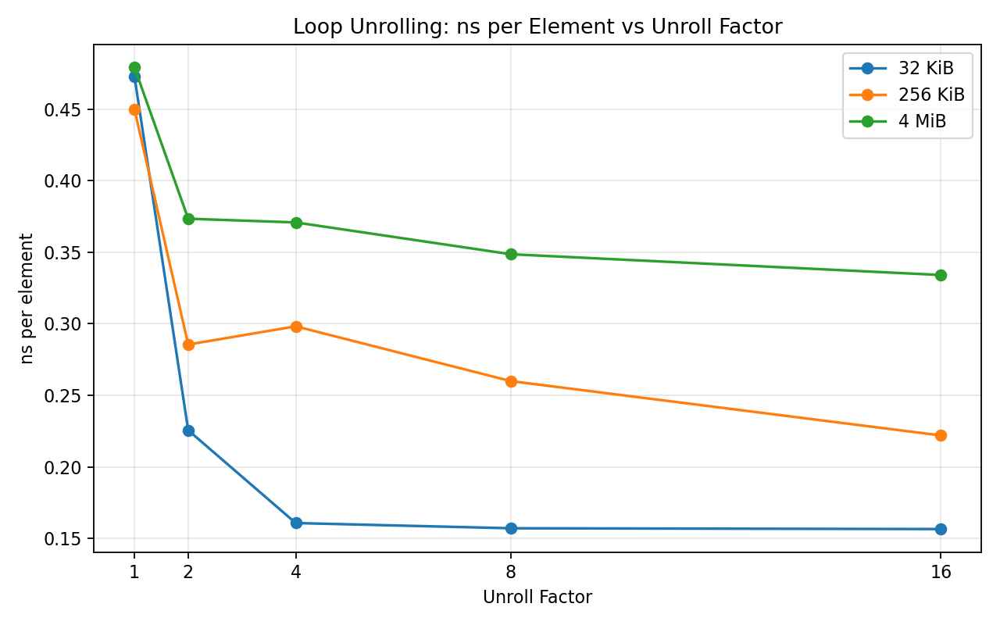
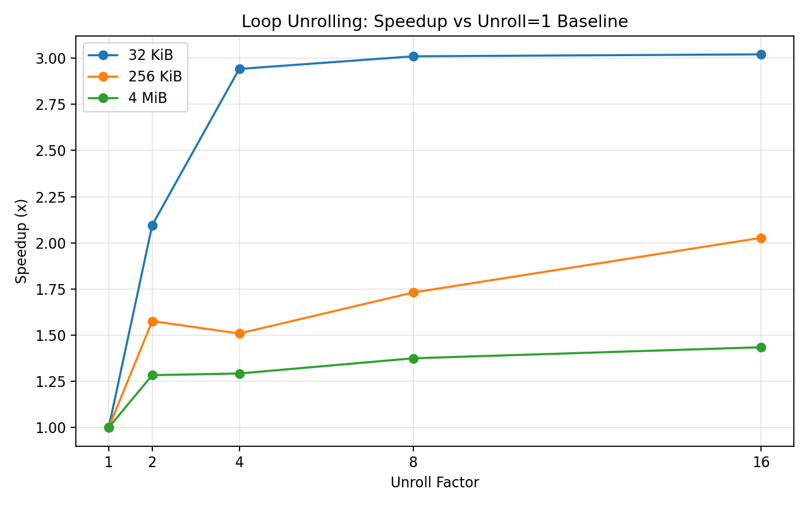

# 02-loop-unrolling

Modern compilers often apply loop unrolling automatically, but what does it really do at the microarchitectural level?

In this lab, we isolate loop unrolling and measure its impact on a simple scalar workload.

---

## 🔧 Experiment Setup

We use a simple array summation kernel:

- Scalar reduction (single accumulator)
- Manual loop unrolling (1, 2, 4, 8, 16)
- Auto-vectorization disabled (`-fno-tree-vectorize`)

We vary working set sizes:

- **32 KiB** → L1-friendly  
- **256 KiB** → L2-ish  
- **4 MiB** → larger, memory influence  

---

## 📊 Results

### Throughput

### ns per Element

### Speedup

---

## 🔍 First Observation

Loop unrolling clearly improves performance:

- **32 KiB** → ~3x speedup
- **256 KiB** → ~2x
- **4 MiB** → ~1.4x

But the shape of the curves matters more than the numbers.

---

## ⚠️ Key Pattern: Early Saturation

For the 32 KiB case:

- Unroll 1 → 4: huge improvement  
- Unroll 4 → 16: almost no change  

Even though we continue to reduce work inside the loop, performance stops improving.

This is the first important clue.

---

## 🧠 What Is Actually Happening?

To understand this, we look at hardware counters using `perf stat`.

---

## 🔬 Microarchitectural Breakdown

### Unroll = 1

- ~822M branches  
- ~3.29B instructions  
- IPC ≈ 3.98  
- Branch miss rate ≈ 0.03%  

---

### Unroll = 4

- ~207M branches (**4× reduction**)  
- ~1.65B instructions (**2× reduction**)  
- IPC ≈ 5.71 (**peak**)  

---

### Unroll = 16

- ~52M branches (**16× reduction**)  
- ~1.03B instructions  
- IPC ≈ 3.68 (**drops**)  

---

## 💡 Insight #1: This Is NOT About Branch Prediction

Branch miss rate is already extremely low.

> Loop unrolling does not help because branches are mispredicted.  
> It helps because branches are executed **less often**.

---

## 💡 Insight #2: Instruction Density Improves

Per-element cost:

- Unroll 1 → ~4 instructions  
- Unroll 4 → ~2 instructions  
- Unroll 16 → ~1.26 instructions  

This directly explains the large speedup.

---

## 💡 Insight #3: Why Performance Stops Improving

At unroll 4:

- Loop overhead is mostly eliminated
- Remaining cost is no longer loop control

Even though:

- Instructions ↓  
- Branches ↓  

Performance no longer improves.

> The bottleneck has shifted.

---

## 💡 Insight #4: IPC Reveals the Sweet Spot

- Unroll 4 → highest IPC  
- Unroll 16 → lower IPC  

This suggests:

- Front-end pressure
- Register pressure
- Scheduling inefficiency

> Too much unrolling can reduce execution efficiency.

---

## 💡 Insight #5: Working Set Size Changes Everything

| Working Set | Behavior |
|------------|--------|
| 32 KiB     | Early saturation |
| 256 KiB    | Gradual improvement |
| 4 MiB      | Memory influence dominates |

- Small data → loop overhead dominates  
- Large data → memory becomes more important  

---

## 🧾 Final Takeaway

Loop unrolling improves performance by:

- Reducing branch frequency  
- Reducing loop-control instructions  
- Increasing straight-line execution  

But:

- Gains **saturate quickly**
- Beyond that, other bottlenecks dominate

---

## 🔥 One-Line Summary

> Loop unrolling is not a branch prediction optimization —  
> it is a **control overhead reduction technique**, and its benefit is bounded by the real bottleneck of the system.

---
