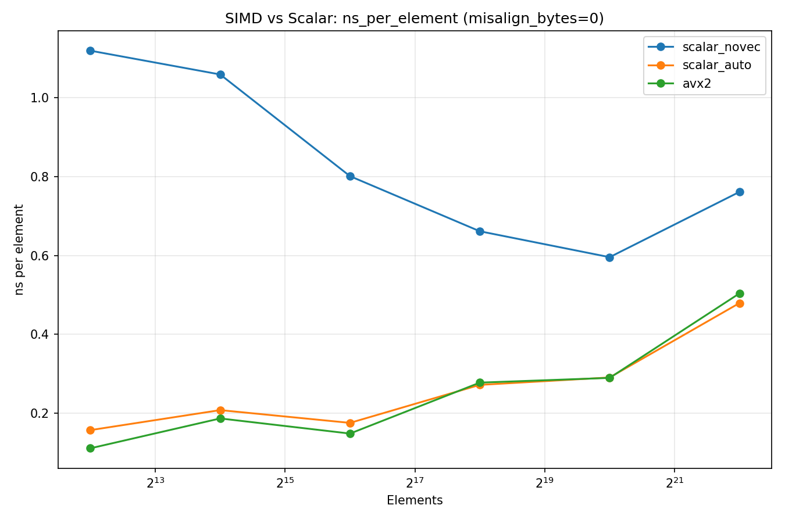
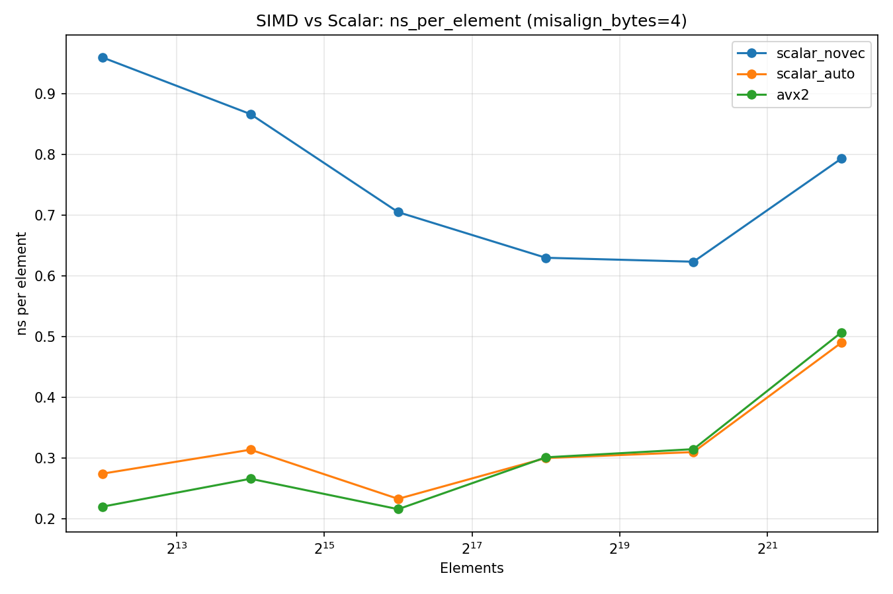
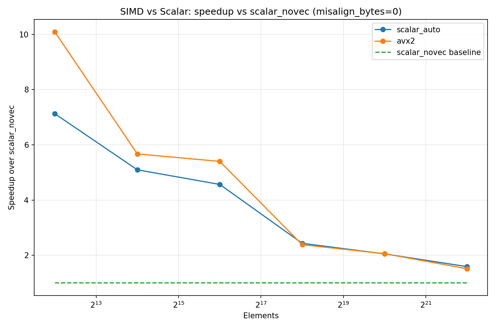
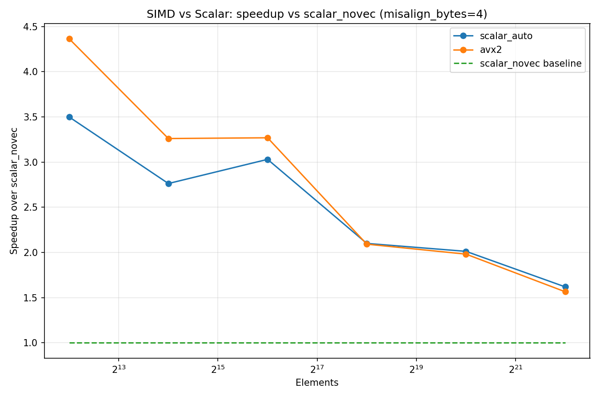

# 03-SIMD-vs-Scalar

---

## Overview

In this experiment, we compare three implementations of a SAXPY kernel:

```

y[i] = a * x[i] + y[i]

```

We evaluate:

- 🐢 `scalar_novec` — scalar loop (auto-vectorization disabled)
- ⚙️ `scalar_auto` — compiler-optimized loop
- 🚀 `avx2` — manual SIMD (AVX2 intrinsics)

> 🎯 Goal:  
> **Understand when SIMD actually improves performance — and when it doesn’t.**

---

## 📊 Absolute Performance (Aligned)



### 🔍 Observations

- 🐢 `scalar_novec` is consistently the slowest
- ⚙️ `scalar_auto` achieves large speedup
- 🚀 `avx2` is slightly faster than `scalar_auto`

### 💡 Key Point

- Small arrays (L1/L2):
  - **Up to ~10× speedup**
- Large arrays:
  - Performance **converges**

---

## 📊 Absolute Performance (Misaligned)



### 🔍 Observations

- ⚠️ Misalignment significantly hurts performance (especially small arrays)
- 🚀 AVX2 is also affected

### 📌 Example

- aligned: ~0.11 ns  
- misaligned: ~0.22 ns (**~2× slower**)

---

## 📈 Speedup vs Scalar Baseline (Aligned)



### 🔍 Observations

- Small arrays:
  - 🚀 AVX2: ~10×
  - ⚙️ Auto: ~7×

- Large arrays:
  - Drops to ~1.5–2×

---

## 📈 Speedup vs Scalar Baseline (Misaligned)



### 🔍 Observations

- Initial speedup reduced (~3–4×)
- Eventually converges (~1.5×)

---

## 🧠 Key Insights

### 1️⃣ SIMD is powerful — but only when compute-bound

- Small working sets → CPU dominates  
- SIMD provides **massive throughput gains**

---

### 2️⃣ Memory quickly becomes the bottleneck

- Large working sets → DRAM dominates  
- SIMD advantage **shrinks dramatically**

> SIMD cannot help if memory is the bottleneck

---

### 3️⃣ Compiler already does most of the work

- ⚙️ `scalar_auto ≈ avx2`
- Manual SIMD gives **only marginal improvement**

> Modern compilers are already very good at vectorization

---

### 4️⃣ Alignment matters (sometimes)

- Important in cache-resident workloads  
- Irrelevant when memory-bound

---

## ⚙️ Core Principle

```

Performance ≈ min(compute throughput, memory bandwidth)

```

- SIMD improves **compute throughput**
- But real performance depends on **memory**

---

## 🚀 Takeaways

- SIMD is **not a silver bullet**
- Memory hierarchy dominates real-world performance
- Auto-vectorization is often **good enough**
- Manual SIMD is useful when:
  - compiler fails
  - fine control is required

---

