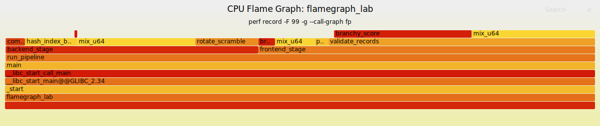

# 02. Flame Graph

## Overview

In the previous lab, we used `perf record` and `perf report` to find CPU hotspots.

That was useful, but it had one limitation.

A flat profile can tell us:

> Which function is hot?

However, it does not always clearly tell us:

> Which call path made that function hot?

This distinction matters because the same function can be called from multiple parts of a program.

In this lab, we move from flat hotspot profiling to stack-based profiling using a CPU Flame Graph.

The main goal is to understand not only where CPU samples were collected, but also how execution reached those hot functions.

---

## Why Flame Graphs?

A Flame Graph visualizes sampled call stacks.

Each box represents a function. The width of a box represents how many samples included that function in that stack path.

A wider box means more samples were collected under that call path.

This is different from simply listing hot functions. A Flame Graph preserves caller context.

For example, a flat profile might say:

```text
mix_u64 is hot.
```

But a Flame Graph can show something more useful:

```text
frontend_stage -> validate_records -> mix_u64
backend_stage  -> hash_index_build -> mix_u64
```

Now we know that the same hot leaf function appears under different workload paths.

That is the main lesson of this lab.

---

## Lab Structure

The lab directory is organized as follows:

```text
06-performance-analysis/
└── 02-flamegraph/
    ├── Makefile
    ├── run.sh
    ├── src/
    │   └── flamegraph_lab.c
    ├── tools/
    │   └── FlameGraph/
    └── artifacts/
        ├── bin/
        │   └── flamegraph_lab
        ├── data/
        │   ├── perf.data
        │   ├── perf.script.txt
        │   ├── out.folded
        │   └── flamegraph.svg
        └── reports/
            └── perf.report.txt
```

The source program creates an artificial multi-stage workload:

```text
run_pipeline
├── frontend_stage
│   ├── parse_records
│   │   └── mix_u64
│   └── validate_records
│       ├── branchy_score
│       └── mix_u64
│
└── backend_stage
    ├── hash_index_build
    │   └── mix_u64
    └── compress_blocks
        └── rotate_scramble
```

The important design choice is that `mix_u64` is called from multiple paths.

This makes the workload useful for learning why caller context matters.

---

## Build Configuration

The program was built with debug symbols and frame pointers enabled:

```makefile
CFLAGS := -O2 -g -Wall -Wextra -std=c11 -march=native
CFLAGS += -fno-omit-frame-pointer
CFLAGS += -fno-optimize-sibling-calls
```

The `-fno-omit-frame-pointer` option is important for this lab.

When using:

```bash
perf record --call-graph fp
```

`perf` relies on frame pointers to unwind the call stack.

The `-fno-optimize-sibling-calls` option is also useful for educational profiling because it reduces tail-call optimizations that may remove frames from the visible call stack.

---

## Running the Experiment

The workload was profiled using `perf record`:

```bash
perf record \
  -F 99 \
  -g \
  --call-graph fp \
  -o artifacts/data/perf.data \
  -- ./artifacts/bin/flamegraph_lab \
      --elements 1048576 \
      --rounds 80 \
      --frontend-weight 2 \
      --backend-weight 3 \
      --cleanup-weight 1
```

The options mean:

```text
-F 99             Sample at 99 Hz.
-g                Collect call graphs.
--call-graph fp   Use frame-pointer-based stack unwinding.
-o perf.data      Write samples to perf.data.
```

After recording, the data was converted into a Flame Graph:

```bash
perf script \
  -i artifacts/data/perf.data \
  > artifacts/data/perf.script.txt

tools/FlameGraph/stackcollapse-perf.pl \
  artifacts/data/perf.script.txt \
  > artifacts/data/out.folded

tools/FlameGraph/flamegraph.pl \
  --title "CPU Flame Graph: flamegraph_lab" \
  --subtitle "perf record -F 99 -g --call-graph fp" \
  artifacts/data/out.folded \
  > artifacts/data/flamegraph.svg
```

The generated files were:

```text
artifacts/data/perf.data
artifacts/reports/perf.report.txt
artifacts/data/perf.script.txt
artifacts/data/out.folded
artifacts/data/flamegraph.svg
```

---

## Perf Report Result

The final `perf report` showed that almost all samples were under `run_pipeline`:

```text
run_pipeline 99.89%
```

The two major branches were:

```text
frontend_stage 57.05%
backend_stage  42.84%
```

The call graph looked like this:

```text
run_pipeline
├── frontend_stage 57.05%
│   ├── validate_records 45.19%
│   │   ├── branchy_score 23.33%
│   │   └── mix_u64 20.90%
│   ├── mix_u64 6.71%
│   ├── branchy_score 2.81%
│   └── parse_records 2.34%
│
└── backend_stage 42.84%
    ├── mix_u64 20.01%
    ├── rotate_scramble 10.69%
    ├── hash_index_build 8.85%
    └── compress_blocks 3.28%
```

This is a good result for the lab because both frontend and backend paths are visible.

The workload is not completely dominated by only one branch.

---

## Flame Graph Result



The Flame Graph makes the same structure easier to see visually.

The two largest high-level areas are:

```text
run_pipeline -> frontend_stage
run_pipeline -> backend_stage
```

The frontend side is mainly validation work:

```text
run_pipeline
└── frontend_stage
    └── validate_records
        ├── branchy_score
        └── mix_u64
```

The backend side is mainly hash-building and compression-like work:

```text
run_pipeline
└── backend_stage
    ├── hash_index_build
    │   └── mix_u64
    └── compress_blocks
        └── rotate_scramble
```

The important point is that `mix_u64` appears in more than one context.

---

## Hot Function vs Hot Call Path

A flat profile can make the diagnosis look simple:

```text
mix_u64 is hot.
```

But the Flame Graph gives a better explanation:

```text
mix_u64 is hot in multiple caller contexts.
```

In this result, `mix_u64` appears under both of these paths:

```text
frontend_stage -> validate_records -> mix_u64
backend_stage  -> hash_index_build -> mix_u64
```

The approximate sample percentages were:

```text
frontend-side mix_u64: about 21%
backend-side mix_u64:  about 20%
```

So the cost of `mix_u64` is not owned by only one part of the program.

It is shared across different workload paths.

This is the key lesson:

> A hot leaf function is not always a complete explanation.
> The caller context matters.

---

## Children vs Self

The report also shows a useful distinction between `Children` and `Self`.

For example:

```text
frontend_stage  Children 57.05%, Self 0.00%
backend_stage   Children 42.84%, Self 0.00%
```

This means that `frontend_stage` and `backend_stage` themselves do not spend much time directly in their own function bodies.

Instead, the time is spent in the functions they call.

In other words, these stage functions are important because they organize expensive work below them.

The CPU-heavy functions are lower in the stack:

```text
mix_u64
branchy_score
rotate_scramble
```

The parent functions explain the workload context.

The leaf functions explain where the CPU instructions are actually executed.

Both views are needed.

---

## What Changed From the Previous Lab?

The previous `perf-record-hotspot` lab was mostly about identifying hot symbols.

That style of analysis answers:

```text
Which function received many CPU samples?
```

This Flame Graph lab answers:

```text
Which call path received many CPU samples?
```

That difference is important.

A function can be hot because it is called by one expensive path, or because it is shared by multiple moderately expensive paths.

Without call stack information, those cases can look similar.

With a Flame Graph, they become visually different.

---

## Takeaways

This lab demonstrated why stack-based profiling is more informative than flat symbol-level profiling.

The final profile showed that the workload was split between two major stages:

```text
frontend_stage: about 57%
backend_stage:  about 43%
```

The same hot function, `mix_u64`, appeared under multiple caller contexts.

That means the function itself was hot, but the full explanation required the call path.

The main takeaway is:

```text
perf report shows which function is hot.
A Flame Graph shows which call path is hot.
```

For real performance work, this distinction is important.

Optimizing a hot leaf function may help, but understanding the caller context tells us where the workload-level cost actually comes from.

---
